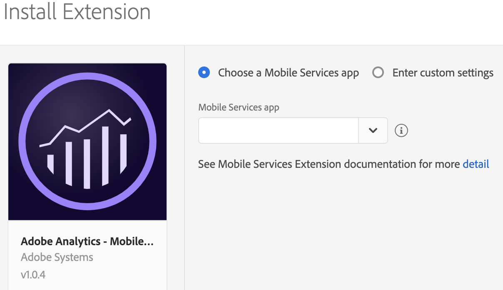
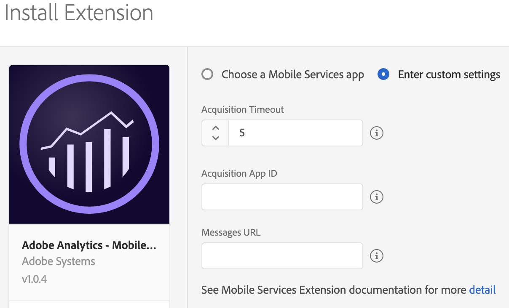
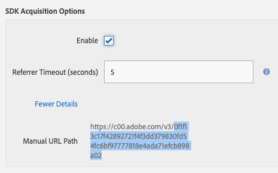
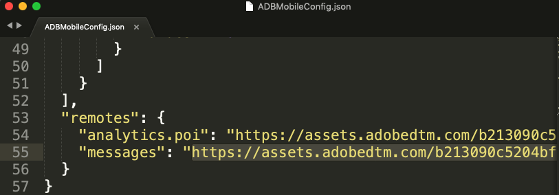
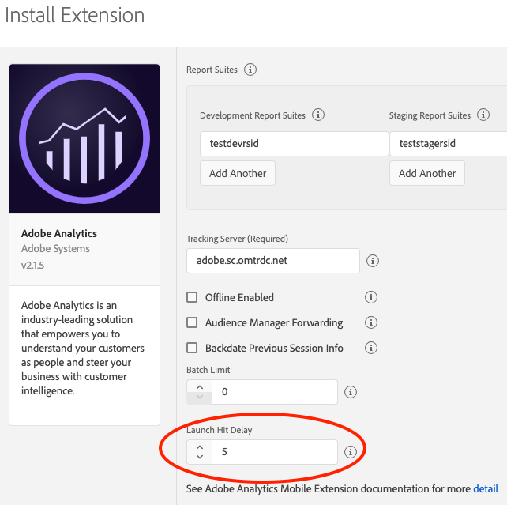

import Tabs from './tabs/index.md'

# Adobe Analytics - Mobile Services

This extension enables in-app messaging, push notifications, and marketing links functionality from [Mobile Services](https://mobilemarketing.adobe.com) on the Experience Platform SDK.

<InlineAlert variant="warning" slots="text"/>

As of **April 1, 2020**, Apple will no longer support UIWebView. To avoid any issues, ensure that you are using the iOS extension versions 1.0.3 or later. For more information, see Apple's documentation on [UIWebView](https://developer.apple.com/documentation/uikit/uiwebview).

<InlineAlert variant="info" slots="text"/>

The Adobe Analytics Mobile Marketing Add-on SKU is required to enable Mobile Services access to mobile acquisition, deep linking, geolocation, and mobile messaging capabilities.<br/><br/>For more information, please contact your Adobe Customer Success Manager.

Review the following Mobile Services functionality documentation for context and set up before implementation at these links:

* [Getting started with Mobile Services](https://experienceleague.adobe.com/docs/mobile-services/using/get-started-ug/gs.html)
* [Create and managing apps](https://experienceleague.adobe.com/docs/mobile-services/using/manage-apps-ug/manage-apps.html)
* [Acquisition and marketing links](https://experienceleague.adobe.com/docs/mobile-services/using/acquisition-main-ug/acquisition-main.html)
* [Push and in-app messaging](https://experienceleague.adobe.com/docs/mobile-services/using/messaging-ug/in-app-messaging.html)

<InlineAlert variant="warning" slots="text"/>

Postbacks created from the Mobile Services interface are **not** supported. Please use a rule defined in the Data Collection UI with the Mobile Core extension to create a postback. [Signal extension and Rules Engine integration](../user-guides/rules-engine-integration.md).

<InlineAlert variant="warning" slots="text"/>

Before you configure the Mobile Services extension, ensure that you previously created apps in [Mobile Services](https://mobilemarketing.adobe.com). To learn how to create an app in Mobile Services, see the [add a new App](https://experienceleague.adobe.com/docs/mobile-services/using/manage-apps-ug/t-new-app.html) tutorial.

<InlineAlert variant="info" slots="text"/>

To use location-based functionality for Mobile Services, see the documentation on the [Places Service](https://experienceleague.adobe.com/docs/places/using/home.html).

To use the Mobile Services extension, complete the following steps:

1. Configure the Mobile Services extension in the Data Collection UI.
2. If using acquisition and marketing links, update your configuration in the Analytics extension.
3. Add Mobile Services extension to your app.
4. Implement the Mobile Services APIs in your app.

## Configure the Mobile Services extension in the Data Collection UI

<InlineAlert variant="warning" slots="text"/>

The Mobile Services extension requires the Analytics extension for reporting. It uses the report suite that is specified in the Analytics extension for reporting. However, the Mobile Services extension uses the report suite that is configured for the app in Mobile Services for push and in-app messaging, acquisition, marketing links, and app management. If the report suite in the two locations do not match, a push message from the wrong report suite may be sent.

### Automatic configuration (Recommended)

1. In the Data Collection UI, select the **Extensions** tab.
2. Choose **Catalog**, locate the **Adobe Analytics – Mobile Services** extension, and select **Install**.
3. Select a Mobile Services app and complete the following tasks:
   1. In **Mobile Services app**, select app from the drop-down list.
   2. Select **Save**.
   3. Follow the publishing process to update the SDK configuration.



### Manual configuration

<InlineAlert variant="error" slots="text"/>

The following instructions only apply if you **do not** see your app listed or need to manually configure your Mobile Services app.

<InlineAlert variant="warning" slots="text"/>

If you are sending data to multiple Analytics report suites, use the Acquisition App ID from the app that is associated with the first report suite in your list of report suite IDs.



To install the Mobile Services extension, complete the following steps:

1. Select **Enter Custom settings**.
2. Enter an Acquisition time out. The recommended time out is 5 seconds. To enable app acquisition, this value must be greater than 0.
3. Provide the **Acquisition App ID** (sample value: `0eb9f2791f0880623f91e41e5309d2ae25066e513054a4cb59168dc886b526da)`).

   You can find the Acquisition App ID in Mobile Services.

4. Select your app, navigate to Manage App Settings page, and in the **SDK Acquisition Options** section, copy the hashed string similar to the highlighted value:

   

5. Provide the **Messages URL**. This value would look something similar to: `https://assets.adobedtm.com/b213432c5204bf94318f4ef0539a38b487d10368/scripts/satellite-5c7711bc64746d7f5800036e.json`

   You can find the Messages URL from your `ADBMobileConfig.json` file typically near the bottom of the file.

   

6. Select **Save**.
7. Follow the publishing process to update your SDK configuration.

## Configure the Adobe Analytics extension

1. To ensure that this extension is correctly configured and implemented, follow the steps in the [configure the Mobile Services extension in the Data Collection UI](#configure-the-mobile-services-extension-in-the-data-collection-ui) section.
2. In **Launch Hit Delay**, type a value of 5s or more to ensure that the acquisition context is sent to Analytics with your Lifecycle information.



## Add the Mobile Services extension to your app

<InlineAlert variant="info" slots="text"/>

The Mobile Services extension depends on the Core extension, which includes the Identity and Lifecycle frameworks and the Analytics extension.

<InlineAlert variant="warning" slots="text"/>

iOS AEP (3.x) Mobile Services extension only supports Cocoapods. It does **not** work with Swift Package Manager or when included in your app as an XCFramework dependency.

<TabsBlock orientation="horizontal" slots="heading, content" repeat="3"/>

Android

<Tabs query="platform=android&task=add"/>

iOS (AEP 3.x)

<Tabs query="platform=ios-aep&task=add"/>

iOS (ACP 2.x)

<Tabs query="platform=ios-acp&task=add"/>

## Register Mobile Services with Mobile Core

<TabsBlock orientation="horizontal" slots="heading, content" repeat="3"/>

Android

<Tabs query="platform=android&task=register"/>

iOS (AEP 3.x)

<Tabs query="platform=ios-aep&task=register"/>

iOS (ACP 2.x)

<Tabs query="platform=ios-acp&task=register"/>

## Implement Mobile Services APIs in your app

To use your Android or iOS extension with the Experience Platform SDKs, implement the following APIs:

### Set up push messaging

<TabsBlock orientation="horizontal" slots="heading, content" repeat="3"/>

Android

<Tabs query="platform=android&task=set-push-messaging"/>

iOS (AEP 3.x)

<Tabs query="platform=ios-aep&task=set-push-messaging"/>

iOS (ACP 2.x)

<Tabs query="platform=ios-acp&task=set-push-messaging"/>

### Debugging the push messaging set up

If the Mobile Services API is correctly configured, after installing your app on a mobile device, verify that the following SDK debug log is displayed:

To verify, make a request to `demdex.net`, containing the device push token has been sent:

```console
2019-01-31 18:22:35.261676-0800 DemoApp[935:156015] [AMSDK DEBUG <com.adobe.module.identity>]: Sending request (https://dpm.demdex.net/id?d_rtbd=json&d_ver=2&d_orgid=B1F855165B4C9EA50A495E06@AdobeOrg&d_mid=43583282444503123217621782542046274680&d_blob=j8Odv6LonN4r3an7LhD3WZrU1bUpAkFkkiY1ncBR96t2PTI&dcs_region=9)
```

### Set up push tracking

Use the following API to track a push messaging click in Adobe Analytics.

<InlineAlert variant="info" slots="text"/>

Using the following API does not increment page views.

<TabsBlock orientation="horizontal" slots="heading, content" repeat="3"/>

Android

<Tabs query="platform=android&task=set-push-tracking"/>

iOS (AEP 3.x)

<Tabs query="platform=ios-aep&task=set-push-tracking"/>

iOS (ACP 2.x)

<Tabs query="platform=ios-acp&task=set-push-tracking"/>

## Troubleshooting push messaging

For more information, see the following:

* [Android troubleshooting guide](https://experienceleague.adobe.com/docs/mobile-services/android/messaging-android/push-messaging/c-troubleshooting-push-messaging.html)
* [iOS troubleshooting guide](https://experienceleague.adobe.com/docs/mobile-services/ios/messaging-ios/push-messaging/c-troubleshooting-push-messaging.html)

## Set up in-app messaging

This feature allows you to deliver in-app messages that are triggered from any analytics data or event. After the implementation, messages are dynamically delivered to the app and do not require a code update. In-app messages are created in Mobile Services. For more information, see the [create an in-app message](https://experienceleague.adobe.com/docs/mobile-services/android/messaging-android/inapp-messaging/messaging.html) tutorial.

To set up your app for in-app messages, implement the following instructions. You can complete these steps even if you have not yet defined any messages in Mobile Services. After you define messages, they are delivered dynamically to your app and displayed without an app store update.

<TabsBlock orientation="horizontal" slots="heading, content" repeat="2"/>

Android

<Tabs query="platform=android&task=set-in-app-messaging"/>

iOS

<Tabs query="platform=ios&task=set-in-app-messaging"/>

## Fallback images

When creating a full-screen message, you can optionally specify a fallback image. If your message cannot retrieve its intended image from the web, the SDK attempts to load the image with the same name from your application’s assets folder. This allows you to show your message in its original form, even if the user is offline or the predetermined image is unreachable.

<InlineAlert variant="warning" slots="text"/>

The fallback image asset name is specified when you configure the message in Mobile Services. You need to ensure that the specified resource is available.

## Configuring notification icons

The following methods allow you to configure the small and large icons that appear in the notification area, and the large icon that is displayed when notifications appear in the notification drawer.

<TabsBlock orientation="horizontal" slots="heading, content" repeat="2"/>

Android

<Tabs query="platform=android&task=set-icon"/>

iOS

<Tabs query="platform=ios&task=set-icon"/>

### Tracking in-app messages

The SDK automatically tracks metrics for your in-app messages.

For full screen and alert style in-app messages, the following metrics are tracked:

* **Impressions**: when user triggers an in-app message.
* **Click throughs**: when user selects the **Click through** button.
* **Cancels**: when user selects the **Cancel** button.

For custom full screen in-app messages, the HTML content in the message needs to include the correct code to notify the SDK tracking about the following buttons:

* **Click-through** (redirect) example tracking: `adbinapp://confirm/?url=http://www.yoursite.com`
* **Cancel** (close) example tracking: `adbinapp://cancel`

For local (remote) notifications, the following metrics are tracked:

* **Impressions**: when user triggers the notification.
* **Opens**: when user opens app from the notification.

The following example shows you how to include open tracking:

```objectivec
- (BOOL) application:(UIApplication *)application didFinishLaunchingWithOptions:(NSDictionary *)launchOptions {

  // handle local notification click-throughs for iOS 10 and older
  NSDictionary *localNotificationDictionary = launchOptions[UIApplicationLaunchOptionsLocalNotificationKey];
  if ([localNotificationDictionary isKindOfClass:[NSDictionary class]]) {
       [ACPCore collectLaunchInfo:localNotificationDictionary];
  }

}
- (void) application:(UIApplication *)application didReceiveLocalNotification:(UILocalNotification *)notification {
   [ACPCore collectLaunchInfo:notification.userInfo];
}
```

### Troubleshooting in-app messaging

For more information, see the following:

* [Android Troubleshooting guide](https://experienceleague.adobe.com/docs/mobile-services/android/messaging-android/inapp-messaging/in-apps-ts.html)
* [iOS Troubleshooting guide](https://experienceleague.adobe.com/docs/mobile-services/ios/messaging-ios/in-app-messaging/in-apps-ts.html)

### Acquisition and marketing links

Acquisition and marketing links must be created in Adobe Mobile Services. For more information, see the documentation on [Acquisition](https://experienceleague.adobe.com/docs/mobile-services/using/acquisition-main-ug/acquisition-main.html) within the Mobile Services.

<InlineAlert variant="info" slots="text"/>

The following configuration collects Acquisition link context from links that were created in Mobile Services and collects referrer data from the Google Play store.

When the user downloads and runs an app as the result of a Google Play store acquisition, the data from the referrer is collected and sent to Adobe Mobile Services. Custom keys that were part of the acquisition data from Google Play are name-spaced with `a.acquisition.custom`.

#### Using the `BroadcastReceiver`

1. Implement the `BroadcastReceiver` for the referrer.

   ```java
   package com.your.package.name;  // replace with your app package name

   import android.content.BroadcastReceiver;
   import android.content.Context;
   import android.content.Intent;

   public class GPBroadcastReceiver extends BroadcastReceiver {
     @Override
     public void onReceive(Context c, Intent i) {
         com.adobe.marketing.mobile.MobileServices.processReferrer(c, i);
     }
   }
   ```

2. Update the `AndroidManifest.xml` to enable the `BroadcastReceiver` you previously created.

   ```xml
   <receiver android:name="com.your.package.name.GPBroadcastReceiver" android:exported="true">
       <intent-filter>
           <action android:name="com.android.vending.INSTALL_REFERRER" />
       </intent-filter>
   </receiver>
   ```

#### Using the Google Play Install Referrer APIs

Starting on March 1, 2020, Google is deprecating the install\_referrer intent broadcast mechanism. For more information, see the [Still Using InstallBroadcast? Switch to the Play Referrer API by March 1, 2020 ](https://android-developers.googleblog.com/2019/11/still-using-installbroadcast-switch-to.html). To continue collecting install referrer information from the Google Play store, update your application to use the Mobile Services extension version 1.1.0 or newer.

With the deprecation, instead of creating a `BroadcastReceiver`, you need to collect the install referrer URL from a new Google API and pass the resulting URL to the SDK.

1. Add the Google Play Install Referrer package to your gradle file's dependencies:

   ```java
   implementation 'com.android.installreferrer:installreferrer:1.1'
   ```

2. To retrieve the referrer URL from the Install Referrer API, complete the steps in the [get the install referrer](https://developer.android.com/google/play/installreferrer/library#install-referrer) tutorial.

3. Pass the referrer URL to the SDK:

   ```java
   MobileServices.processGooglePlayInstallReferrerUrl(referrerUrl);
   ```

   To decide the best way to use the Google Play Install Referrer APIs in your app, see Google's documentation. Here is an example of how to use the Adobe SDK with the Google Play Install Referrer APIs:

   ```java
   void handleGooglePlayReferrer() {
       // Google recommends only calling this API the first time you need it:
       // https://developer.android.com/google/play/installreferrer/library#install-referrer
   
       // Store a boolean in SharedPreferences to ensure we only call it once.
       final SharedPreferences prefs = getSharedPreferences("acquisition", 0);
       if (prefs != null) {
           if (prefs.getBoolean("referrerHasBeenProcessed", false)) {
               return;
           }
       }
   
       final InstallReferrerClient referrerClient = InstallReferrerClient.newBuilder(getApplicationContext()).build();
       referrerClient.startConnection(new InstallReferrerStateListener() {
           private boolean complete = false;
   
           @Override
           public void onInstallReferrerSetupFinished(int responseCode) {
               switch (responseCode) {
                   case InstallReferrerClient.InstallReferrerResponse.OK:
                       // connection is established
                       complete();
                       try {
                           final ReferrerDetails details = referrerClient.getInstallReferrer();                        
   
                           // pass the install referrer url to the SDK
                           MobileServices.processGooglePlayInstallReferrerUrl(details.getInstallReferrer());
   
                       } catch (final RemoteException ex) {
                           Log.w("Acquisition - RemoteException while retrieving referrer information (%s)", ex.getLocalizedMessage() == null ? "unknown" : ex.getLocalizedMessage());
                       } finally {
                           referrerClient.endConnection();
                       }
                       break;
                   case InstallReferrerClient.InstallReferrerResponse.FEATURE_NOT_SUPPORTED:
                   case InstallReferrerClient.InstallReferrerResponse.SERVICE_UNAVAILABLE:
                   default:
                       // API not available in the Play Store app - nothing to do here
                       complete();
                       referrerClient.endConnection();
                       break;
               }
           }
   
           @Override
           public void onInstallReferrerServiceDisconnected() {
               if (!complete) {
                   // something went wrong trying to get a connection, try again
                   referrerClient.startConnection(this);
               }
           }
   
           void complete() {
               complete = true;
               SharedPreferences.Editor editor = getSharedPreferences("acquisition", 0).edit();
               editor.putBoolean("referrerHasBeenProcessed", true);
               editor.apply();
           }
       });
   }
   ```

<InlineAlert variant="info" slots="text"/>

No setup is required, since Acquisition context is automatically collected and tracked by the SDK.

### Deep link tracking

The SDK can parse key-value pairs of data that are appended to any deep or universal link, provided the link contains a key `a.deeplink.id` and a corresponding non-null and user generated value. All key-value pairs of data that are appended to the URL string are parsed, attached to a lifecycle hit as context data, and sent to Adobe Analytics.

You can also append one or more of the following reserved keys, with user-generated values, to the deep or universal link:

* `a.launch.campaign.trackingcode`
* `a.launch.campaign.source`
* `a.launch.campaign.medium`
* `a.launch.campaign.medium`
* `a.launch.campaign.content`

<InlineAlert variant="warning" slots="text"/>

Ensure that the deep link URL has the `a.deeplink.id` key in the URL string. If `a.deeplink.id` is not found, none of the appended URL parameters are sent to Analytics via context data.

<TabsBlock orientation="horizontal" slots="heading, content" repeat="3"/>

Android

<Tabs query="platform=android&task=track-deep-link"/>

iOS (AEP 3.x)

<Tabs query="platform=ios-aep&task=track-deep-link"/>

iOS (ACP 2.x)

<Tabs query="platform=ios-acp&task=track-deep-link"/>

## Integration with Apple Search Ads (iOS)

The Adobe Experience Platform SDK leverages [Apple's Search Ads attribution](https://developer.apple.com/documentation/iad/setting_up_apple_search_ads_attribution) to attribute app downloads that originate from Search Ads campaigns in the Apple App Store. For more information about Search Ad campaigns, see [Apple Search Ads](https://searchads.apple.com/). This optional feature helps you easily measure the effectiveness of your Search Ads app download campaigns by adding a few lines of code to your app.

### Implement Search Ads integration

To enable your app for Search Ad attribution, you will need to [add the iAd framework](https://developer.apple.com/documentation/iad/setting_up_apple_search_ads_attribution#overview), in addition to the Mobile Services extension to your app.

### Reporting on Search Ads Attribution

Apple Search Ads attribution data is provided in the acquisition name, the source, and the term values.

If `attribution = true` , all of the `iad-*` fields will be included in a Lifecycle request to Adobe Analytics. In addition, the following values will be mapped from the "iad" dictionary to our typical acquisition context data fields:

* `iad-campaign-id` --&gt; `a.referrer.campaign.trackingcode`
* `iad-campaign-name` --&gt; `a.referrer.campaign.name`
* `iad-adgroup-id` --&gt; `a.referrer.campaign.content`
* `iad-keyword` --&gt; `a.referrer.campaign.term`

This mapping ensures that the values are available in Adobe Analytics standard reporting.

## Migration notes

To prepare for your migration, please note the following information:

* Lifetime value is **not** supported on the Experience Platform SDK, so it should not be used to trigger in-app messages or local notifications.
* `ce` is no longer supported as a trigger for in-app messages or local notifications.
* `a.internalaction` or `action` (from Lifecycle) can be used to trigger in-app messages or local notifications. You should, however, use `LaunchEvent` instead.
* Local notifications do **not** support Android 8.0 or higher.

### Configuration keys

| Key | Description |
| :--- | :--- |
| mobile.acquisitionTimeout | Amount of time, in seconds, to wait for acquisition information from the Mobile Services acquisition server. |
| mobile.acquisitionAppId | App ID uniquely identifies the app on the Mobile Services acquisition server. |
| mobile.messagesUrl | Messages URL from your configuration (`ADBMobileConfig.json`) file's remotes section. |

## Watch the video

<Media slots="video"/>

<https://youtu.be/VKI2ECZU3bU>

### Additional information

* Visit [Mobile Services documentation](https://experienceleague.adobe.com/docs/mobile-services/using/home.html)
* Visit [Mobile Services](https://mobilemarketing.adobe.com)

