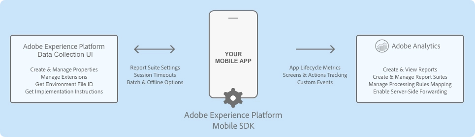

import Tabs from './tabs/index.md'

# Adobe Analytics

## Configure the Analytics extension in the Data Collection UI

1. In the Data Collection UI, select the **Extensions** tab.
2. On the **Catalog** tab, locate the **Adobe Analytics** extension, and select **Install**.
3. Type the extension settings. For more information, please read the [configure the Analytics Extension section](./#configure-the-analytics-extension).
4. Click **Save**.
5. Follow the publishing process to update SDK configuration.

### Configure the Analytics extension

#### Analytics company

If you have access to more than one Analytics company, a select menu will appear, allowing you to choose which company you want to use. If you only have access to one Analytics company, this select menu will not appear.

Once you select an Analytics company, the list of report suites associated with that company will appear in the report suites section.

#### Report suites

<InlineAlert variant="info" slots="text"/>

To learn how to find report suite IDs, please read the documentation on [report suites](https://experienceleague.adobe.com/docs/analytics/admin/manage-report-suites/report-suites-admin.html).

Select one or more mobile-enabled report suite identifiers from the combo box to which the Analytics data should be sent. Only report suite identifiers that belong to a company and that are enabled for mobile can be selected. For information on how to enable mobile for your report suite, see the [mobile management documentation](https://experienceleague.adobe.com/docs/analytics/admin/admin-tools/mobile-management.html).

To narrow the search for a report suite identifier, type a string in the combo box text field. After a valid report suite identifier has been selected, this identifier appears in a tag below the combo box. To remove a report suite ID, click on the X next to the ID you want to remove. Report suite IDs can also be configured for the Development and Staging environments.

#### Tracking server

<InlineAlert variant="info" slots="text"/>

To learn what a tracking server is and how to find it, please read the documentation on [tracking servers](https://experienceleague.adobe.com/docs/analytics/implementation/vars/config-vars/trackingserver.html).

The tracking server is the tracking domain that all the Analytics requests should be made.

#### Offline enabled

<InlineAlert variant="info" slots="text"/>

To learn more about offline tracking, please read the documentation on [offline tracking](https://experienceleague.adobe.com/docs/analytics/implementation/vars/config-vars/trackoffline.html).

When the **Offline Enabled** checkbox is selected, Analytics hits are queued when your device is offline and are sent later when your device is back online. To use offline tracking, ensure that your report suite is timestamp enabled.

<InlineAlert variant="warning" slots="text"/>

If your report suite is timestamp enabled, the checkbox must be selected. If your report suite is not timestamped enabled, leave the checkbox unselected. If this setting is not configured correctly, data will be lost.  If you are not sure whether your report suite is timestamp enabled, contact Customer Care.

<InlineAlert variant="info" slots="text"/>

If you currently send Mobile SDK data to a report suite that also collects data from web JavaScript, you may need to set up a separate report suite for mobile data or include a custom timestamp on all JavaScript hits that use the `s.timestamp` variable. For more information, please contact Customer Care.

#### Audience Manager forwarding

<InlineAlert variant="info" slots="text"/>

For more information about Analytics server-side forwarding to Audience Manager, see the documentation on [Analytics sever-side forwarding](./#server-side-forwarding-with-audience-manager).

If you set up Analytics server-side forwarding to Audience Manager, select the **Audience Manager Forwarding** checkbox. When this checkbox is selected, all SDK requests to Analytics servers are sent with an expected response code of **10**. This step ensures that Analytics traffic is forwarded to Audience Manager and that the Audience Manager User Profile is correctly updated in the SDK.

#### Backdate previous session info

<InlineAlert variant="warning" slots="text"/>

Select the **Backdate Previous Session Info** checkbox **only** if you have timestamp-enabled report report suites.

When you select this checkbox, the SDK backdates the end-of-session lifecycle information so that this information can be attributed into its correct session. Session information currently consists of crashes and session length.

The SDK also backdates the session information hit to one second after the last hit of the previous session. This means that crashes and session data will correlate with the correct date on which they occurred. One hit is backdated each time a new launch of the application is occurs.

For example, if you select the checkbox, Lifecycle session information or crash events are backdated to one second after the last hit was sent. If you do not select the checkbox, Lifecycle data is attached to the first hit of the subsequent session.

If this option is disabled, Mobile SDK attaches the session information to the current lifecycle.

#### Batch limit

This setting creates a threshold number of hits to be sent in consecutive calls. For example, if you type or select "10", each Analytics hit before the 10th hit is stored in the queue. When the 10th hit comes in, all 10 hits are sent to Analytics in the order in which they were generated.

<InlineAlert variant="info" slots="text"/>

If you set a value greater than 0, ensure that the **Offline Enabled** checkbox is also selected.

The default value for this setting is 0, which means that hit batching is disabled, and all hits are immediately sent to Analytics as they are generated.

#### Launch hit delay

The number of seconds to wait before Analytics launch hits are sent from the SDK. Ensure that this setting is set at 5 seconds or greater when using acquisition functionality from the [Mobile Services](../adobe-analytics-mobile-services/) extension.

## Add Analytics to your application

<TabsBlock orientation="horizontal" slots="heading, content" repeat="2"/>

Android

<Tabs query="platform=android&task=add"/>

iOS

<Tabs query="platform=ios&task=add"/>

## Register Analytics with Mobile Core

<TabsBlock orientation="horizontal" slots="heading, content" repeat="2"/>

Android

<Tabs query="platform=android&task=register"/>

iOS

<Tabs query="platform=ios&task=register"/>

## Send Lifecycle metrics to Analytics

To automatically report on the application lifecycle details in Analytics, ensure that you properly configure the lifecycle data collection. For more information, see the documentation on [Lifecycle metrics](../mobile-core/lifecycle/metrics.md).

## Send app states and actions to Analytics

To track mobile app states and actions in Adobe Analytics, implement the [trackAction](../mobile-core/api-reference.md#trackaction) and [trackState](../mobile-core/api-reference.md#trackstate) APIs from the Mobile Core extension. For more information, see the [track app actions](../mobile-core/api-reference.md#track-app-actions) and [track app states](../mobile-core/api-reference.md#track-app-states-and-views) tutorials.

<InlineAlert variant="info" slots="text"/>

[trackState](../mobile-core/api-reference.md#trackstate) reports the view state as the **Page Name**, and state views are reported as **Page View** in Analytics. The value is sent to Analytics by using the page name variable (`pagename=value`).   [trackAction](../mobile-core/api-reference.md#trackaction) reports the Action as an **event** and does not increment your page views in Analytics. The value is sent to Analytics by using the action variable (`action=value`).

## Integrations with Adobe Experience Platform solutions and services

### Analytics for Adobe Target (A4T)

To see the performance of your Target activities for some segments, you can set up the Analytics extension for Target (A4T) cross-solution integration by enabling the A4T campaigns. This integration allows you to use Analytics reports to examine your results. If you use Analytics as the reporting source for an activity, all reporting and segmentation for that activity is based on Analytics data collection. For more information, see [Target](https://experienceleague.adobe.com/docs/target/using/integrate/a4t/a4t.html).

### Server-side forwarding with Audience Manager

To enable the ability to share Analytics data with Audience Manager, in the Data Collection UI, select the **Audience Manager Forwarding** checkbox. For more information, go to [Audience Manager](../adobe-audience-manager/index.md).

### Audio and video analytics

For more information about collecting audio and video analytics, please read the documentation on [Media Analytics for audio and video](../adobe-media-analytics/index.md).

## Event serialization

Event serialization is not supported by processing rules. To set serialized events directly on the hits sent to Analytics, use the following syntax in context data parameters:

<TabsBlock orientation="horizontal" slots="heading, content" repeat="2"/>

Android

<Tabs query="platform=android&task=serialize"/>

iOS

<Tabs query="platform=ios&task=serialize"/>

## Configuration keys

To update the SDK configuration programmatically, use the following information to change your Analytics configuration values.

| Key | Required | Description | Data Type |
| :--- | :--- | :--- | :--- |
| analytics.server | Yes | See [Tracking Server](./#tracking-server) | String |
| analytics.rsids | Yes | See [Report Suites](./#report-suites). Multiple report suite IDs can be comma separated with no space in- between. For example: "rsids" : "rsid" "rsids" : "rsid1,rsid2" | String |
| analytics.batchLimit | No | See [Batch Limit](./#batch-limit) | Integer |
| analytics.aamForwardingEnabled | No | See [Audience Manager Forwarding](./#audience-manager-forwarding) | Boolean |
| analytics.offlineEnabled | No | See [Offline Enabled](./#offline-enabled) | Boolean |
| analytics.backdatePreviousSessionInfo | No | See [Backdate Previous Session Info](./#backdate-previous-session-info). | Boolean |

## Update Analytics configuration

<TabsBlock orientation="horizontal" slots="heading, content" repeat="2"/>

Android

<Tabs query="platform=android&task=update"/>

iOS

<Tabs query="platform=ios&task=update"/>

For more information, see the [configuration API reference](../mobile-core/configuration/api-reference.md).
