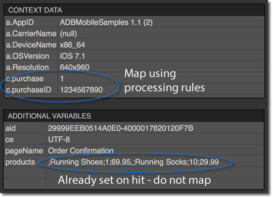
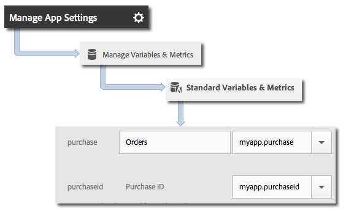

import ProductsIos from './tabs/products-variable/products/ios.md'
import ProductsAndroid from './tabs/products-variable/products/android.md'
import ProductsReactNative from './tabs/products-variable/products/react-native.md'
import ProductsFlutter from './tabs/products-variable/products/flutter.md'
import SetVariableIos from './tabs/products-variable/set-variable/ios.md'
import SetVariableAndroid from './tabs/products-variable/set-variable/android.md'
import SetVariableReactNative from './tabs/products-variable/set-variable/react-native.md'
import SetVariableFlutter from './tabs/products-variable/set-variable/flutter.md'

# Products variable

## Set the products variable

Since the products variable cannot be set by processing rules, you need to set serialized events directly on the hits that are sent to Analytics.

To set the products variable, set a context data key to `&&products`, and set the value to the products or merchandising variable. For more information, see the [implementing a merchandising variable tutorial](https://experienceleague.adobe.com/docs/analytics/components/dimensions/evar-merchandising.html).

<TabsBlock orientation="horizontal" slots="heading, content" repeat="4"/>

#### Android

<SetVariableAndroid/>

#### iOS

<SetVariableIos/>

#### React Native

<SetVariableReactNative/>

#### Flutter

<SetVariableFlutter/>

A sample network request can be seen in the image below:

_`products`_ is set directly on the image request, and the other variables are set as context data. All context data variables must be mapped by using processing rules:

You do **not** need to map the `products` variable using processing rules because it is set directly on the image request by the SDK.

## Products variable with merchandising eVars and product-specific events

The following code samples show an example of the products variable with merchandising eVars and product-specific events.

<TabsBlock orientation="horizontal" slots="heading, content" repeat="4"/>

#### Android

<ProductsAndroid/>

#### iOS

<ProductsIos/>

#### React Native

<ProductsReactNative/>

#### Flutter

<ProductsFlutter/>

<InlineAlert variant="info" slots="text"/> 

If you trigger a product-specific event by using the `&&products` variable, you must also set that event in the `&&events` variable. If you do not set that event, it is filtered out during processing.

