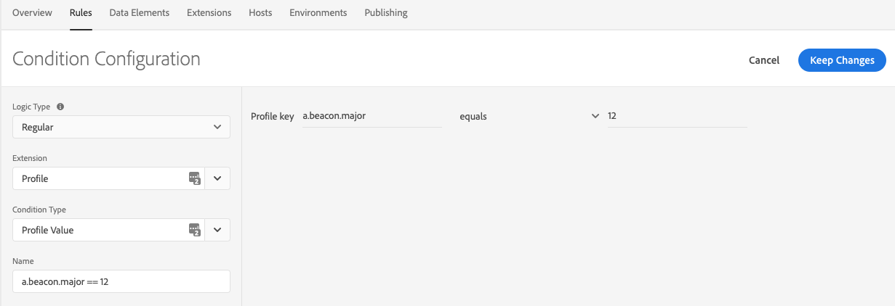
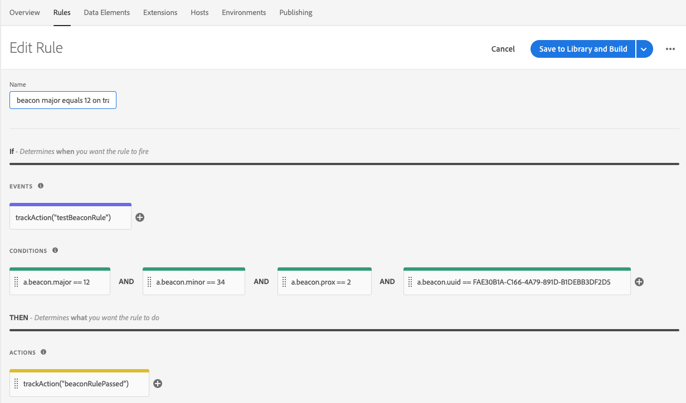
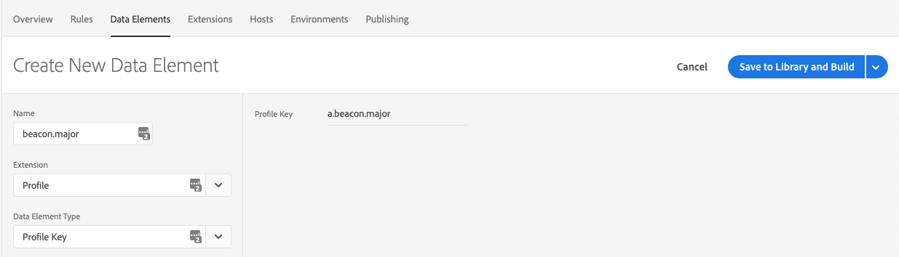
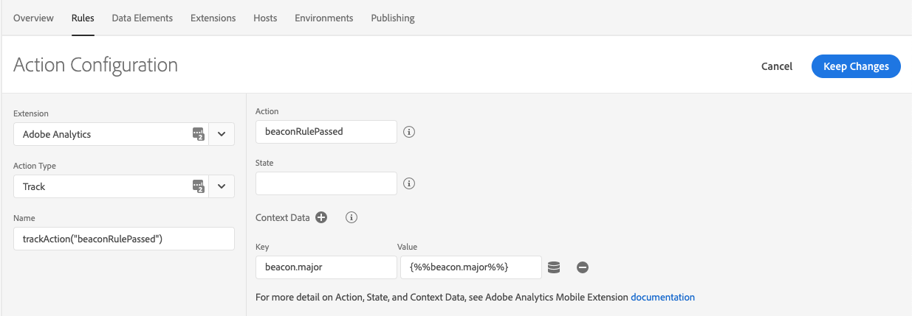

import TrackBeaconAndroid from './tabs/track-beacon/track-beacon/android.md'
import TrackBeaconIos from './tabs/track-beacon/track-beacon/ios.md'
import ClearBeaconAndroid from './tabs/track-beacon/clear-beacon/android.md'
import ClearBeaconIos from './tabs/track-beacon/clear-beacon/ios.md'

# Tracking beacons

## Emulate the trackBeacon call from the v4 SDKs

The `trackBeacon` call is no longer available in the Experience Platform SDKs. Now, you need to manually send beacon tracking data to your Adobe Analytics server and create the rules based on a user's proximity to your beacons. This solution relies on the [Profile extension](../profile/index.md) to generate beacon-related rules.

This topic contains sample code to help you implement your own `trackBeacon` calls.

### Track a beacon

When your user comes within the range of a beacon, call this method to send beacon data to [Adobe Analytics](../adobe-analytics/index.md). This code also saves all beacon-related data in the client-side Profile for use with the Rules Engine.

<TabsBlock orientation="horizontal" slots="heading, content" repeat="2"/>

Android

<TrackBeaconAndroid/>

iOS

<TrackBeaconIos/>

### Clear the current beacon

The `clearCurrentBeacon` code removes the user attributes that were previously set in the Profile extension. To keep rules working as expected, this method should be called when the user is no longer within range of your beacon.

<TabsBlock orientation="horizontal" slots="heading, content" repeat="2"/>

Android

<ClearBeaconAndroid/>

iOS

<ClearBeaconIos/>

## Use beacon values in tag rules

In the code samples above, attributes are set in the client-side user profile. You can use these attributes when creating a rule in the Data Collection UI to provide a custom experience or to take a specific action when the user is near a beacon.

### Beacon data in rule conditions

In conditions, you can mix and match beacon data to determine the specific audience for your action. You can use the following beacon-related variables:

* UUID (`a.beacon.uuid`)
* Major ID (`a.beacon.major`)
* Minor ID (`a.beacon.minor`)
* User Proximity (`a.beacon.prox`)

Configure your condition by selecting the **Profile** extension, selecting **Profile Value** as the condition type, and typing the variable. The following graphic shows an example of a condition that passes when the Major ID (`a.beacon.major`) of the beacon is equal to 12:

### Beacon data in rule actions

Before you can use beacon data in your actions, create a data element for each variable that you want to use in your actions. The following graphic shows an example of creating a data element called `beacon.major` for the `a.beacon.major` key in our profile:

After creating a data element, you can use this data element as a token replacement in our actions. The graphic below shows an action that sends data to Adobe Analytics and attaches the `beacon.major` data element as additional context data:

