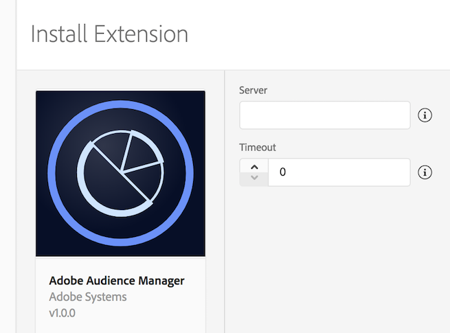

import Tabs from './tabs/index.md'

# Adobe Audience Manager

Adobe Audience Manager is a versatile audience data management platform. With the SDK, you can update audience profiles for users and retrieve user segment information from your mobile app. For more information, see [Adobe Audience Manager](https://business.adobe.com/products/audience-manager/adobe-audience-manager.html).

## Configuring the Audience Manager extension in the Data Collection UI

1. In the Data Collection UI, select the **Extensions** tab.
2. Choose **Catalog**, locate the **Adobe Audience Manager** extension, and select **Install**.
3. Type your Audience Manager server.
4. Type a timeout value. This value is the period, in seconds, to wait for a response from Audience Manager before timing out. For best practices, you should use a default value of 2s.
5. Select **Save**.
6. Follow the publishing process to update the SDK configuration.

## Add Audience Manager to your app

<TabsBlock orientation="horizontal" slots="heading, content" repeat="2"/>

Android

<Tabs query="platform=android&task=add"/>

iOS

<Tabs query="platform=ios&task=add"/>

## Register Audience Manager with Mobile Core

<TabsBlock orientation="horizontal" slots="heading, content" repeat="2"/>

Android

<Tabs query="platform=android&task=register"/>

iOS

<Tabs query="platform=ios&task=register"/>

## Implement Audience Manager APIs

For more information about implementing Audience Manager APIs, please read the [Audience Manager API reference](./api-reference.md).

## Configuration keys

To update SDK configuration programmatically, use the following information to change your Audience Manager configuration values. For more information, see the [Configuration API reference](../mobile-core/configuration/api-reference.md).

| Key | Required | Description | Data Type |
| :--- | :--- | :--- | :--- |
| `audience.server` | Yes | Server endpoint used to collect Audience Manager data | String |
| `audience.timeout` | No | Time, in seconds, to wait for a response from Audience Manager before timing out. Default value is 2 seconds. | Integer |

## Additional information

* How do you find your Audience Manager server?
* Want to know more about setting up Adobe Analytics server-side forwarding to Audience Manager?
  * [Server-side forwarding overview](https://experienceleague.adobe.com/docs/analytics/admin/admin-tools/server-side-forwarding/ssf.html)
  * [Set up server-side forwarding with Audience Manager](../adobe-analytics/index.md#server-side-forwarding-with-audience-manager)

