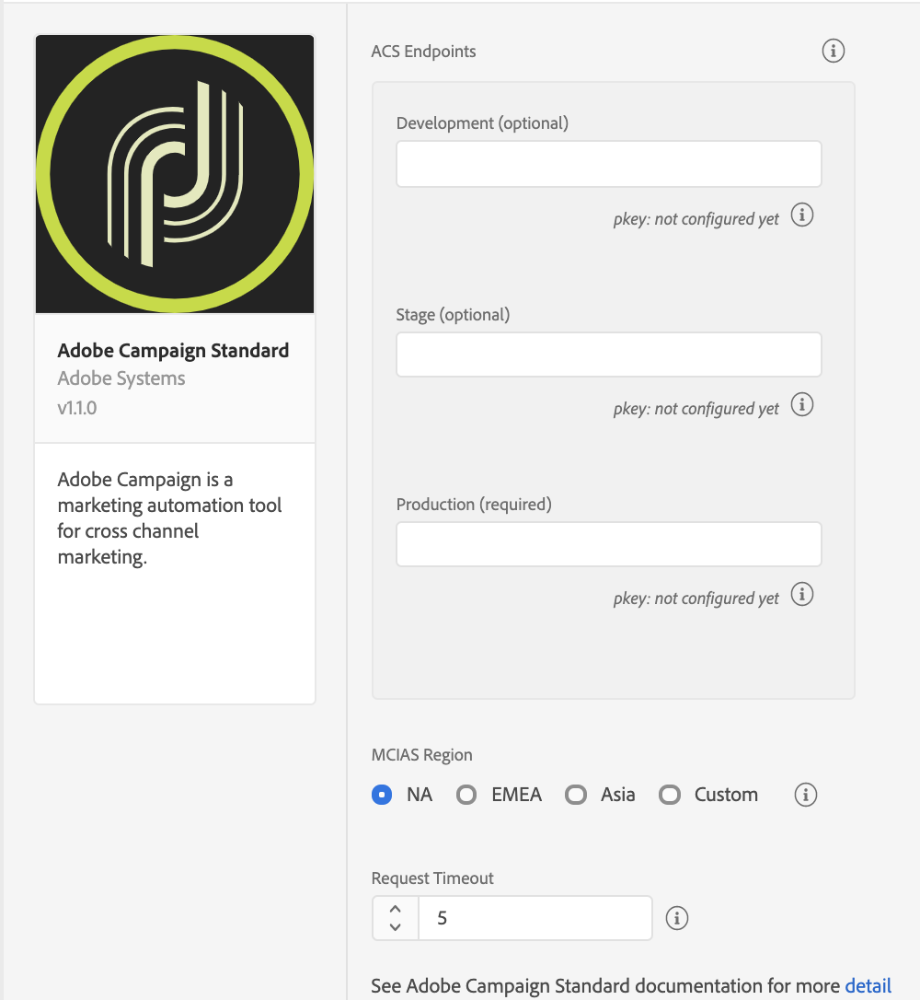

import Tabs from './tabs/index.md'

# Adobe Campaign Standard

<InlineAlert variant="info" slots="text"/>

**Before** you install or configure the Campaign Standard extension, please read the [getting started guide](../getting-started/create-a-mobile-property.md) and the [configuring a mobile application using Adobe Experience Platform SDKs guide](https://experienceleague.adobe.com/docs/campaign-standard/using/administrating/configuring-channels/configuring-a-mobile-application.html).

## Configure the Campaign Standard extension in the Data Collection UI

1. In the Data Collection UI, select the **Extensions** tab.
2. On the **Catalog** tab, locate the **Adobe Campaign Standard** extension, and select **Install**.
3. Provide the extension settings.
4. Select **Save**.
5. Follow the publishing process to update SDK configuration.

### Configure the Campaign Standard extension

### Campaign Standard endpoints

Provide endpoint URL(s) for your Campaign Standard instances. You can specify up to three unique endpoints for your development, staging, and production environments. In most cases, the server endpoint is the root URL address, such as `companyname.campaign.adobe.com`.

<InlineAlert variant="warning" slots="text"/>

For this extension, these endpoint URLs **do not** contain the `http://` or `https://` and **cannot** end with a forward slash.

#### pKey

A unique, automatically generated identifier for a mobile app that was configured in Adobe Campaign Standard. After you configure this extension in the Data Collection UI, configure your mobile property in Campaign Standard. For more information, please read the tutorial on [configuring a mobile application in Adobe Campaign](https://experienceleague.adobe.com/docs/campaign-standard/using/administrating/configuring-channels/configuring-a-mobile-application.html).

After the configuration is successful in Campaign, the pKey is automatically generated and configured in the Campaign extension for a successful validation.

#### MCIAS region

Select an MCIAS region based on your customer's location or enter a custom endpoint. The SDK retrieves all in-app messaging rules and definition payloads from this endpoint.

<InlineAlert variant="warning" slots="text"/>

For this extension, the custom MCIAS endpoint URL **do not** contain the `http://` or `https://` and **cannot** end with a forward slash.

#### Request timeout

The request timeout is the time in seconds to wait for a response from the in-app messaging service before timing out. The default timeout value is 5 seconds, and the minimum timeout value is 1 second.

<InlineAlert variant="warning" slots="text"/>

The request timeout value must be a non-zero number.

## Add the Campaign Standard extension to your app

Remember the following information when you add the Campaign extension to your app:

| Extension | Information |
| :--- | :--- |
| Campaign Standard | The Campaign Standard extension requires the [Mobile Core](../mobile-core/index.md), [Profile](../profile/index.md), [Lifecycle](../mobile-core/lifecycle/index.md), and [Signal](../mobile-core/signal/index.md) extensions. You should always ensure that you get the latest version of the extensions. |
| Profile | The Profile extension is required for in-app trigger frequencies to work accurately. For more information, see [Profile](../profile/index.md). |
| Signal | The Signal extension is required for all postback rules to work. For more information, see [Signal](../mobile-core/signal/index.md). |
| Lifecycle | The Lifecycle extension is required for a profile to be registered in Campaign. In order to do this, you will need to implement the Lifecycle APIs. For more information, please read either the [Lifecycle API (Android)](../mobile-core/lifecycle/android.md) or the [Lifecycle API (iOS)](../mobile-core/lifecycle/ios.md) documentation. |

<InlineAlert variant="info" slots="text"/>

The instructions to add these extensions to your mobile app are also available in the Data Collection UI. To access the installation dialog box, open your mobile property, select the **Environments** tab, followed by **Install**.

<TabsBlock orientation="horizontal" slots="heading, content" repeat="2"/>

Android

<Tabs query="platform=android&task=add"/>

iOS

<Tabs query="platform=ios&task=add"/>

### Register the Campaign Standard extension with Mobile Core

<TabsBlock orientation="horizontal" slots="heading, content" repeat="2"/>

Android

<Tabs query="platform=android&task=register"/>

iOS

<Tabs query="platform=ios&task=register"/>

### Initialize the SDK and set up tracking

To initialize the SDK and set up tracking, see the [initialize the SDK and set up tracking tutorial](../getting-started/track-events.md).

<TabsBlock orientation="horizontal" slots="heading, content" repeat="2"/>

Android

<Tabs query="platform=android&task=initialize"/>

iOS

<Tabs query="platform=ios&task=initialize"/>

### Set up push messaging

To enable push messaging with Adobe Campaign, call `setPushIdentifer` to send the push identifier that is received from the Apple Push Notification Service (APNS) or Firebase Cloud Messaging Platform (FCM) to the Adobe Identity service. For more information about the `setPushIdentifer` API, see the [setPushIdentifier section of the Adobe Identity API guide](../mobile-core/identity/api-reference.md#setpushidentifier).

For more information about setting up your iOS app to connect to APNS and retrieve a device token that will be used as a push identifier, see the tutorial on [registering your app with APNs](https://developer.apple.com/documentation/usernotifications/registering_your_app_with_apns?language=objc). For more information about setting up your Android app to connect to FCM and retrieve a device registration token that will be used as a push identifier, see the tutorial on [setting up a Firebase Cloud Messaging client app on Android](https://firebase.google.com/docs/cloud-messaging/android/client).

<InlineAlert variant="info" slots="text"/>

To learn more about creating a push notification using Adobe Campaign, see the tutorial on [preparing and sending a push notification](https://experienceleague.adobe.com/docs/campaign-standard/using/communication-channels/push-notifications/preparing-and-sending-a-push-notification.html).

<TabsBlock orientation="horizontal" slots="heading, content" repeat="2"/>

Android

<Tabs query="platform=android&task=push-messaging"/>

iOS

<Tabs query="platform=ios&task=push-messaging"/>

## Tracking local and push notification message interactions

User interactions with local or push notifications can be tracked by invoking the `collectMessageInfo` API. After the API is invoked, a network request is made to Campaign that contains the message interaction event.

<InlineAlert variant="warning" slots="text"/>

The code samples below are provided as examples on how to correctly invoke the `collectMessageInfo` API. For more specific details, please read the tutorials on [implementing local notification tracking](https://experienceleague.adobe.com/docs/campaign-standard/using/administrating/configuring-mobile/local-tracking.html) and [configuring push tracking](https://experienceleague.adobe.com/docs/campaign-standard/using/administrating/configuring-mobile/push-tracking.html) within the Adobe Campaign documentation.

<TabsBlock orientation="horizontal" slots="heading, content" repeat="2"/>

Android

<Tabs query="platform=android&task=track"/>

iOS

<Tabs query="platform=ios&task=track"/>

### Deleting mobile properties in the Data Collection UI

<InlineAlert variant="warning" slots="text"/>

Deleting your property in the Experience Platform Data Connection UI might cause disruption to your recurring push and in-app messaging activities.

In the Data Collection UI, if you delete your mobile property, review your mobile property status in the Campaign Standard extension and ensure that the property displays an updated **Deleted in Launch** status. For more information about deleting a property, please read the [delete a property](https://experienceleague.adobe.com/docs/experience-platform/tags/admin/companies-and-properties.html#delete-a-property) section within the Data Collection UI documentation.

To remove the corresponding mobile app in Campaign Standard, select **Remove from ACS**. For more information, see the section on [deleting your tags-enabled mobile application](https://experienceleague.adobe.com/docs/campaign-standard/using/administrating/configuring-channels/configuring-a-mobile-application.html#delete-app).

<InlineAlert variant="warning" slots="text"/>

Deleting your mobile property in the Data Collection UI does not automatically delete your Campaign Standard mobile app.

### Handling clickthrough destinations included in Campaign in-app messages

A destination URL can be added to in-app messages that are delivered from Adobe Campaign. The destination can be a website URL such as [https://www.adobe.com](https://www.adobe.com) or a deep link such as `campaigndemoapp://signupactivity?paidaccount=true` which can be used to direct the user to a specific area of your app.

<TabsBlock orientation="horizontal" slots="heading, content" repeat="2"/>

Android

<Tabs query="platform=android&task=handling"/>

iOS

<Tabs query="platform=ios&task=handling"/>

### Customizing the frequency of registration requests sent to Campaign

The frequency of registration requests sent to Campaign are reduced starting with Campaign Standard Android extension version 1.0.7 and iOS extension version 1.0.6. The default registration delay is seven days since the last successful registration. This registration delay can be configured to provide more flexibility on when to send a registration request.

<InlineAlert variant="warning" slots="text"/>

The configuration setting to pause registration requests is provided for specific use cases only. The use of this configuration setting should be **avoided** when possible.

<TabsBlock orientation="horizontal" slots="heading, content" repeat="2"/>

Android

<Tabs query="platform=android&task=customize"/>

iOS

<Tabs query="platform=ios&task=customize"/>

Giving a value of `0` when setting `campaign.registrationDelay` will send a registration request on every launch event. This is the previous behavior seen before the registration request reduction enhancement was added.

## Configuration keys

To update SDK configuration programmatically, use the following information to change your Campaign Standard configuration values. For more information, see the [Configuration API reference](../mobile-core/configuration/api-reference.md).

| Key | Required | Description | Data Type |
| :--- | :--- | :--- | :--- |
| `campaign.timeout` | Yes | Sets the amount of time to wait for a response from the in-app messaging service. | Integer |
| `campaign.mcias` | Yes | Sets the in-app messaging service URL endpoint. | String |
| `campaign.server` | Yes | Sets the endpoint URL for the production environment in the Adobe Campaign Standard instance. | String |
| `campaign.pkey` | Yes | Sets the identifier for a mobile app that was configured in the production environment in the Adobe Campaign Standard. | String |
| `build.environment` | Yes | Specifies which environment to use (prod, dev, or staging) when sending registration information. | String |
| `__dev__campaign.pkey` | No | Sets the identifier for a mobile app that was configured in the development environment in Adobe Campaign Standard. | String |
| `__dev__campaign.server` | No | Sets the endpoint URL for the development environment in the Adobe Campaign Standard instance. | String |
| `__stage__campaign.pkey` | No | Sets the identifier for a mobile app that was configured in the staging environment in Adobe Campaign Standard. | String |
| `__stage__campaign.server` | No | Sets the endpoint URL for the staging environment in the Adobe Campaign Standard instance. | String |
| `campaign.registrationDelay` | No | Sets the number of days to delay the sending of the next Adobe Campaign Standard registration request. | Integer |
| `campaign.registrationPaused` | No | Sets the Adobe Campaign Standard registration request paused status. | Boolean |

