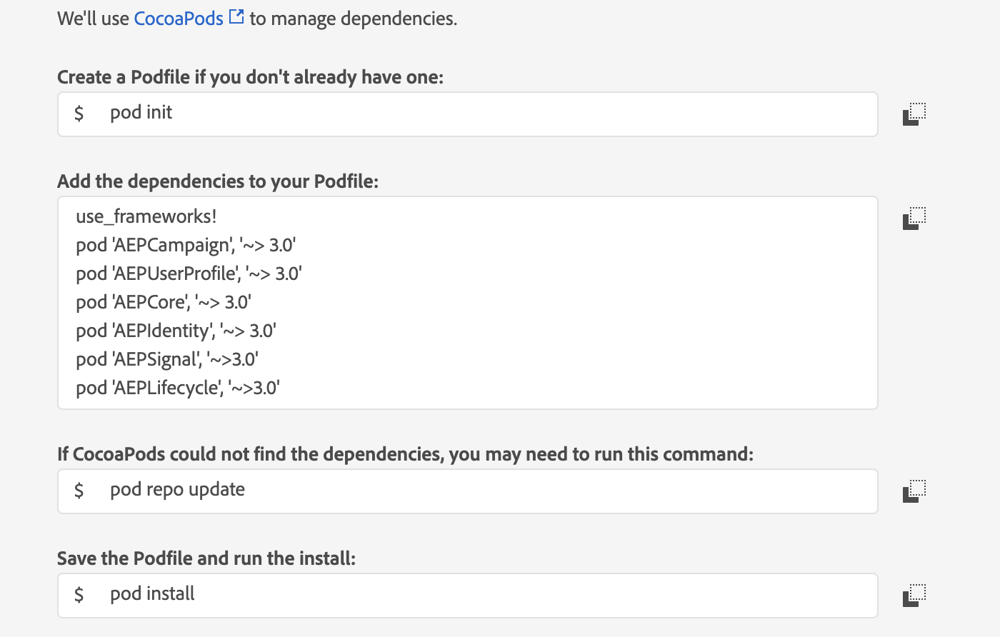

<Variant platform="android" task="add" repeat="5"/>

1. Add the Campaign Standard, [Mobile Core](../mobile-core/index.md) and [Profile](../profile/index.md) extensions to your project using the app's Gradle file.

```java
implementation 'com.adobe.marketing.mobile:campaign:2.+'
implementation 'com.adobe.marketing.mobile:core:2.+'
implementation 'com.adobe.marketing.mobile:identity:2.+'
implementation 'com.adobe.marketing.mobile:lifecycle:2.+'
implementation 'com.adobe.marketing.mobile:signal:2.+'
implementation 'com.adobe.marketing.mobile:userprofile:2.+'
```

<InlineNestedAlert variant="warning" header="false" iconPosition="left">

Using dynamic dependency versions is **not** recommended for production apps. Please read the [managing Gradle dependencies guide](../resources/manage-gradle-dependencies.md) for more information. 

</InlineNestedAlert>

2. Import the Campaign Standard, [Mobile Core](../mobile-core/index.md), [Profile](../profile/index.md), [Lifecycle](../mobile-core/lifecycle/index.md), and [Signal](../mobile-core/signals/index.md) extensions in your application's main activity.

```java
import com.adobe.marketing.mobile.Campaign;
import com.adobe.marketing.mobile.Identity;
import com.adobe.marketing.mobile.Lifecycle;
import com.adobe.marketing.mobile.MobileCore;
import com.adobe.marketing.mobile.Signal;
import com.adobe.marketing.mobile.UserProfile;
```

<Variant platform="ios" task="add" repeat="7"/>

1. Add the Campaign Standard, [Mobile Core](../mobile-core/index.md), and [Profile](../profile/index.md) extensions to your project using Cocoapods.



2. In Xcode, import the Mobile Core, Campaign Standard, Profile, Lifecycle, Identity, Signal, and Services extensions:

**Swift**

```swift
import AEPCore
import AEPCampaign
import AEPUserProfile
import AEPIdentity
import AEPLifecycle
import AEPSignal
import AEPServices
```

**Objective-C**

```objective-c
@import AEPCore;
@import AEPCampaign;
@import AEPUserProfile;
@import AEPIdentity;
@import AEPLifecycle;
@import AEPSignal;
@import AEPServices;
```

<Variant platform="android" task="register" repeat="4"/>

In your app's `OnCreate` method, call the `setApplication` method.

#### Java

```java
public class MainApp extends Application {
    private static final String APP_ID = "YOUR_APP_ID";

    @Override
    public void onCreate() {
        super.onCreate();

        MobileCore.setApplication(this);
        MobileCore.configureWithAppID(APP_ID);

        List<Class<? extends Extension>> extensions = new ArrayList<>();
        extensions.add(Campaign.EXTENSION);
        extensions.add(Identity.EXTENSION);
        extensions.add(Lifecycle.EXTENSION);
        extensions.add(Signal.EXTENSION);
        extensions.add(UserProfile.EXTENSION);
        MobileCore.registerExtensions(extensions, o -> {
            Log.d(LOG_TAG, "AEP Mobile SDK is initialized");
        });
    }

}
```

#### Kotlin

```java
class MyApp : Application() {

    override fun onCreate() {
        super.onCreate()
        MobileCore.setApplication(this)
        MobileCore.configureWithAppID("YOUR_APP_ID")

        val extensions = listOf(Campaign.EXTENSION, Identity.EXTENSION, Lifecycle.EXTENSION, Signal.EXTENSION, UserProfile.EXTENSION)
        MobileCore.registerExtensions(extensions) {
            Log.d(LOG_TAG, "AEP Mobile SDK is initialized")
        }
    }

}
```

For more information about starting Lifecycle, see the [Lifecycle extension in Android guide](../mobile-core/lifecycle/android.md).

<Variant platform="ios" task="register" repeat="6"/>

In your app's `application:didFinishLaunchingWithOptions:` method, register the Campaign, Identity, Signal, and Lifecycle extensions:

#### Swift

```swift
func application(_ application: UIApplication, didFinishLaunchingWithOptions launchOptions: [UIApplication.LaunchOptionsKey: Any]?) -> Bool {
  MobileCore.setLogLevel(.debug)
  let appState = application.applicationState
  let extensions = [
    Campaign.self,
    UserProfile.self,
    Identity.self,
    Lifecycle.self,
    Signal.self
  ]
  MobileCore.registerExtensions(extensions, {
    MobileCore.configureWith(appId: "APP-ID")
    if appState != .background {
      MobileCore.lifecycleStart(additionalContextData: ["contextDataKey": "contextDataVal"])
    }
  })

  return true;
}
```

#### Objective-C

```objective-c
- (BOOL)application:(UIApplication *)application didFinishLaunchingWithOptions:(NSDictionary *)launchOptions
{
  [AEPMobileCore setLogLevel: AEPLogLevelDebug];
  NSArray *extensionsToRegister = @[
    AEPMobileCampaign.class,
    AEPMobileUserProfile.class,
    AEPMobileIdentity.class,
    AEPMobileLifecycle.class,
    AEPMobileSignal.class
  ];
  [AEPMobileCore registerExtensions:extensionsToRegister completion:^{
  [AEPMobileCore lifecycleStart:@{@"contextDataKey": @"contextDataVal"}];
  }];
  [AEPMobileCore configureWithAppId: @"APP-ID"];
  // Override point for customization after application launch.
  return YES;
}
```

For more information about starting Lifecycle, see the [Lifecycle extension in iOS guide](../mobile-core/lifecycle/ios.md).

<Variant platform="android" task="initialize" repeat="6"/>

#### Set up in-app messaging

To learn how to create an in-app message using Adobe Campaign, see the [tutorial on preparing and sending an in-app message](https://experienceleague.adobe.com/docs/campaign-standard/using/communication-channels/in-app-messaging/preparing-and-sending-an-in-app-message.html).

#### Set up local notifications

To set up local notifications in Android, update the AndroidManifest.xml file:

```markup
<receiver android:name="com.adobe.marketing.mobile.LocalNotificationHandler"/>
```

To configure the notification icons that the local notification will use, see the [configuring notification icons section](../mobile-core/api-reference.md#setsmalliconresourceid--setlargeiconresourceid) within the Mobile Core.

<Variant platform="ios" task="initialize" repeat="1"/>

No additional setup is needed for iOS in-app messaging and local notifications.

<Variant platform="android" task="push-messaging" repeat="3"/>

#### Java

**Example**

```java
FirebaseInstanceId.getInstance().getInstanceId()
        .addOnCompleteListener(new OnCompleteListener<InstanceIdResult>() {
            @Override
            public void onComplete(@NonNull Task<InstanceIdResult> task) {
                if (!task.isSuccessful()) {
                    return;
                }
                // Get new Instance ID token
                String registrationID = task.getResult().getToken();
                // Log and toast
                System.out.println("Received new registration token: " + registrationID);
                // invoke the API to send the push identifier to the Identity Service
                MobileCore.setPushIdentifier(registrationID);
            }
});
```

<Variant platform="ios" task="push-messaging" repeat="7"/>

iOS simulators do **not** support push messaging.

#### Swift

**Example**

```swift
func application(_ application: UIApplication, didRegisterForRemoteNotificationsWithDeviceToken deviceToken: Data) {
  // Set the deviceToken that the APNS has assigned to the device
  MobileCore.setPushIdentifier(deviceToken: deviceToken)
  //...
}
```

#### Objective-C

**Example**

```objective-c
- (void) application:(UIApplication *)application didRegisterForRemoteNotificationsWithDeviceToken:(NSData *)deviceToken {
  // Set the deviceToken that the APNS has assigned to the device
  [AEPMobileCore setPushIdentifier:deviceToken];
  //...
}
```

<Variant platform="android" task="track" repeat="6"/>

#### Java

**Syntax**

```java
public static void collectMessageInfo(final Map<String, Object> messageInfo)
```

* _messageInfo_ is a map that contains the delivery ID, message ID, and action type for a local or push notification for which there were interactions. The delivery and message IDs are extracted from the notification payload.

**Example**

```java
@Override
protected void onResume() {
  super.onResume();
  handleTracking();
}

// handle notification open and click tracking
private void handleTracking() {
  Intent intent = getIntent();
  Bundle data = intent.getExtras();
  HashMap<String, Object> userInfo = null;

  if (data != null) {
    userInfo = (HashMap)data.get("NOTIFICATION_USER_INFO");
  } else {
    return;
  }

  // Check if we have notification user info.
  // If it is present, this view was opened based on a notification.
  if (userInfo != null) {
    String deliveryId = (String)userInfo.get("deliveryId");
    String broadlogId = (String)userInfo.get("broadlogId");

    HashMap<String, Object> contextData = new HashMap<>();

    if (deliveryId != null && broadlogId != null) {
      contextData.put("deliveryId", deliveryId);
      contextData.put("broadlogId", broadlogId);

      // Send Click Tracking since the user did click on the notification
      contextData.put("action", "2");
      MobileCore.collectMessageInfo(contextData);

      // Send Open Tracking since the user opened the app
      contextData.put("action", "1");
      MobileCore.collectMessageInfo(contextData);
    }
  }
}
```

<Variant platform="ios" task="track" repeat="12"/>

#### Swift

**Syntax**

```swift
static func collectMessageInfo(_ messageInfo: [String: Any])
```

* _messageInfo_ is a dictionary that contains the delivery ID, message ID, and action type for a local or push notification for which there were interactions. The delivery and message IDs are extracted from the notification payload.

**Example**

```swift
// Handle notification interaction from background or closed
func userNotificationCenter(_ center: UNUserNotificationCenter, didReceive response: UNNotificationResponse, withCompletionHandler completionHandler: @escaping () -> Void) {
  DispatchQueue.main.async(execute: {
    let userInfo = response.notification.request.content.userInfo
    var broadlogId:String = (userInfo["_mId"] ?? userInfo["broadlogId"]) as! String
    var deliveryId:String = (userInfo["_dId"] ?? userInfo["deliveryId"]) as! String

    if (broadlogId.count == 0 || deliveryId.count == 0) {
      return
    }
    // Send Click Tracking since the user did click on the notification
    MobileCore.collectMessageInfo([
      "broadlogId": broadlogId,
      "deliveryId": deliveryId,
      "action": "2"
    ])
    // Send Open Tracking since the user opened the app
    MobileCore.collectMessageInfo([
      "broadlogId": broadlogId,
      "deliveryId": deliveryId,
      "action": "1"
    ])
  })
}
```

#### Objective-C

**Syntax**

```objective-c
+ (void) collectMessageInfo:(NSDictionary<NSString *,id> * _Nonnull)
```

* _messageInfo_ is a dictionary that contains the delivery ID, message ID, and action type for a local or push notification for which there were interactions. The delivery and message IDs are extracted from the notification payload.

**Example**

```objectivec
// Handle notification interaction from background or closed
-(void)userNotificationCenter:(UNUserNotificationCenter *)center didReceiveNotificationResponse:(UNNotificationResponse *)response withCompletionHandler:(void(^)(void))completionHandler{
  dispatch_async(dispatch_get_main_queue(), ^{
    NSDictionary *userInfo = response.notification.request.content.userInfo;
    NSString *broadlogId = userInfo[@"_mId"] ?: userInfo[@"broadlogId"];
    NSString *deliveryId = userInfo[@"_dId"] ?: userInfo[@"deliveryId"];

    if(!broadlogId.length || !deliveryId.length){
      return;
    }
    
    // Send Click Tracking since the user did click on the notification
    [AEPMobileCore collectMessageInfo:@{
      @"broadlogId" : broadlogId,
      @"deliveryId": deliveryId,
      @"action": @"2"
    }];
    // Send Open Tracking since the user opened the app
    [AEPMobileCore collectMessageInfo:@{
      @"broadlogId" : broadlogId,
      @"deliveryId": deliveryId,
      @"action": @"1"
    }];
  });
}
```

<Variant platform="android" task="handling" repeat="10"/>

#### Handling in-app message website URLs on Android

Website URL's are handled without any additional action by the app developer. If an in-app message is clicked through and contains a valid URL, the device's default web browser will redirect to the URL contained in the in-app notification payload. The location of the URL differs for each notification type:

* The `url` key is present in the alert message payload
* The `url` is present in the query parameters of a fullscreen message button (`data-destination-url`)
* The `adb_deeplink` key is present in the local notification payload
* The `uri` key is present in the push notification payload

#### Handling in-app message deep links on Android

To handle deep links in the notification payload, you need to set up URL schemes in the app. For more information about setting URL schemes for Android, please read the tutorial on [creating deep links to app content](https://developer.android.com/training/app-links/deep-linking). Once the desired activity is started by the newly added intent filter, the data present in the deep link can be retrieved. After that point, any further actions based on the data present in the deep link can be made.

#### Java

```java
@Override
public void onCreate(Bundle savedInstanceState) {
    super.onCreate(savedInstanceState);
    setContentView(R.layout.main);

    Intent intent = getIntent();
    String action = intent.getAction();
    Uri data = intent.getData();
      // parse any data present in the deep link
}
```

#### Handling in-app message app links on Android

Android app links were introduced with Android OS 6.0. They are similar to deep links in functionality, although they have the appearance of a standard website URL. The intent filter previously set up for deep links is modified to handle `http` schemes and verification of the app link needs to be set up on [Google Search Console](https://support.google.com/webmasters/answer/9008080).

For more information on the additional verification setup needed, please read the tutorial on [verifying Android app links](https://developer.android.com/training/app-links/verify-site-associations.html). The resulting app link can be used to redirect to specific areas of your app if the app is installed or redirect to your app's website if the app isn't installed. For more information on Android app links, please read the guide on [handling Android app links](https://developer.android.com/training/app-links/index.html#add-app-links).

<Variant platform="ios" task="handling" repeat="27"/>

#### Handling alert or fullscreen notification website URLs on iOS

Website URL's included in alert or fullscreen messages are handled without any additional action by the app developer. If an alert of fullscreen message is clicked through and contains a valid URL, the Safari browser will be used to load the URL contained in the notification payload. The location of the URL differs for each notification type:

* The `url` key is present in the alert message payload
* The `url` is present in the query parameters of a fullscreen message button (`data-destination-url`)
* The `adb_deeplink` key is present in the local notification payload
* The `uri` key is present in the push notification payload

#### Handling local notification website URLs on iOS

**Swift**

The website URL in the local notification response can be loaded using the UrlService's `openUrl` method.

```swift
func userNotificationCenter(_ center: UNUserNotificationCenter, didReceive response: UNNotificationResponse, withCompletionHandler completionHandler: @escaping () -> Void) {
    DispatchQueue.main.async(execute: {
        let userInfo = response.notification.request.content.userInfo
        let urlString = userInfo["adb_deeplink"] as? String
        if (urlString?.count ?? 0) != 0 {
            if let url = URL(string: urlString ?? "") {
              ServiceProvider.shared.urlService.openUrl(url)
            }
        }
        completionHandler()
    })
}
```

**Objective-C**

The website URL in the local notification response can be loaded using the [openURL:options:completionHandler:](https://developer.apple.com/documentation/uikit/uiapplication/1648685-openurl?language=objc) instance method.

```objective-c
-(void)userNotificationCenter:(UNUserNotificationCenter *)center didReceiveNotificationResponse:(UNNotificationResponse *)response withCompletionHandler:(void(^)(void))completionHandler{
    dispatch_async(dispatch_get_main_queue(), ^{
      NSDictionary *userInfo = response.notification.request.content.userInfo;
      NSString *urlString = userInfo[@"adb_deeplink"];
      if(urlString.length){
          [[UIApplication sharedApplication] openURL:[NSURL URLWithString: urlString] options:@{} completionHandler:^(BOOL success) {
            NSLog(@"Open %@: %d",urlString,success);
        }];
            }
        completionHandler();
        });   
}
```

#### Handling push notification website URLs on iOS

**Swift**

The website URL in the push notification response can be loaded using the UrlService's `openUrl` method.

```swift
func application(_ application: UIApplication, didReceiveRemoteNotification userInfo: [AnyHashable : Any], fetchCompletionHandler completionHandler: @escaping (UIBackgroundFetchResult) -> Void) {
    DispatchQueue.main.async(execute: {
        let urlString = userInfo["uri"] as? String
        if (urlString?.count ?? 0) != 0 {
            if let url = URL(string: urlString ?? "") {
                ServiceProvider.shared.urlService.openUrl(url)
            }
        }
        completionHandler(UIBackgroundFetchResultNoData)
    })
}
```

**Objective-C**

The website URL in the push notification can be loaded using the [openURL:options:completionHandler:](https://developer.apple.com/documentation/uikit/uiapplication/1648685-openurl?language=objc) instance method.

```objective-c
- (void)application:(UIApplication *)application didReceiveRemoteNotification:(NSDictionary *)userInfo
fetchCompletionHandler:(void (^)(UIBackgroundFetchResult result))completionHandler {
    dispatch_async(dispatch_get_main_queue(), ^{
      NSString *urlString = userInfo[@"uri"];
      if(urlString.length){
          [[UIApplication sharedApplication] openURL:[NSURL URLWithString: urlString] options:@{} completionHandler:^(BOOL success) {
            NSLog(@"Open %@: %d",urlString,success);
        }];
            }
        completionHandler(UIBackgroundFetchResultNoData);
    });
}
```

#### Handling local or push notification deep links on iOS

When a local or push notification is clicked through, the `didReceiveNotificationResponse` instance method is called with the notification response being passed in as a parameter. For more information, see the Apple developer docs at [userNotificationCenter:didReceiveNotificationResponse:withCompletionHandler:](https://developer.apple.com/documentation/usernotifications/unusernotificationcenterdelegate/1649501-usernotificationcenter?language=objc).

The deep link URL can be retrieved from the response object passed into the handler method. An example for retrieving the deep link URL and loading web links is provided below. The retrieved URL can then be parsed to aid with app navigation decision making. For more information about handling deep links and setting URL schemes for iOS, see the tutorial on [defining a custom URL scheme for your app](https://developer.apple.com/documentation/xcode/defining-a-custom-url-scheme-for-your-app).

**Swift**

```swift
func userNotificationCenter(_ center: UNUserNotificationCenter, didReceive response: UNNotificationResponse, withCompletionHandler completionHandler: @escaping () -> Void) {
    DispatchQueue.main.async(execute: {
        let userInfo = response.notification.request.content.userInfo
        let urlString = userInfo["adb_deeplink"] as? String
        let urlString2 = userInfo["uri"] as? String
        if (urlString?.count ?? 0) != 0 {
            // handle the local notification deep link (parse any data present in the deep link and/or redirect to a desired area within the app)
        } else if (urlString2?.count ?? 0) != 0 {
            // handle the push notification deep link (parse any data present in the deep link and/or redirect to a desired area within the app)
        }
        completionHandler()
    })
}
```

**Objective-C**

```objective-c
-(void)userNotificationCenter:(UNUserNotificationCenter *)center didReceiveNotificationResponse:(UNNotificationResponse *)response withCompletionHandler:(void(^)(void))completionHandler{
    dispatch_async(dispatch_get_main_queue(), ^{
      NSDictionary *userInfo = response.notification.request.content.userInfo;
      NSString *urlString = userInfo[@"adb_deeplink"];
      NSString *urlString2 = userInfo[@"uri"];
      if(urlString.length){
            // handle the local notification deep link (parse any data present in the deep link and/or redirect to a desired area within the app)
            }else if(urlString2.length){
        // handle the push notification deep link (parse any data present in the deep link and/or redirect to a desired area within the app)
      }
        completionHandler();
        });   
}
```

#### Handling in-app message universal links on iOS

Universal links are available for devices on iOS 9.0 or later. They can be used to redirect to specific areas of your app if the app is installed or redirect to your app's website if the app isn't installed. For more information, see the guide on [allowing apps and websites to link to your content](https://developer.apple.com/documentation/xcode/allowing-apps-and-websites-to-link-to-your-content).

Universal links are typically used from outside your installed app. For example, a universal link would be used from a link present on a website or a link included in an email message. iOS will **not** open a universal link if it determines that the link is being opened from within the app it links to. For more information on this limitation, see the "Preparing Your App to Handle Universal Links" section within the documentation on [supporting universal links](https://developer.apple.com/library/archive/documentation/General/Conceptual/AppSearch/UniversalLinks.html#//apple_ref/doc/uid/TP40016308-CH12-SW2). If a universal link is included as a Campaign clickthrough destination, the link must be handled by the app developer in a similar fashion as a deep link. More information can be seen in the [handling alert or fullscreen notification deep links on iOS](#handling-alert-or-fullscreen-notification-deep-links-on-ios) and [handling local or push notification deep links on iOS](#handling-local-or-push-notification-deep-links-on-ios) sections.

<Variant platform="android" task="customize" repeat="3"/>

#### Java

**Example**

```java
MobileCore.updateConfiguration(new HashMap<String, Object>() {
  {
    put("campaign.registrationDelay", 30); // number of days to delay sending a registration request.
    put("campaign.registrationPaused", false); // boolean signaling if registration requests should be paused
  }
});
```

<Variant platform="ios" task="customize" repeat="6"/>

#### Swift

**Example**

```swift
var config = [AnyHashable: Any]()
config["campaign.registrationDelay"] = 30 // number of days to delay sending a registration request.
config["campaign.registrationPaused"] = false // boolean signaling if registration requests should be paused
MobileCore.updateConfiguration(config)
```

#### Objective-C

**Example**

```objective-c
NSMutableDictionary *config = [@{} mutableCopy];
config[@"campaign.registrationDelay"] = @30; // number of days to delay sending a registration request.
config[@"campaign.registrationPaused"] = [NSNumber numberWithBool:NO]; // boolean signaling if registration requests should be paused
[AEPMobileCore updateConfiguration:config];
```
