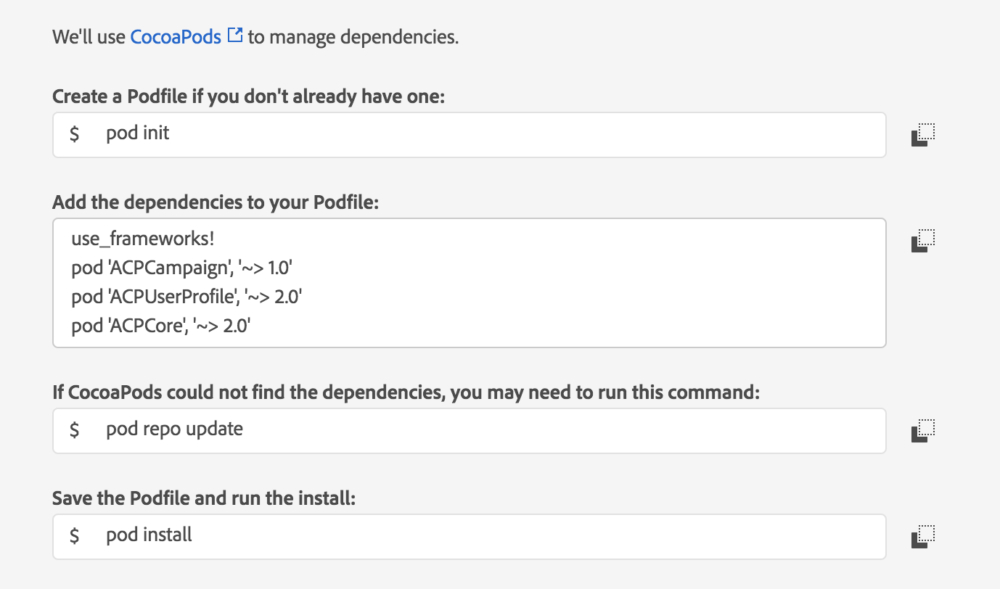

1. Add the Campaign Standard, [Mobile Core](../mobile-core/index.md) and [Profile](../profile/index.md) extensions to your project using Cocoapods.

   

   To complete a manual installation, go to the [Adobe Experience Platform SDKs for iOS GitHub](https://github.com/Adobe-Marketing-Cloud/acp-sdks/tree/master/iOS) repo, fetch the Mobile Core, Campaign Standard, Profile, Lifecycle, and Signal artifacts, and complete the steps in the [manual installation](https://github.com/Adobe-Marketing-Cloud/acp-sdks/blob/master/README.md#manual-installation-1) section.

2. In Xcode, import the Mobile Core, Campaign Standard, Profile, Lifecycle, and Signal extensions:

   **Objective-C**

   ```objectivec
    #import "ACPCore.h"
    #import "ACPCampaign.h"
    #import "ACPUserProfile.h"
    #import "ACPIdentity.h"
    #import "ACPLifecycle.h"
    #import "ACPSignal.h"
   ```

   **Swift**

   ```swift
    import ACPCore
    import ACPCampaign
    import ACPUserProfile
   ```