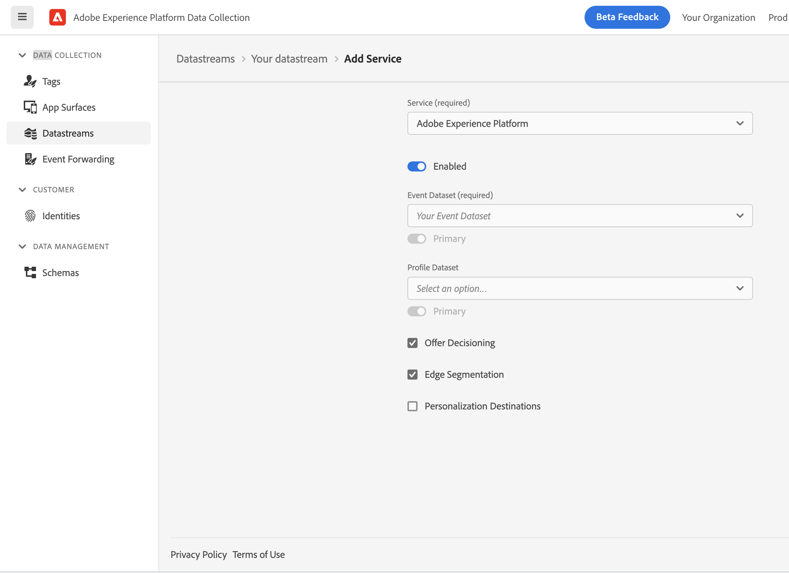
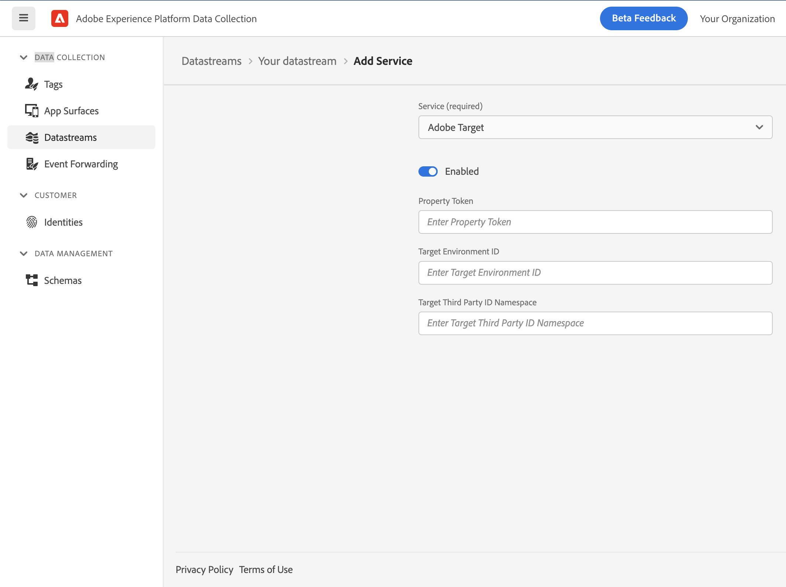
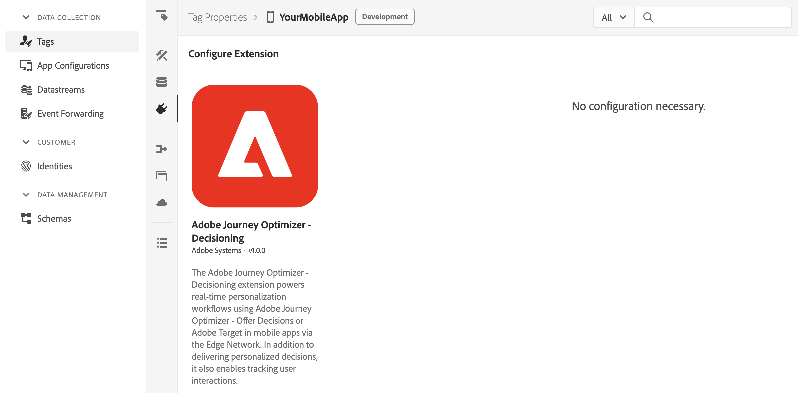
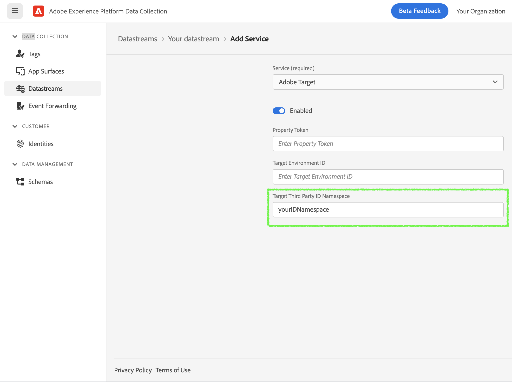
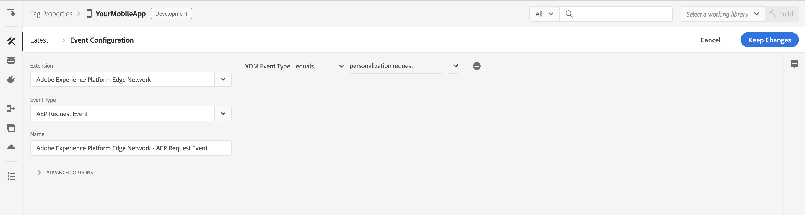
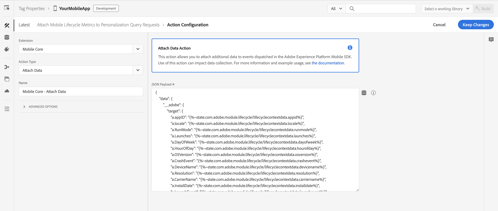
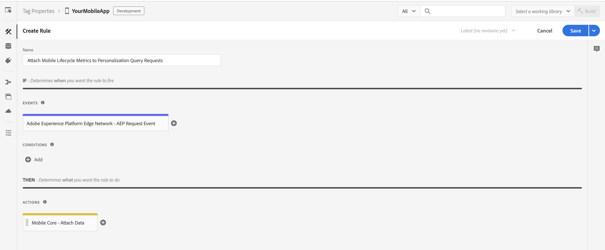

import Tabs from './tabs/index.md'

# Adobe Journey Optimizer - Decisioning Extension

The Adobe Journey Optimizer - Decisioning extension powers real-time personalization workflows using Adobe Journey Optimizer - Offer Decisioning or Adobe Target in mobile apps via the Edge Network. It helps deliver personalized decisions to your app and enables tracking user interactions with the proposed decisions.

## Prerequisites

Before starting, make sure the following steps are completed.

* Your organization is provisioned for edge decisioning. 
* If using Adobe Target, Target activities are set up in your desired workspace in your organization on Target UI. For more details, see the [Target activities guide](https://experienceleague.adobe.com/docs/target/using/activities/target-activities-guide.html?lang=en).
* If using Journey Optimizer - Offer Decisioning, decisions are set up in your desired sandbox in your organization on Experience Platform UI. For more details, see the [create decisions guide](https://experienceleague.adobe.com/docs/offer-decisioning/using/create-manage-activities/create-offer-activities.html?lang=en).

## Adobe Experience Platform Data Collection setup

### Configure the Datastream for Adobe Target and/or Journey Optimizer - Offer Decisioning

On [Experience Platform Data Collection](https://experience.adobe.com/#/data-collection/), navigate to **Data Collection** > **Datatreams** using the left navigation panel. Select an existing datastream or create a new datastream. For more details, see the [configure datastreams guide](../getting-started/configure-datastreams.md).

1. In the datastream, click on the desired environment from the list. Make sure **Adobe Experience Platform** section is enabled and configured with the required information like **Sandbox** and **Event Dataset**.
2. For Journey Optimizer - Offer Decisioning, navigate to **Adobe Experience Platform** section and enable **Offer Decisioning** checkbox.

3. For Adobe Target, navigate to **Adobe Target** section and enable it. Specify the configuration. For more information on the configuration settings, refer to the [Administer Target Overview](https://experienceleague.adobe.com/docs/target/using/administer/administrating-target.html?lang=en).

1. Click **Save**.

### Configure Adobe Journey Optimizer - Decisioning extension in Tag property for Mobile

On [Experience Platform Data Collection](https://experience.adobe.com/#/data-collection/), navigate to **Data Collection** > **Tags** using the left navigation panel. Select an existing mobile tag property or create a new property.

1. In your mobile property, navigate to **Extensions** in the left navigation panel and click on the **Catalog** tab.
2. In the extensions Catalog, search or locate the **Adobe Journey Optimizer - Decisioning** extension, and click **Install**.
3. Since an extension configuration is not necessary, click **Save**.
4. Follow the publishing process to update SDK configuration. For more details, see the [publish the configuration guide](../getting-started/create-a-mobile-property.md.md#publish-the-configuration).



## Integrate Experience Platform Optimize SDK in your mobile application

<InlineAlert variant="warning" slots="text"/>

For the AEPOptimize APIs to work properly, you need to integrate Mobile Core and Edge extensions in your mobile app. For more details see, documentation on [Mobile Core](../mobile-core/index.md) and [Adobe Experience Platform Edge Network](../edge-network/index.md).

### Install the Experience Platform Mobile SDK

<TabsBlock orientation="horizontal" slots="heading, content" repeat="2"/>

Android

<Tabs query="platform=android&task=install"/>

iOS

<Tabs query="platform=ios&task=install"/>

### Register the extensions with Mobile Core

<TabsBlock orientation="horizontal" slots="heading, content" repeat="2"/>

Android

<Tabs query="platform=android&task=register"/>

iOS

<Tabs query="platform=ios&task=register"/>

## Adobe Journey Optimizer - Offer Decisioning

<InlineAlert variant="warning" slots="text"/>

Some offer constraints, such as Capping, are currently unsupported with the mobile Experience Edge workflows. The Capping field value specifies the number of times an offer can be presented across all users. For more details, see the [offer eligibility rules and constraints guide](https://experienceleague.adobe.com/docs/offer-decisioning/using/managing-offers-in-the-offer-library/creating-personalized-offers.html#eligibility).

### DecisionScope

The `DecisionScope` public class provides a constructor to create a scope object using the activityId, placementId, and optional itemCount. The decision scope activity and placement information can be obtained from the decision on the Experience Platform UI. 

<TabsBlock orientation="horizontal" slots="heading, content" repeat="2"/>

Android

<Tabs query="platform=android&task=decisionscope"/>

iOS

<Tabs query="platform=ios&task=decisionscope"/>

Alternately, another of the class's constructor can be used to create a scope object using the encoded decision scope. The encoded scope can also be read directly from the decision on the Experience Platform UI.

<TabsBlock orientation="horizontal" slots="heading, content" repeat="2"/>

Android

<Tabs query="platform=android&task=encodedscope"/>

iOS

<Tabs query="platform=ios&task=encodedscope"/>

## Adobe Target

### Target location

The `DecisionScope` public class provides a designated initializer which can be used to create a Target location (or mbox).

<TabsBlock orientation="horizontal" slots="heading, content" repeat="2"/>

Android

<Tabs query="platform=android&task=target-location"/>

iOS

<Tabs query="platform=ios&task=target-location"/>

### Target Parameters

Target Parameters can be sent in a personalization query request to the Experience Edge network by adding them in `data` dictionary when calling the `updatePropositions` API.

<TabsBlock orientation="horizontal" slots="heading, content" repeat="2"/>

Android

<Tabs query="platform=android&task=target-parameters"/>

iOS

<Tabs query="platform=ios&task=target-parameters"/>

### Target Third Party ID

To use Target Third Party ID in the Experience Edge mobile workflows, the corresponding namespace needs to be configured in Experience Platform Data Collection.

1. On [Experience Platform Data Collection](https://experience.adobe.com/#/data-collection/), navigate to **Data Collection** > **Datatreams** using the left navigation panel.
2. Select your configured datastream and click on the desired environment from the list.
3. Navigate to **Adobe Target** section, specify the **Target Third Party ID Namespace**.
4. Click **Save**.



In your mobile application, integrate the Identity for Edge Network extension to add the Target Third Party ID in the Identity Map in the personalization query request to the Edge network when calling the `updatePropositions` API. For more details, see the [Identity for Edge Network - updateIdentities API](../identity-for-edge-network/api-reference.md#updateidentities).

<TabsBlock orientation="horizontal" slots="heading, content" repeat="2"/>

Android

<Tabs query="platform=android&task=target-tpid"/>

iOS

<Tabs query="platform=ios&task=target-tpid"/>

### Target Audience Segmentation using Mobile Lifecycle Metrics

To send mobile Lifecycle metrics to Target for creating audiences, a rule needs to be set up on Experience Platform Data Collection to attach these metrics to the Edge personalization query requests. Follow the link to learn [how to target visitors using Custom Parameters in Adobe Target](https://experienceleague.adobe.com/docs/target/using/audiences/create-audiences/categories-audiences/custom-parameters.html?lang=en).

#### Create a rule

On Experience Platform Data Collection, navigate to **Data Collection** > **Tags** using the left navigation panel. Select an existing mobile tag property or create a new property.

1. In your mobile property, navigate to **Rules** in the left navigation panel and click on **Create New Rule**. If there already are existing rules, you can click on **Add Rule** to add a new rule.
2. Provide a name for your rule. In the example here, the rule is named "Attach Mobile Lifecycle Metrics to Personalization Query Requests".

#### Select an event

1. Under the **Events** section, click on **Add**.
2. From the **Extension** dropdown list, select **Adobe Experience Platform Edge Network**.
3. From the **Event Type** dropdown list, select **AEP Request Event**.
4. On the right pane, click on **+** to specify **XDM Event Type** equals **personalization.request**.
5. Click on **Keep Changes**.



#### Define the action

1. Under the **Actions** section, click on **Add**.
2. From the **Extension** dropdown list, select **Mobile Core**.
3. From the **Action Type** dropdown list, select **Attach Data**.
4. On the right pane, specify the **JSON Payload** containing metrics of interest. An example JSON Payload containing all of the mobile Lifecycle metrics is shown below.
5. Click on **Keep Changes**.



```javascript
{
    "data": {
        "__adobe": {
            "target": {
                "a.appID": "",
                "a.locale": "",
                "a.RunMode": "",
                "a.Launches": "",
                "a.DayOfWeek": "",
                "a.HourOfDay": "",
                "a.OSVersion": "",
                "a.CrashEvent": "",
                "a.DeviceName": "",
                "a.Resolution": "",
                "a.CarrierName": "",
                "a.InstallDate": "",
                "a.LaunchEvent": "",
                "a.InstallEvent": "",
                "a.UpgradeEvent": "",
                "a.DaysSinceLastUse": "",
                "a.DailyEngUserEvent": "",
                "a.DaysSinceFirstUse": "",
                "a.PrevSessionLength": "",
                "a.MonthlyEngUserEvent": "",
                "a.DaysSinceLastUpgrade": "",
                "a.LaunchesSinceUpgrade": "",
                "a.ignoredSessionLength": ""
            }
        }
    }
}
```

#### Save the rule and republish the configuration

After you finish your rule configuration, verify the rule details are as shown below:



1. Click on **Save**.
2. [Republish your configuration](../getting-started/create-a-mobile-property.md#publish-the-configuration) to the desired environment.

### Analytics for Target (A4T)

Set up the Analytics for Target (A4T) cross-solution integration by enabling the A4T campaigns to use Analytics as the reporting source for an activity. Subsequently, all reporting and segmentation for that activity is based on Analytics data collection. For more information, see [Adobe Analytics for Adobe Target (A4T)](https://experienceleague.adobe.com/docs/target/using/integrate/a4t/a4t.html).

Once Analytics is listed as the reporting source for an activity on Target UI, A4T works out of the box in the Optimize SDK. The Experience Edge handles forwarding any Target A4T payloads to Adobe Analytics and no additional action is required on the client-side.

<InlineAlert variant="warning" slots="text"/>

For this integration to work, make sure Analytics is enabled in your datastream configuration for the desired environment and Report Suite information is provided. 

## Tracking

### Proposition tracking using direct Offer class methods

User interactions with the decision propositions can be tracked using the following public methods in the `Offer` class. 

<TabsBlock orientation="horizontal" slots="heading, content" repeat="2"/>

Android

<Tabs query="platform=android&task=proposition-tracking-offer"/>

iOS

<Tabs query="platform=ios&task=proposition-tracking-offer"/>

Upon calling these `Offer` methods, an Experience Event is sent to the Edge network with the proposition interaction data for the given offer.

<TabsBlock orientation="horizontal" slots="heading, content" repeat="2"/>

Android

<Tabs query="platform=android&task=send-event-offer"/>

iOS

<Tabs query="platform=ios&task=send-event-offer"/>

### Proposition tracking using Edge extension API

For more advanced tracking use cases, additional public methods are available in the `Offer` and `Proposition` classes. These methods can be used to generate XDM formatted data for `Experience Event - Proposition Interactions` and `Experience Event - Proposition Reference` field groups. 

<TabsBlock orientation="horizontal" slots="heading, content" repeat="2"/>

Android

<Tabs query="platform=android&task=proposition-tracking-edge"/>

iOS

<Tabs query="platform=ios&task=proposition-tracking-edge"/>

The Edge `sendEvent` API can then be used to send this tracking XDM data along with any additional XDM and freeform data to the Experience Edge network. Additionally, an override dataset can also be specified for tracking data. For more details, see [Edge - sendEvent API](../edge-network/api-reference.md#sendevent).

<TabsBlock orientation="horizontal" slots="heading, content" repeat="2"/>

Android

<Tabs query="platform=android&task=send-event-edge"/>

iOS

<Tabs query="platform=ios&task=send-event-edge"/>

## Configuration keys

To update the SDK configuration programmatically, use the following information to change the Optimize extension configuration values. For more information, see the [programmatic updates to Configuration guide](../mobile-core/configuration/api-reference.md#updateconfiguration).

| Key | Required | Description | Data Type |
| :--- | :--- | :--- | :--- |
| optimize.datasetId | No | Override dataset's Identifier which can be obtained from the Experience Platform UI. For more details see, [Datasets UI guide](https://experienceleague.adobe.com/docs/experience-platform/catalog/datasets/user-guide.html?lang=en) | String |

<InlineAlert variant="info" slots="text"/>

If the override dataset is used for proposition tracking, make sure the corresponding schema definition contains the `Experience Event - Proposition Interaction` field group. For more information, see the [setup schemas and datasets guide](../getting-started/set-up-schemas-and-datasets.md).
