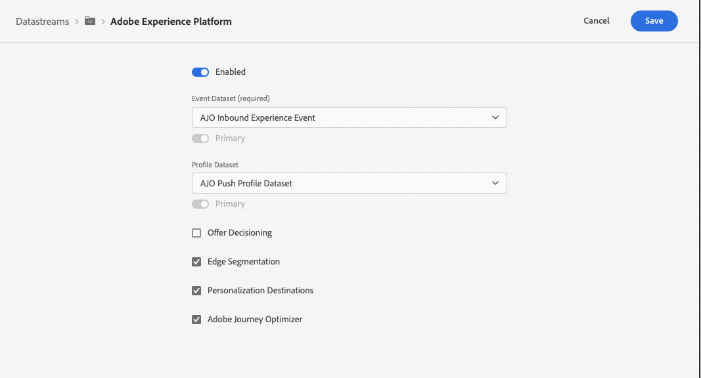
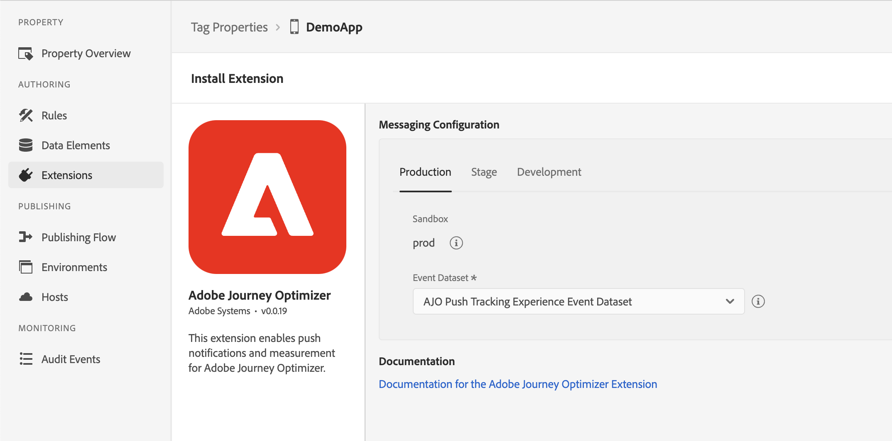

import Tabs from './tabs/index.md'

# Adobe Journey Optimizer

The [Adobe Journey Optimizer](https://business.adobe.com/products/journey-optimizer/adobe-journey-optimizer.html) extension for Adobe Experience Platform Mobile SDKs powers push notifications for your mobile apps. This extension helps you collects user push tokens and manages interaction measurement with Adobe Experience Platform services.

The following documentation details how to use the extension and required configurations to get started with push notifications for Adobe Journey Optimizer for Adobe Experience Platform services, app stores, and your apps.

## Before starting

1. Read the tutorial on [getting started with push configuration](https://experienceleague.adobe.com/docs/journey-optimizer/using/get-started/configuration/push-config/push-gs.html) to learn how to configure push channels in Adobe Journey Optimizer.
2. [Update your app's Datastream](#update-datastream-with-profile-dataset) in [Adobe Experience Platform Data Collection](https://experience.adobe.com/#/data-collection/)
3. Integrate with following extensions:
   * [Mobile Core](../mobile-core/index.md)
   * [Adobe Experience Platform Edge Network](../edge-network/index.md)
   * [Identity for Edge Network](../identity-for-edge-network/index.md)

### Update Datastream with a Profile dataset

Navigate to a previously configured Datastream by following the instructions in the [configure datastreams tutorial](../../getting-started/configure-datastreams.md) in [Adobe Experience Platform Data Collection](https://experience.adobe.com/#/data-collection/).

Select the pre-created **CJM Push Profile Dataset** in **Profile Dataset** dropdown (under the **Adobe Experience Platform** section) and select **Save**.

## Setup Adobe Journey Optimizer extension

### Configure extension in the Data Collection UI

Go to the [Experience Platform Data Collection UI](https://experience.adobe.com/#/data-collection/), select mobile property and navigate to **Extensions** from the left navigation panel:

1. Navigate to the **Catalog** tab, locate the **Adobe Journey Optimizer** extension, and select **Install**
2. Select the pre-created **CJM Push Tracking Event Dataset** from the **Event Dataset** dropdown.
3. Select **Save**.
4. Follow the publishing process to update SDK configuration.

<InlineAlert variant="info" slots="text"/>

The datasets selected should use a schema that uses the "Push Notification Tracking" XDM field group. The pre-created CJM Push Tracking Dataset contains this XDM field group in its schema definition. For more information, please read the tutorial on [setting up schemas and datasets](../../getting-started/setup-schemas-and-datasets.md).

### Implement extension in mobile app

Follow these steps to integrate the Adobe Journey Optimizer extension.

#### Import the extension

<TabsBlock orientation="horizontal" slots="heading, content" repeat="2"/>

Android

<Tabs query="platform=android&task=import"/>

iOS

<Tabs query="platform=ios&task=import"/>

#### Register the extension with Mobile Core

<TabsBlock orientation="horizontal" slots="heading, content" repeat="2"/>

Android

<Tabs query="platform=android&task=register"/>

iOS

<Tabs query="platform=ios&task=register"/>

#### Sync the user push token with Adobe

After importing and registering the extensions with your application, you need to sync the push token with Adobe Experience Platform, by using the setPushIdentifier API.

<TabsBlock orientation="horizontal" slots="heading, content" repeat="2"/>

Android

<Tabs query="platform=android&task=sync"/>

iOS

<Tabs query="platform=ios&task=sync"/>

## Next steps

* [Track Push Interactions](api-reference.md#addpushtrackingdetails)

## Configuration keys

You can update the SDK configuration, including the Messaging configuration values, programatically by using the following information.

| Key | Required | Description | Data Type | Operating System |
| :--- | :--- | :--- | :--- | :--- |
| messaging.eventDataset | Yes | Experience Event Dataset ID which can be found from Experience Platform | String | Android/iOS |
| messaging.useSandbox | No | A variable that lets the `apnsSandbox` environment be used for receiving push notifications. More details can be found in the [messaging documentation](https://github.com/adobe/aepsdk-messaging-ios/blob/dev/Documentation/SetupSDK.md#using-apnssandbox-environment-for-push-notification) | Boolean | iOS |

