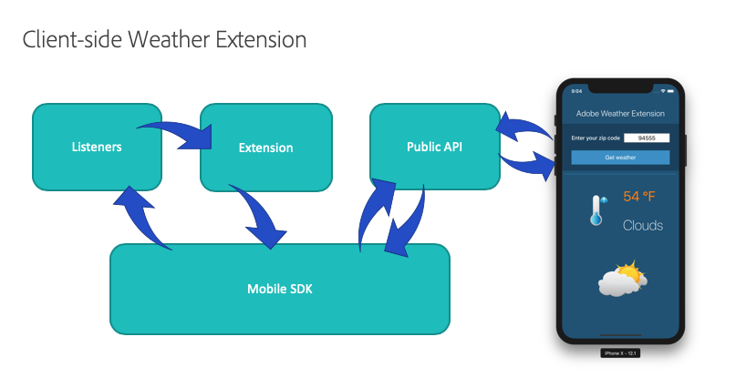

# Mobile extension samples

## Skeleton extension

To help in getting started with your first Adobe Experience Platform Mobile Extension, the following skeleton extension template for iOS and Android is available.

The skeleton extension is a bare-bones, third-party extension that contains a framework for building your own custom extension. Inside the project you'll see well commented examples of how to register your extension with the Mobile Core event hub and how to set up listeners to hear specific events passed through the SDK. The skeleton extension also shows how to set a shared state and publish an event back onto the Mobile Core event hub.

To learn more about the skeleton extension, please look at the code within the [GitHub repository](https://github.com/Adobe-Marketing-Cloud/acp-mobile-extension).

## Weather extension

The Weather extension example for both iOS and Android shows a complete client-side and Experience Platform Launch UI extension that uses an API to fetch weather information using the [OpenWeatherMap online service](https://openweathermap.org/). The weather conditions are published on to the Mobile Core event hub and are saved as a shared state. The Experience Platform Launch UI extension shows how an extension can be used to not only pass configuration values to the client-side extension, but to integrate with the Experience Platform Launch workflow rules engine.

To learn more about the client-side weather extension for iOS and Android, please look at the code within the [Mobile SDK GitHub repository](https://github.com/Adobe-Marketing-Cloud/acp-sdks/tree/weather-example). To learn more about the weather extension from the Data Collection UI perspective, please look at the code within the [Data Collection UI GitHub repository](https://github.com/adobe/reactor-mobile-examples).
