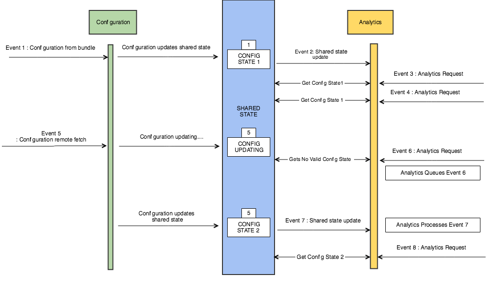

import Tabs from './tabs/shared-states.md'

# Shared states and events

A shared state is composed of the following:

* A name, which is the name of the extension or module that owns this shared state.
* An event, which is an event that contains data that an extension wants to expose to other extensions or modules.

<InlineAlert variant="warning" slots="text"/>

Not every event results in an updated shared state. Shared states have to be specifically set, which causes events to be sent that the extensions and internal modules can listen for to be updated.

## Using a shared state

Modules and extensions use events and shared states to communicate with each other. The events allow modules to be relatively decoupled, but shared states are necessary when you have a dependency on a module’s information.

A module that receives an event for which it is listening, for example, when Adobe Analytics listens for configuration changes, may trigger asynchronous work in response to that event. Examples of asynchronous work include network requests, processing the event data received, or persisting some data on the disk. When the results of that work results in another event being dispatched, the second event that was dispatched is tied to the original event that started the cycle. This process allows downstream listeners to retrieve the same shared state with the same event data that caused the additional work to occur.

<InlineAlert variant="warning" slots="text"/>

An event can be received under some circumstances when the shared state that it represents has not yet become available. In this case, calling `getSharedEventState` returns a null value, which indicates the pending status. In this case, you should ignore the state change event and continue listening.

An illustration of the workflow can be seen below:

## Clearing a shared state

Shared states persist for the life of the application context, which results in the following potential concerns:

* Since data accumulates over time, you must manage the amount of data that you are saving. Currently, a rough guideline is that a maximum of 1000 shared state versions be saved, with each instance being a maximum of 10MB, and overall, a maximum of 1GB of memory consumed. These limits are evaluated over time and might change. To prevent poor app performance, if you exceed these limits, a violation may result in your extension being unregistered.
* If you are storing volatile or sensitive identifiers, you should ensure that the identifiers are cleaned up at certain stages, such as when you unregister yourself.    

<InlineAlert variant="info" slots="text"/>

You cannot store a user’s personally identifiable information in the shared state.

To manage identifiers, an API is available that clears the existing shared state for your extension without impacting other extensions. The following examples show you how to call this API in your `onUnregister` (iOS) / `onUnregistered` (Android) method.

<TabsBlock orientation="horizontal" slots="heading, content" repeat="2"/>

Android

<Tabs query="platform=android&task=clear"/>

iOS

<Tabs query="platform=ios&task=clear"/>

## Monitoring shared states

To monitor changes to a shared state, register an event listener by using `registerListener` API. You need to pass a `com.adobe.eventType.hub` event type and a `com.adobe.eventSource.sharedState` event source. This listener is now be called when the shared state changes for any extension. To check an extension’s or an internal module’s shared state, check the `stateowner` key in the event data.

In the example below, you can find the listener that is being registered in the extension’s `init` method and the listener implementation where the shared state check is happening. The extension is checking for changes to the `com.adobe.module.configuration` shared state.

<TabsBlock orientation="horizontal" slots="heading, content" repeat="2"/>

Android

<Tabs query="platform=android&task=monitor"/>

iOS

<Tabs query="platform=ios&task=monitor"/>

## Requesting a shared state

Extensions request shared states by using the `ACPExtensionApi` (iOS) / `ExtensionApi` (Android) interface that is available in the `ACPExtension` (iOS) / `Extension` (Android) parent class. Extensions can request any of the publicly documented shared states, noting any prerequisites on timing. Generally, a shared state request occurs when an event listener and the event that was heard are passed when responding to an event listener callback. This ensures that the state that is returned is synchronized with other events in flight at the same time. When your extension dispatches its own events or updates, or its shared data in response to an event, this synchronization is becomes extremely important.

The following example shows a typical scenario where shared state is requested. A previously registered event listener is called, and the implementation gets the latest configuration shared state by passing the current event as context.

<TabsBlock orientation="horizontal" slots="heading, content" repeat="2"/>

Android

<Tabs query="platform=android&task=request"/>

iOS

<Tabs query="platform=ios&task=request"/>

### Public shared state constants

An example of a shared state constant is `com.adobe.module.configuration`, which is available any time after start up.

### Example structure

To see a sample configuration event data, please refer to the sample JSON file in the [Mobile Core extension configuration document](../mobile-core/configuration/index.md#sample-configuration).

`com.adobe.module.identity` is available after receiving a shared state update event where `eventData["stateowner"]=com.adobe.module.identity`.

`com.adobe.module.target` is available after receiving a shared state update event where `eventData["stateowner"]=com.adobe.module.target`.

A shared state can be `nil` at some point in time, which means that it is in a pending state. When this occurs, a new shared state update event is sent when the shared state is updated with valid information. An example of this would be when a network request is sent, and you are waiting for the server response. To notify other extensions that the operation is not complete, an extension sets a `nil` shared state and then updates the state when the server response is received.

<InlineAlert variant="warning" slots="text"/>

Do not request and rely on shared states that are not documented, because their implementation may change.

## Requesting a shared state that is not tied to an event

Extensions can skip passing the `ACPExtensionEvent` (iOS) / `Event` (Android) parameter to the `getSharedEventState` method. If no state is available, the SDK returns the latest available shared state or a null value.

<InlineAlert variant="info" slots="text"/>

The caller must be careful to account for null values being passed back.

<TabsBlock orientation="horizontal" slots="heading, content" repeat="2"/>

Android

<Tabs query="platform=android&task=request-not-tied"/>

iOS

<Tabs query="platform=ios&task=request-not-tied"/>

## Updating the shared state

Extensions set a shared state by creating an event data that the extensions save by calling `setSharedEventState` from the `ACPExtensionApi` (iOS) / `ExtensionApi` (Android) interface. This interface is available through the `ACPExtension` (iOS) / `Extension` (Android) parent class. Extensions can only set their own state, so the name that is used is the same as your extension (for example, `com.exampleCompany.extension`). This name is also the name that other extensions need to use when requesting your shared state.

<TabsBlock orientation="horizontal" slots="heading, content" repeat="2"/>

Android

<Tabs query="platform=android&task=update"/>

iOS

<Tabs query="platform=ios&task=update"/>

## Updating a shared state that is not tied to an event

Here, extensions can skip passing the `ACPExtensionEvent` (iOS) / `Event` (Android) parameter to the `setSharedEventState` method. The Adobe Experience Platform SDKs set the state to be the latest available state for this extension. This process ensures that new events see this state, but events that are in flight can access the older state if necessary.

<TabsBlock orientation="horizontal" slots="heading, content" repeat="2"/>

Android

<Tabs query="platform=android&task=update-not-tied"/>

iOS

<Tabs query="platform=ios&task=update-not-tied"/>