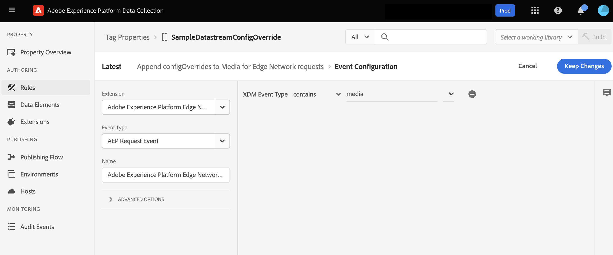
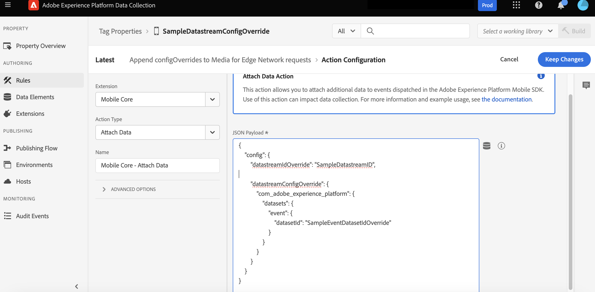

# Overriding Datastream ID and Configuration for Edge Network Requests Using Tags Rules

<InlineAlert variant="info" slots="text"/>

Starting with version **2.4.0** of the `Edge` Android extension and version **4.3.0** of the `AEPEdge` iOS extension, the `sendEvent` API now supports optional Datastream overrides. For detailed information, please refer to the [sendEvent API reference](./api-reference.md#sendEvent).

## Using Datacollection Tags Rules for datastream configuration overrides in Edge based extensions

Suppose you are working with an Edge based extension like **Streaming Media for Edge** and you need to override `datastream ID` and `datastream configuration` for Media requests passing through the Edge Network. Follow these steps to achieve that:

1. Navigate to the **DataCollection UI** and go to **Tags** select your mobile property.

2. Add a new rule for your mobile property:

    a. Provide a descriptive name for your Rule.

    b. Under the **If** section in the **Events** category, add a new Event.

    c. In the Event configuration view, set the **Extension** to "Adobe Experience Platform Edge Network" and the **Event Type** to "AEP Request Event." Then, click the plus button to "Add XDM Event Type." For all media requests, set the condition to contain "media" since all media events have types prefixed with "media."

    

    d. Save the event configuration and return to the Rule Editor UI.

    e. In the **Then** section under **Actions** add a new Action.

    f. In the Action configuration view, set the **Extension** to "Mobile Core" and the **Action Type** to "Attach Data."

    g. Now, add the JSON payload for your `datastream ID override` and `datastream config override` in the following format:

    **Payload Format:**

    ```json
    {
        "config" : {
            "datastreamIdOverride" : "<Your_Datastream_ID>",
            "datastreamConfigOverride" : {
                "<Your_Config_Key>" : "<Your_Config_Value>"
            }
        }
    }
    ```

    **Sample Payload:**

    ```json
    {
        "config": {
            "datastreamIdOverride": "SampleDatastreamID",
            "datastreamConfigOverride": {
                "com_adobe_experience_platform": {
                    "datasets": {
                        "event": {
                            "datasetId": "SampleEventDatasetIdOverride"
                        }
                    }
                }
            }
        }
    }
    ```

    

    h. **Save** the Action configuration and return to the Rule Editor UI. Your rule should look like this:

    

    i. **Save** this Rule, **publish** the new Tags library with all the changes, and your rule will be set and ready. Now, all Media Edge Requests will be sent with the overridden datastream ID and Datastream Config Overrides.
