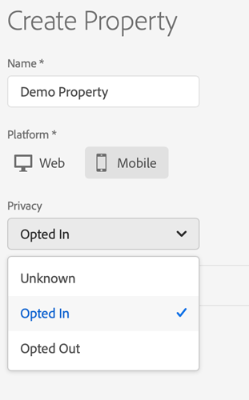
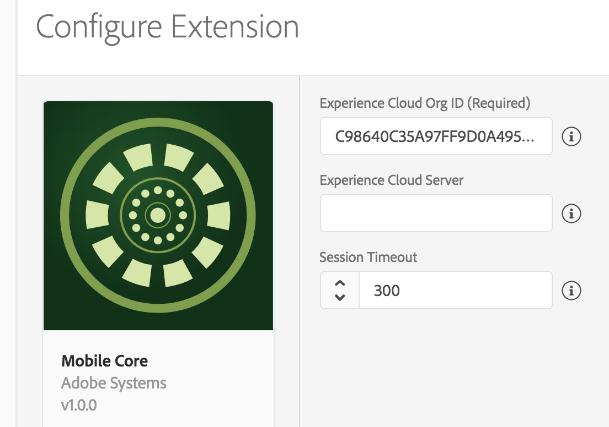

# Set up a mobile property

A property is a container that you fill with extensions, rules, data elements, and libraries. To use these resources, you need to create and configure a mobile property in the [Data Collection UI](https://experience.adobe.com/#/data-collection/). You will typically create a mobile property for each mobile application you want to manage.

## Before you start

Before you can set up your mobile property, complete the following prerequisites:

### Set up groups and users

The Data Collection UI is fully integrated with your Adobe ID. User permissions are managed through the Admin Console with other Adobe products and solutions from the Creative Cloud, Document Cloud, and Experience Cloud.

For detailed instructions on how to create groups and add users in the Data Collection UI, see [user permissions](https://experienceleague.adobe.com/docs/experience-platform/tags/admin/user-permissions.html).

### Log in to the Data Collection UI

After Data Collection UI rights have been added to your Adobe ID, log in to the Data Collection UI. You can do this by going to the [Data Collection UI](https://experience.adobe.com/#/data-collection) directly or by logging in to the [Experience Cloud](https://experiencecloud.adobe.com), navigating to the Activation page, and selecting the Data Collection UI.

## Create a mobile property

1. Log in to the Data Collection UI.
2. On the main page, review the list of existing mobile and web properties.
3. Select **New Property**.
4. Type a name for the property and select **Mobile** as the platform.

   If necessary, you can change the [**Privacy**](../privacy-and-gdpr.md#setting-privacy-status) setting later.

5. Select **Save** to create the mobile property.
6. Search for the property you just created and select it to open it.

<InlineAlert variant="warning" slots="text"/>

The default privacy status is set to _opted in_ and might impact data collection. For more information, see [Privacy and GDPR](../privacy-and-gdpr.md).

## Install your extensions

An extension is an integration built by Adobe or an Adobe partner that adds new options you can use in your apps. By default, all new mobile properties come with the Mobile Core and Profile extensions installed.

The Mobile Core extension provides a robust default set of functionality, including lifecycle events and conditions. The Profile extension allows storing of data into a client-side profile. Additional functionality for Analytics, Target, and so on will come from extensions that you install from the catalog. For more information, see the document on [adding a new extension](https://experienceleague.adobe.com/docs/experience-platform/tags/ui/extensions/overview.html#add-a-new-extension).

## Set up your extensions

1. In the Data Collection UI, on the details page for your mobile property, select the **Extensions** tab.

   The **Mobile Core** and **Profile** extensions are installed by default.

2. On the **Mobile Core** card, select **Configure** to open the extensions detail page.

   

3. Check your Experience Cloud Org ID.

   By default, this value is auto-populated using the currently signed-in Organization ID. This is a required identifier for your Experience Cloud Organization and is typically a 24-character, alphanumeric string followed by `@AdobeOrg`. If you need help finding it, contact your Adobe CSM or Customer Care.

4. (Optional) Provide your Experience Cloud ID Server.

   This is an optional server value that is used to send Visitor ID Service network requests to a custom endpoint. If this property is not set, the visitor identifiers sync requests are sent to `dpm.demdex.net` when the `Identity` extension is registered.

5. (Optional) Change the **Session Timeout** value.

   A default value of 300 seconds is already set. This timeout value indicates the number of seconds that must pass after a user backgrounds the app before a launch is considered to be a new Lifecycle session.

6. Select **Save** to confirm your settings for **Mobile Core**.

## Publish the configuration

Before the mobile application can access the configuration, it needs published to an environment. For now, we need to publish the Mobile Core and Profile extension configurations.

To deploy your configuration to a development environment for testing:

1. In the Data Collection UI, on your mobile property's details page, select the **Publishing Flow** menu.
2. Under the **Development** section of the publishing workflow, select **Add New Library**.
3. Specify any name for the library **Name**.
4. From the **Environment** drop-down list, select Development as the environment.
5. Select **Add All Changed Resources** to add the configuration changes to be deployed. You will see the Mobile Core and Profile extensions listed as changes to be published.
6. Select **Save & Build for Development**.

   The library builds and is displayed under the **Development** section of the publishing workflow.

7. On the library card, select the ellipsis (...) to see a dropdown list.
8. Select **Submit for Approval** and then **Submit**.

The library of changes are then published to the Development environment and the library is displayed under the **Submitted** section of the publishing workflow.

<InlineAlert variant="info" slots="text"/>

Testing can be done using the configuration in the Development environment. The library can later be deployed to the **Staging** and **Production** environments by using the rest of the publishing workflow. For more information, see the documentation on [publishing in the Data Collection UI](https://experienceleague.adobe.com/docs/experience-platform/tags/publish/overview.html).

Now that you published your configuration, get the Adobe Experience Platform SDK for your application. For more information, see tutorial on [getting the Experience Platform SDKs](./get-the-sdk.md).

## Watch the video

<Media slots="video"/>

<https://youtu.be/xBWYFUKAoyo>

## Additional information

* To learn more about getting access to the Data Collection UI, see the [user permissions](https://experienceleague.adobe.com/docs/experience-platform/tags/admin/manage-permissions.html) document.
* To learn more publishing workflows in the Data Collection UI, watch this [video](https://www.youtube.com/embed/Pe-YSn26_xI).

## Get help

* To ask questions, visit the SDK [community forum](https://experienceleaguecommunities.adobe.com/t5/adobe-experience-platform/ct-p/adobe-experience-platform-community).
* For immediate assistance, contact [Adobe Experience Cloud customer care](https://experienceleague.adobe.com/?support-solution=General#support).

