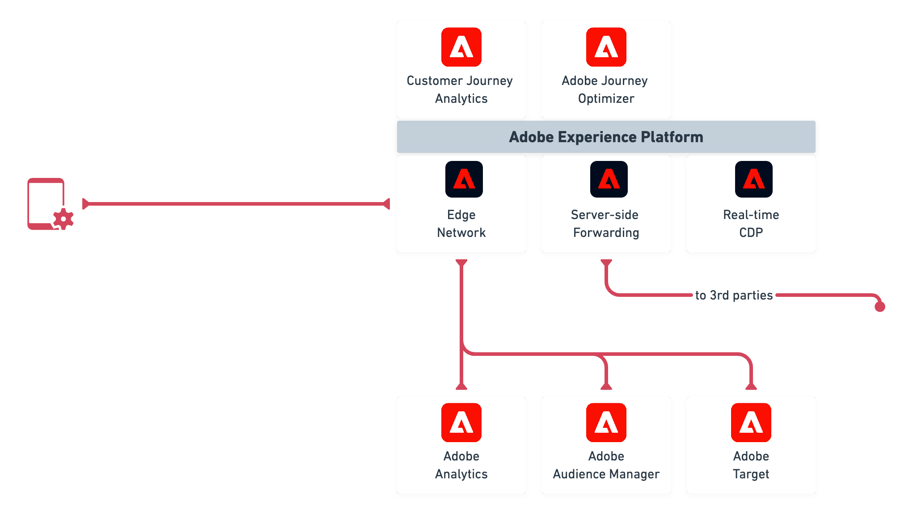
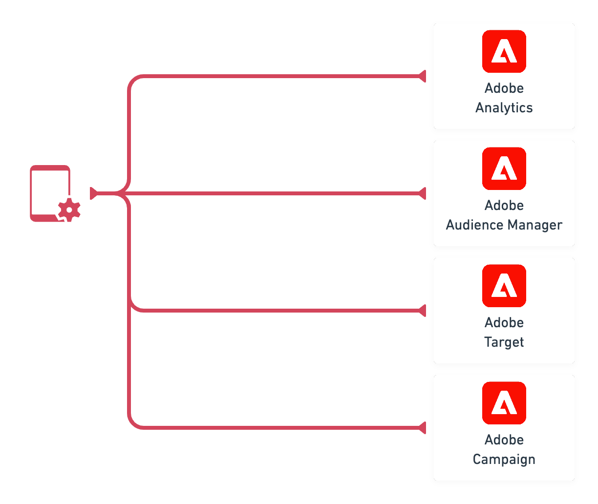

# Overview

The Adobe Experience Platform Mobile SDKs support interaction with Adobe Experience Cloud solutions and services through one or both of the following methods:

1. [Adobe Experience Platform Edge Network](#integration-using-experience-platform-edge-network)
2. [Leveraging Experience Cloud solution / service-specific endpoints](#integration-via-solutions-specific-endpoints)

The following information outlines the steps you'll need to follow to get started to leverage integrations using one or both of the following methods.

## Integration using Experience Platform Edge Network

### Steps to get started

1. [Set up schemas and datasets](./set-up-schemas-and-datasets.md)
2. [Configure datastreams](./configure-datastreams.md)
3. [Set up mobile property](./create-a-mobile-property.md)
4. [Get the Experience Platform Mobile SDK](./get-the-sdk.md)
5. [Debugging and implementing basic events](./enable-debug-logging.md)
6. [Validation and next steps](./validate.md)

## Integration via solutions-specific endpoints

### Steps to getting started

1. Configure solutions
2. [Set up mobile property](./create-a-mobile-property.md)
3. [Get the Experience Platform Mobile SDK](./get-the-sdk.md)
4. [Debugging and implementing basic events](./enable-debug-logging.md)
5. [Validation and next steps](./validate.md)

## Reference

* [Adobe Experience Platform Edge Network](https://experienceleague.adobe.com/docs/web-sdk-learn/tutorials/introduction-to-web-sdk-and-edge-network.html)
* [What is Experience Data Model (XDM)](https://experienceleague.adobe.com/docs/experience-platform/xdm/home.html)
* [How to build a schema?](https://experienceleague.adobe.com/docs/experience-platform/xdm/schema/composition.html#schema)

