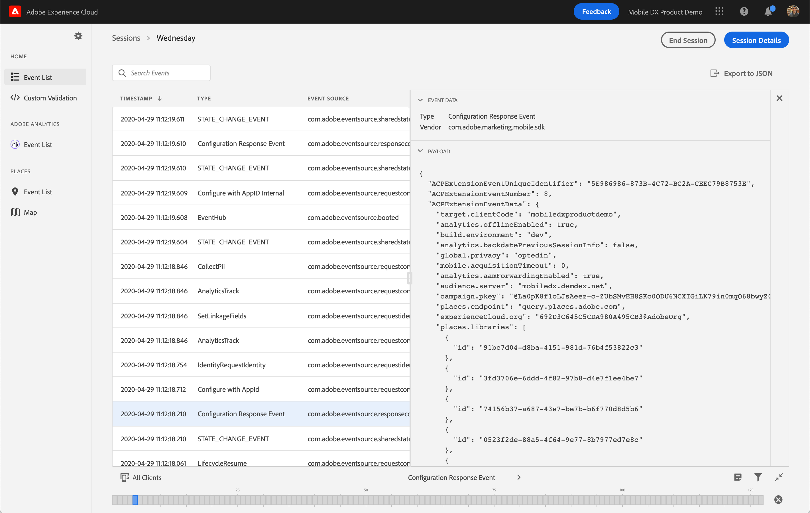

# Validation and next steps

As you begin to add solution APIs to your mobile implementation, you are going to want to validate that specific actions and experiences work as intended. Adding [Adobe Experience Platform Assurance](../platform-assurance/index.md#what-can-assurance-do-for-you) to your application at the beginning of your implementation provides a way to quickly check to make sure the SDK has been instrumented properly and that data is flowing to Adobe Analytics and other solutions.

Assurance is available across all [SDK platforms and frameworks](../current-sdk-versions.md). Installation and setup instructions are available [here](../platform-assurance/index.md#quick-setup).

Once you have Assurance integrated, you can create a [new session](../platform-assurance/tutorials/index.md#creating-sessions) by either scanning a QR code or by following a unique deep link URL.

The main interface for Assurance will show a running event list of all SDK events, including a configuration response event that will provide a readout of all configuration values obtained from the Data Collection UI.

## Adobe Analytics view

The [Adobe Analytics](../platform-assurance/tutorials/adobe-analytics.md#using-assurance-for-adobe-analytics) event list offers a focused view of analytics events triggered in the application. You can sort through all of the track action and track state calls. In the [analytics view in Adobe Experience Platform Assurance](../platform-assurance/tutorials/adobe-analytics.md), you can see both the raw hit request sent to Analytics and the post-processed details.

## Places Service view

Assurance simplifies testing point of interest entries and exits. The Places event list provides a focused view showing all events related to Places Service, including user authorization level granted and requests for nearby points of interest (POIs).

While a device is connected to an active Assurance session, the map view will show a timeline of POI entries and exits. If you want to test actions or experiences triggered by geofence entries and exits, the map view will allow you to spoof or simulate your location by clicking on any area within the map.

To learn more about the Places Service, please read the [Places Service overview](https://experienceleague.adobe.com/docs/places/using/home.html)

To learn more about Assurance, please read the [Assurance setup guide](../platform-assurance/set-up.md)

## Next steps

Once you have added, initialized, and validated the Experience Platform SDK for a base implementation, you can extend SDK functionality by adding in other extensions.

To get started, see the **Mobile Foundations** and **Experience Cloud** sections in the left pane.

## Get help

* Visit the SDK [community forum](https://experienceleaguecommunities.adobe.com/t5/adobe-experience-platform/ct-p/adobe-experience-platform-community) to ask questions
* Contact [Adobe Experience Cloud customer care](https://experienceleague.adobe.com/?support-solution=General&support-tab=home#support) for immediate assistance

