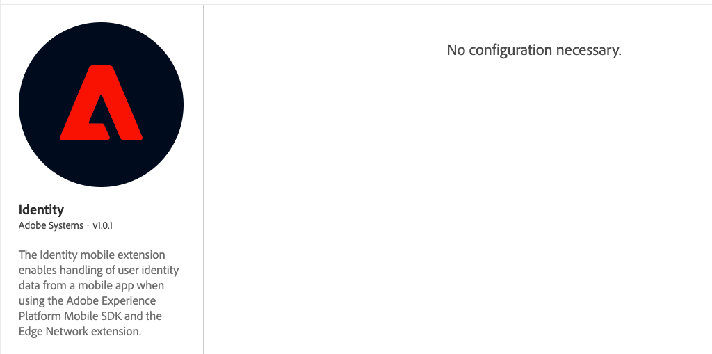

import Tabs from './tabs/index.md'

# Identity for Edge Network

The Adobe Experience Platform Identity mobile extension enables identity management from your mobile app when using the Adobe Experience Platform Mobile SDK and the [Edge Network extension](../edge-network/index.md).

## Configure the Identity extension in the Data Collection UI

1. In Data Collection UI, in your mobile property, select the **Extensions** tab.
2. On the **Catalog** tab, locate or search for the **Identity** extension, and select **Install**.
3. There are no configuration settings for **Identity**.
4. Select **Save**.
5. Follow the publishing process to update SDK configuration.

## Add the AEP Identity extension to your app

### Download and import the Identity extension

<InlineAlert variant="info" slots="text"/>

The following instructions are for configuring an application using Adobe Experience Platform Edge mobile extensions. If an application will include both Edge Network and Adobe Solution extensions, both the Identity for Edge Network and Identity for Experience Cloud ID Service extensions are required. Find more details in the [frequently asked questions](./faq.md).

<InlineAlert variant="info" slots="text"/>

When using the [`setAdvertisingIdentifier`](./api-reference.md#setadvertisingidentifier) API, see the setup guide for [Consent for Edge Network](../consent-for-edge-network/index.md) for instructions on setting up the extension and profile schema for proper usage.

<TabsBlock orientation="horizontal" slots="heading, content" repeat="2"/>

Android

<Tabs query="platform=android&task=download"/>

iOS

<Tabs query="platform=ios&task=download"/>

### Register the Identity extension with Mobile Core

<TabsBlock orientation="horizontal" slots="heading, content" repeat="2"/>

Android

<Tabs query="platform=android&task=register"/>

iOS

<Tabs query="platform=ios&task=register"/>

## Advertising identifier

The Edge Identity extension compares the previously stored advertising identifier value with the new value received from the [`setAdvertisingIdentifier`](./api-reference.md#setadvertisingidentifier) API and handles the following scenarios:

Ad tracking enabled - when the new value sent to the API is:
- A valid UUID string (example: `"a127a99e-50be-4d87-bf6f-6ab9541c105b"`)

Process:
1. Updates the client side XDM `IdentityMap` with the new value for IDFA/GAID, which is included in subsequent [XDM Experience events](../edge-network/xdm-experience-events.md). For more details, see the [standard Identity namespaces](https://experienceleague.adobe.com/docs/experience-platform/identity/namespaces.html#standard).
2. Sends a [consent update event](https://experienceleague.adobe.com/docs/experience-platform/xdm/data-types/consents.html) with ad ID consent preferences set to `yes` (only when a valid ad ID is absent from the `IdentityMap` and the Edge Consent extension is registered and properly configured).

Ad tracking disabled - Given a valid ad ID already exists in the `IdentityMap`, and the new value sent to the API is:
- `null`/`nil`
- Empty string (`""`)
- All-zeros string (`"00000000-0000-0000-0000-000000000000"`)  

Process:
1. Removes the ad ID from the client side XDM `IdentityMap`, which is removed from subsequent [XDM Experience events](../edge-network/xdm-experience-events.md).
2. Sends a [consent update event](https://experienceleague.adobe.com/docs/experience-platform/xdm/data-types/consents.html) with ad ID consent preferences set to `no` (only when the Edge Consent extension is registered and properly configured).

No operations are executed when no changes are detected between the previously stored and new ad ID value.
