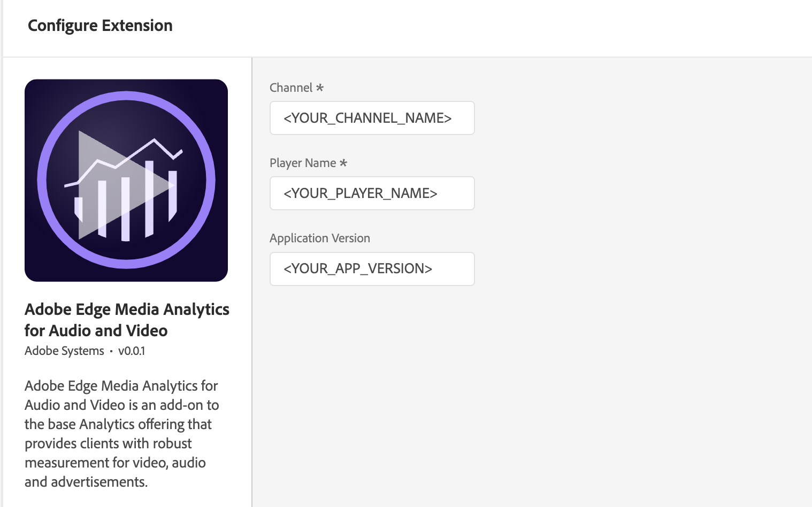

import Tabs from './tabs/index.md'

# Adobe Edge Media Analytics for Audio and Video

<InlineAlert variant="warning" slots="text"/>

This extension requires the [Adobe Analytics for Media](https://experienceleague.adobe.com/docs/media-analytics/using/media-overview.html) add-on SKU. To learn more, contact your Adobe Customer Success Manager.

## Configure Edge Media Analytics extension in the Data Collection UI

1. In the Data Collection UI, select the **Extensions** tab.
2. On the **Catalog** tab, locate the **Adobe Edge Media Analytics for Audio and Video** extension, and select **Install**.
3. Type the extension settings. For more information, see [Configure Media Analytics Extension](#configure-media-analytics-extension).
4. Select **Save**.
5. Follow the publishing process to update your SDK configuration.

## Configure the Edge Media Analytics extension

<InlineAlert variant="info" slots="text"/>

To configure the Edge Media Analytics extension, complete the following steps:

### Channel

Type the channel name property.

### Player name

Type the name of the media player in use (for example, _AVPlayer_, _Native Player_, or _Custom Player_).

### Application version

Type the version of the media player application/SDK.

## Add Edge Media Analytics to your app

<InlineAlert variant="info" slots="text"/>

This extension requires the [Adobe Analytics extension](../adobe-analytics/index.md). You must add the Analytics extension to your mobile property and make sure the extension is correctly configured.

<TabsBlock orientation="horizontal" slots="heading, content" repeat="2"/>

Android

<Tabs query="platform=android&task=add"/>

iOS

<Tabs query="platform=ios&task=add"/>

## Register Media with Mobile Core

<TabsBlock orientation="horizontal" slots="heading, content" repeat="2"/>

Android

<Tabs query="platform=android&task=register"/>

iOS

<Tabs query="platform=ios&task=register"/>

## Configuration keys

To update your SDK configuration programmatically, use the following information to change your Media configuration values. For more information, see [Configuration API reference](../mobile-core/configuration/api-reference.md).

| Key | Required | Description | Data Type |
| :--- | :--- | :--- | :--- |
| `media.channel` | Yes | The Channel name. For more information, see [Channel](#channel). | String |
| `media.playerName` | Yes | The media player name, i.e., "AVPlayer", "HTML5 Player", "My Custom Player". For more information, see [Player Name](#player-name). | String |
| `media.appVersion` | No | Version of the media player app/SDK. For more information, see [Application Version](#application-version). | String |
