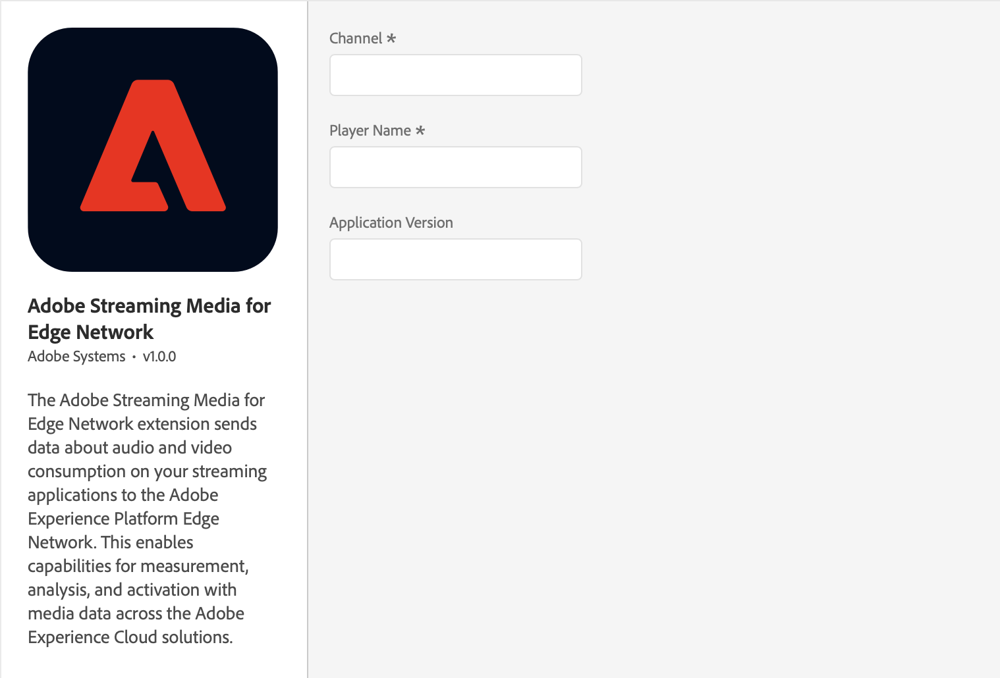

import Tabs from './tabs/index.md'

# Adobe Streaming Media for Edge Network
The Media for Edge Nework extension enables tracking user's engagement and consumption of audio and video content on mobile devices.

## Before starting

### Configure and Setup Adobe Streaming Media for Edge Network with Experience Platform

1. [Define a report suite](https://experienceleague.adobe.com/docs/media-analytics/using/implementation/implementation-edge.html#define-a-report-suite)
2. [Set up the schema in Adobe Experience Platform](https://experienceleague.adobe.com/docs/media-analytics/using/implementation/implementation-edge.html#set-up-the-schema-in-adobe-experience-platform)
3. [Create a dataset in Adobe Experience Platform](https://experienceleague.adobe.com/docs/media-analytics/using/implementation/implementation-edge.html#create-a-dataset-in-adobe-experience-platform)
4. [Configure a datastream in Adobe Experience Platform](https://experienceleague.adobe.com/docs/media-analytics/using/implementation/implementation-edge.html#configure-a-datastream-in-adobe-experience-platform)

Follow the full guide for setting up [Adobe Streaming Media for Edge Network with Experience Platform Edge](https://experienceleague.adobe.com/docs/media-analytics/using/implementation/media-sdk/setup/implementation-edge.html) before configuring and implementing the SDK.

### Configure and Install Dependencies

Media for Edge Network requires Edge and Edge Identity extensions. Make sure to [configure the Edge extension in Data Collection UI](https://developer.adobe.com/client-sdks/documentation/edge-network/#configure-the-edge-network-extension-in-data-collection-ui) and [configure the Edge Identity extension in Data Collection UI](https://developer.adobe.com/client-sdks/documentation/identity-for-edge-network/#configure-the-identity-extension-in-the-data-collection-ui) before proceeding.

## Configure Media for Edge Network extension in the Data Collection UI

1. In the Data Collection UI, select the **Extensions** tab.
2. On the **Catalog** tab, locate the **Adobe Streaming Media for Edge Network** extension, and select **Install**.
3. Type the extension settings. For more information, see [Configure Media for Edge Network extension](#configure-the-media-for-edge-network-extension).
4. Select **Save**.
5. Follow the publishing process to update your SDK configuration.

## Configure the Media for Edge Network extension

<InlineAlert variant="info" slots="text"/>

To configure the Media for Edge Network extension, complete the following steps:

### Channel

Type the channel name property.

### Player name

Type the name of the media player in use (for example, _AVPlayer_, _Native Player_, or _Custom Player_).

### Application version

Type the version of the media player application/SDK.

## Add Media for Edge Network to your app

<InlineAlert variant="info" slots="text"/>

This extension requires the [Edge Network extension](../edge-network/index.md) and [Identity for Edge Network extension](../identity-for-edge-network/index.md). You must add the `Adobe Experience Platform Edge Network` and `Identity` extensions to your mobile property in the `Data collection UI` and make sure they are correctly configured.

<TabsBlock orientation="horizontal" slots="heading, content" repeat="2"/>

Android

<Tabs query="platform=android&task=add"/>

iOS

<Tabs query="platform=ios&task=add"/>

## Register Media with Mobile Core

<TabsBlock orientation="horizontal" slots="heading, content" repeat="2"/>

Android

<Tabs query="platform=android&task=register"/>

iOS

<Tabs query="platform=ios&task=register"/>

## Configuration keys

To update your SDK configuration programmatically, use the following information to change your Media configuration values. For more information, see [Configuration API reference](../mobile-core/configuration/api-reference.md).

| Key | Required | Description | Data Type |
| :--- | :--- | :--- | :--- |
| `edgeMedia.channel` | Yes | The Channel name. For more information, see [Channel](#channel). | String |
| `edgeMedia.playerName` | Yes | The media player name, i.e., "AVPlayer", "HTML5 Player", "My Custom Player". For more information, see [Player Name](#player-name). | String |
| `edgeMedia.appVersion` | No | Version of the media player app/SDK. For more information, see [Application Version](#application-version). | String |
