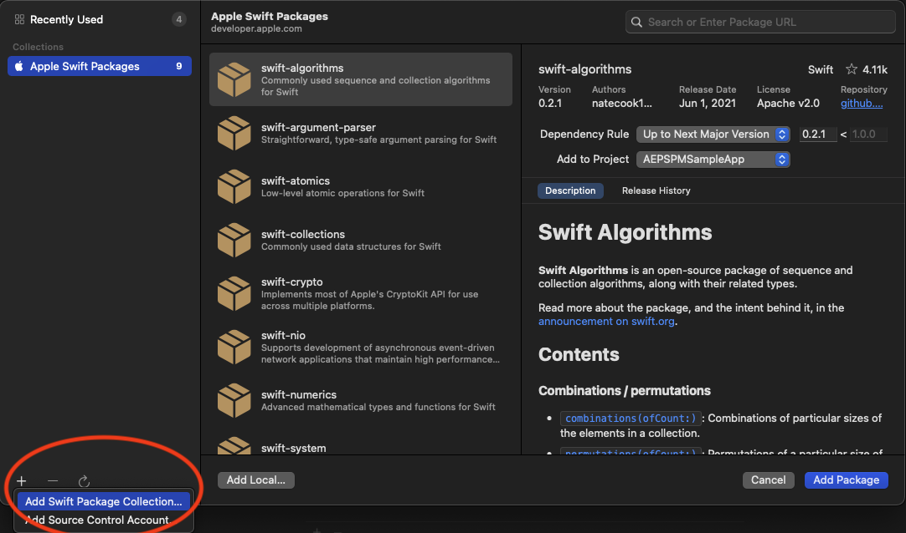

import Tabs from './tabs/migrate-to-swift.md'

# Migrate to Swift

If you have implemented Objective-C versions (ACP-prefixed SDK libraries, 2.x or lower), then this guide will help you understand the steps required to migrate your implementation to the latest Swift versions (AEP-prefixed SDK libraries, 3.x or higher). In summary, you'll need to:

1. [Switch imported libraries from ACP-prefix to AEP-prefix libraries](#switch-imported-libraries)
2. [Update SDK initialization](#update-sdk-initialization)
3. [Update API references to call AEP-prefix libraries](#update-api-usage-and-references-for-each-extension)

## Switch imported libraries

At this time, the following ACP-prefix libraries may be switched out with their respective AEP-prefix SDK libraries. See instructions on proceeding further if you have [manually imported SDK libraries](#manual-library-import) , if you used [CocoaPods to manage SDK dependencies](#cocoapods), or you used [Swift Package Manager](#swift-package-manager).

<InlineAlert variant="warning" slots="text"/>

In addition to `ACPCore` being replaced with `AEPCore`, you will also need to explicitly import `AEPLifecycle`, `AEPIdentity`, and `AEPSignal` libraries to ensure there is no disruption in SDK behavior.

| Objective-C (ACP-prefix) | Swift (AEP-prefix) |
| :----------------------- | :----------------- |
| ACPCore | AEPCore/AEPLifecycle/AEPIdentity/AEPSignal |
| ACPUserProfile | AEPUserProfile |
| ACPAnalytics | AEPAnalytics |
| ACPAudience | AEPAudience |
| ACPTarget | AEPTarget |
| ACPMedia | AEPMedia |
| ACPPlaces | AEPPlaces |
| AEPAssurance (1.x) | AEPAssurance (3.x) |
| ACPCampaign | AEPCampaign |
| ACPCampaignClassic | AEPCampaignClassic |

### Manual library import

If you are manually importing SDK libraries, ensure you identify all currently used ACP-prefix libraries and switch them over to AEP-prefix libraries. The list of current AEP-prefix SDK libraries can be found in the [current SDK versions document](current-sdk-versions.md#ios-swift) (in the Swift section).

### CocoaPods

If you are using CocoaPods to manage your Adobe Experience Platform Mobile SDK dependencies, the following example shows you how to switch ACP-prefix libraries to AEP-prefix libraries in your `Podfile`.

```ruby
# replace ACPCore with AEPCore/AEPLifecycle/AEPIdentity/AEPSignal
# pod 'ACPCore'
  pod 'AEPCore'
  pod 'AEPLifecycle'
  pod 'AEPIdentity'
  pod 'AEPSignal'

# replace ACPUserProfile with AEPUserProfile
# pod 'ACPUserProfile'
  pod 'AEPUserProfile'
```

Save the `Podfile` and run `pod repo update` to update your local CocoaPods repository.

Once the previous command is complete, run `pod install` or `pod update` to update the application dependencies.

### Swift Package Manager

#### Swift Package Collection

In Swift 5.5, the Swift Package Manager (SPM) adds support for [package collections](https://www.swift.org/blog/package-collections). You can configure package collection in Xcode 13 for easy installation of AEP SDKs. The Swift package collection for the Adobe Experience Platform SDKs is available at the [Adobe Open Source site](https://opensource.adobe.com/aepsdk-core-ios/swift/packages/aep.json).

To add the Swift package collection in Xcode 13, select File followed by Add Packages", selecting the plus sign on the bottom left and choosing "Add Swift Package Collection"



Next, enter the package collection URL and click "Load". After the package collection has loaded, click "Add Collection" to add the collection.


You should now see the added package collection on the left pane. Once selected, you will see all of the packages included in the collection listed.


#### Installing AEP SDKs using SPM 

To add the AEP SDK Packages to your application, from the Xcode 13 menu select **File**, followed by **Add Packages**.

If you have configured package collection as mentioned above, select each package you would like to add to your project and click "Add Package" on the bottom right.

If not, enter the Package URL for the AEP SDK repositories: 

- AEPCore: `https://github.com/adobe/aepsdk-core-ios.git`
- AEPUserProfile: `https://github.com/adobe/aepsdk-userprofile-ios.git`

For each package, specify the Dependency rule as a specific version or a range of versions and select the Project. 

When prompted, select all the `AEP*` libraries, then click `Add Package`.


Alternatively, if your project has a `Package.swift` file, you can add AEPCore and AEPUserProfile directly to your dependencies:

```ruby
dependencies: [
    .package(url: "https://github.com/adobe/aepsdk-core-ios.git", .upToNextMajor(from: "3.0.0")),
    .package(url: "https://github.com/adobe/aepsdk-userprofile-ios.git", .upToNextMajor(from: "3.0.0")),
],
targets: [
    .target(name: "YourTarget",
            dependencies: [
                .product(name: "AEPCore", package: "AEPCore"),
                .product(name: "AEPIdentity", package: "AEPCore"),
                .product(name: "AEPSignal", package: "AEPCore"),
                .product(name: "AEPLifecycle", package: "AEPCore"),
                .product(name: "AEPServices", package: "AEPCore"),
                .product(name: "AEPUserProfile", package: "AEPUserProfile"),
            ],
            path: "your/path"),
]
```

## Update SDK initialization

After you have imported the new Swift-based AEP-prefix libraries, you'll need to update SDK initialization code as described below. With Swift, the `MobileCore.start()` API is no longer required. The SDK has simplified initialization and registration of extensions by providing the `MobileCore.registerExtensions()` API. After the given extensions have been registered, the SDK will be initialized and the completion block will be executed. Code which used to reside in the start() block will now reside in the `MobileCore.registerExtensions()` completion block.

The following code snippets show the new and correct initialization code required for the Swift-based, AEP-prefix SDK libraries.

<TabsBlock orientation="horizontal" slots="heading, content" repeat="2"/>

Objective-C

<Tabs query="platform=obj-c"/>

Swift

<Tabs query="platform=swift"/>

## Update API usage and references for each extension

Finally, you'll need to scan through your current implementation and replace ACP-prefix API calls to the new Swift-based, AEP-prefix libraries. A quick find and replace should do the trick. Detailed API changes by extension may be found at the links below.

| SDK Component & Extensions | Migration API Reference |
| :--- | :--- |
| [Core](./mobile-core/index.md) | [AEPCore](./mobile-core/migration.md) |
| [Identity](./mobile-core/identity/index.md) | [AEPIdentity](./mobile-core/identity/migration.md) |
| [Lifecycle](./mobile-core/lifecycle/index.md) | [AEPLifecycle](./mobile-core/lifecycle/migration.md) |
| [Signal](./mobile-core/signal/index.md) | [AEPSignal](./mobile-core/signals/migration.md) |
| [Profile](./profile/index.md) | [AEPUserProfile](./profile/migration.md) |
| [Adobe Experience Platform Assurance](./platform-assurance/index.md) | [AEPAssurance](./platform-assurance/migration.md) |
| [Adobe Experience Platform Places Service](./places/index.md) | [AEPPlaces](./places/migration.md) |
| [Adobe Analytics - Mobile Services](./adobe-analytics-mobile-services/index.md) | [AEPMobileService](./adobe-analytics-mobile-services/migration.md) |
| [Adobe Analytics](./adobe-analytics/index.md) | [AEPAnalytics](./adobe-analytics/migration.md) |
| [Adobe Analytics - Media Analytics for Audio & Video](./adobe-media-analytics/index.md) | [AEPMedia](./adobe-media-analytics/migration.md) |
| [Adobe Audience](./adobe-audience-manager/index.md) | [AEPAudience](./adobe-audience-manager/migration.md) |
| [Adobe Experience Platform Target](./adobe-target/index.md) | [AEPTarget](./adobe-target/migration.md) |
| [Adobe Experience Platform Campaign](./adobe-campaign-standard/index.md) | [AEPCampaign](./adobe-campaign-standard/migration.md) |
| [Adobe Experience Platform Campaign Classic](./adobe-campaign-classic/index.md) | [AEPCampaignClassic](./adobe-campaign-classic/migration.md) |
