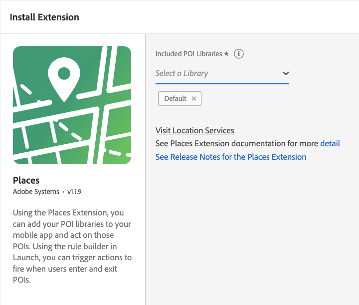

import Tabs from './tabs/index.md'

# Adobe Experience Platform Location Service

Adobe Experience Platform Location Service provides an SDK extension which allows you to act based on the location of your users. This extension is the interface to the [Location Service Web Services APIs](https://experienceleague.adobe.com/docs/places/using/web-service-api/places-web-services.html?lang=en).

The SDK extension listens for events that contain GPS coordinates and geofence region events, and dispatches new events that are processed by the Rules Engine. The SDK extension also retrieves and delivers a list of the nearest POI for the app data that retrieves from the APIs. The regions returned by the APIs are stored in cache and persistence, which allows limited offline processing.

`Places` is the mobile SDK supporting the Location Service.

## Configure the Places extension in Data Collection UI

1. In the Data Collection UI, from your mobile property, select the **Extensions** tab.
2. On the **Catalog** tab, locate or search for the **Places** extension, and select **Install**.
3. Select the **POI Library (or libraries)** you wish to use in the app.
4. Select **Save**.
5. Follow the publishing process to update SDK configuration.

## Add the AEP Places extension to your app

### Download and import the Places extension

<TabsBlock orientation="horizontal" slots="heading, content" repeat="3"/>

Android

<Tabs query="platform=android&task=download"/>

iOS (AEP 3.x)

<Tabs query="platform=ios-aep&task=download"/>

iOS (ACP 2.x)

<Tabs query="platform=ios-acp&task=download"/>

### Register the Places extension with Mobile Core

<TabsBlock orientation="horizontal" slots="heading, content" repeat="3"/>

Android

<Tabs query="platform=android&task=register"/>

iOS (AEP 3.x)

<Tabs query="platform=ios-aep&task=register"/>

iOS (ACP 2.x)

<Tabs query="platform=ios-acp&task=register"/>

## Additional Location Service resources

For more information about implementing and using Adobe Experience Platform Location Service, please see the following documentation links:

* [Release notes](https://experienceleague.adobe.com/docs/places/using/release-notes.html?lang=en)
* [Overview](https://experienceleague.adobe.com/docs/places/using/home.html?lang=en)
* [Places SDK implementation](https://experienceleague.adobe.com/docs/places/using/places-ext-aep-sdks/places-extension/places-extension.html?lang=en)
* [Places Monitor SDK implementation](https://experienceleague.adobe.com/docs/places/using/places-ext-aep-sdks/places-monitor-extension/places-monitor-extension.html?lang=en)
* [Cordova Places SDK GitHub readme](https://github.com/adobe/cordova-acpplaces/blob/master/README.md)
* [Cordova Places Monitor SDK GitHub readme](https://github.com/adobe/cordova-acpplaces-monitor/blob/master/README.md)
* [React Native Places SDK GitHub readme](https://github.com/adobe/react-native-acpplaces/blob/master/README.md)
* [React Native Places Monitor SDK GitHub readme](https://github.com/adobe/react-native-acpplaces-monitor/blob/master/README.md)
* [Flutter Places SDK GitHub readme](https://github.com/adobe/flutter-acpplaces/blob/master/README.md)
* [Flutter Places Monitor SDK GitHub readme](https://github.com/adobe/flutter_acpplaces_monitor/blob/master/README.md)
* [Xamarin Places SDK GitHub readme](https://github.com/adobe/xamarin-acpplaces/blob/master/README.md)
