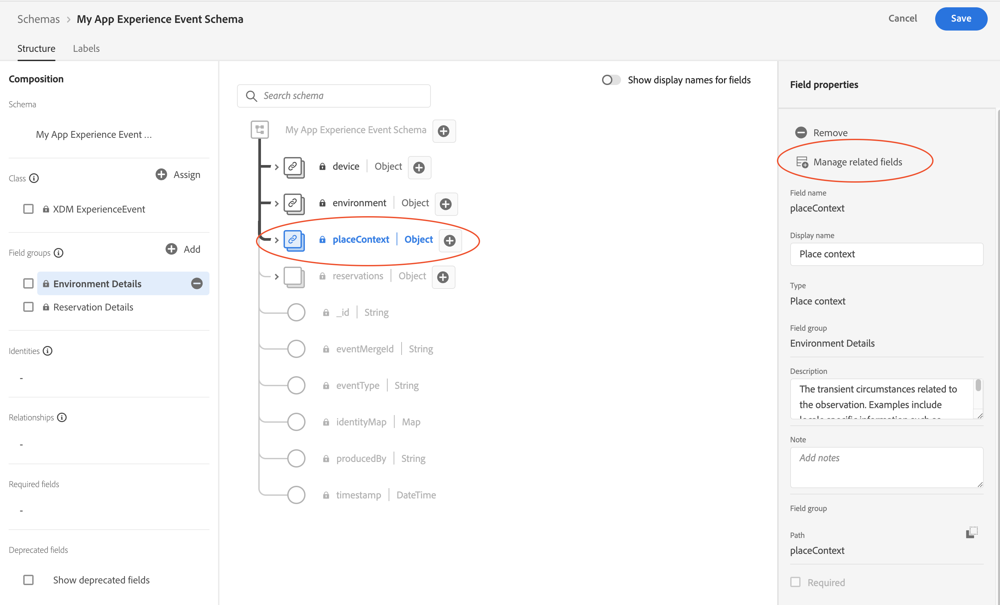
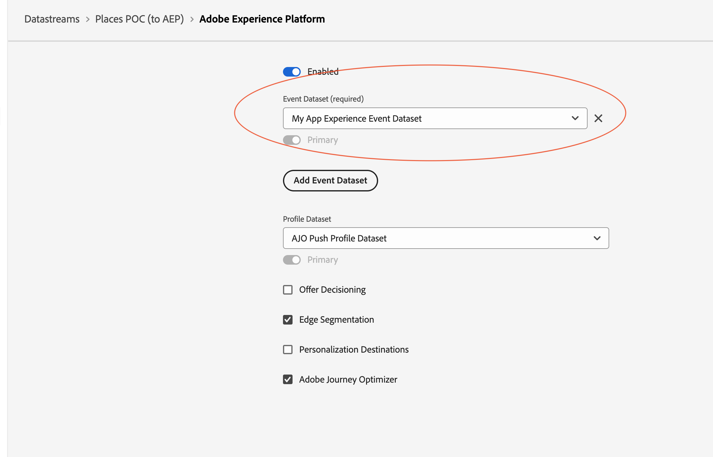

# Steps to configure Places Event forwarding for Experience Platform

## Capablities

1. Enriches AJO Journey's ability to have events based on Location (Entry/Exit) Triggers
2. Allows creating Audiences based on POI visits

## Mobile SDK

Upgrade your Mobile SDK to following Places extension version
| Platform | Version Supported|
|---|---|
|iOS|4.1.0 and above|
|Android|2.1.0 and above|

## Experience Platform Configuration

### Step 1 : Choose your Application's Experience Event Schema

* In the browser, navigate to the [Experience Platform](https://experience.adobe.com/#/platform/) and login with your credentials.
* If your organization is enabled for multiple sandboxes, first select the appropirate sandbox from the top right corner. For more details about sandboxes, please read the [sandboxes overview](https://experienceleague.adobe.com/docs/experience-platform/sandbox/home.html).
* From the left panel, select **Schemas**.
* Select your Application's Experience Event Schema from the list of schemas.

### Step 2: Adding PlacesContext to your schema

* Under the Field groups section, click **Add**.

* Search and Add **Environment Details** Field group.

### Step 3:  Mask/Remove the unnecessary fields from EnvironmentDetails Field groups.

* In the Field Group section, select **Environmen Details**->**placeContext** and on the right pane click on **Manage related fields**

* Uncheck all the fields except for poiID (placeContext -> poiDetail -> poiID).

<InlineAlert variant="info" slots="text"/>
Also Mask **devices**, and **environment** fields if they are not relevant to your application.

* Save your Schema
Hit confirm and finally, your schema's **placeContext** field group should look like:

## Datastream Configuration

* In the browser, navigate to the [Data Collection UI](https://experience.adobe.com/#/data-collection).
* From the left panel, select **Datastreams** and from the list select the datastream that is configured for your application. For more details about configuring datastream, please read [this section](../getting-started/configure-datastreams.md).
* Find **Adobe Experience Platform** service, click on `...` and choose **Edit**

* Make sure you have set up the Dataset with placeContext field group enabled Schema as one of your Event Datasets in the Datastream configuration (Be it primary or not).

* Make sure **Adobe Journey Optimizer** check box is enabled.

<InlineAlert variant="warning" slots="text"/>
Please remove `AJO Push Tracking dataset`, if it exist in the list of Event Dataset in your Datastream. This is a system dataset and is not meant to be configured in the Datastream.

## Data Collection Tag Configuration

* In the browser, navigate to the [Data Collection UI](https://experience.adobe.com/#/data-collection).
* From the left panel, select **Tags** tab and from the list select the Tag that is configured for your application.
* From the left panel, select **Extensions** tab.
* Update the Places Launch Card to 1.3.0 or greater. No Additional configuration is required.
* Make sure **Adobe Expereience Edge Network**, **Identity** and **Consent** extensions are installed.
* Make sure **Adobe Expereience Edge Network** is configured with appropritate datastream which has dataset with **placecontext** field group enabled in their schema.

