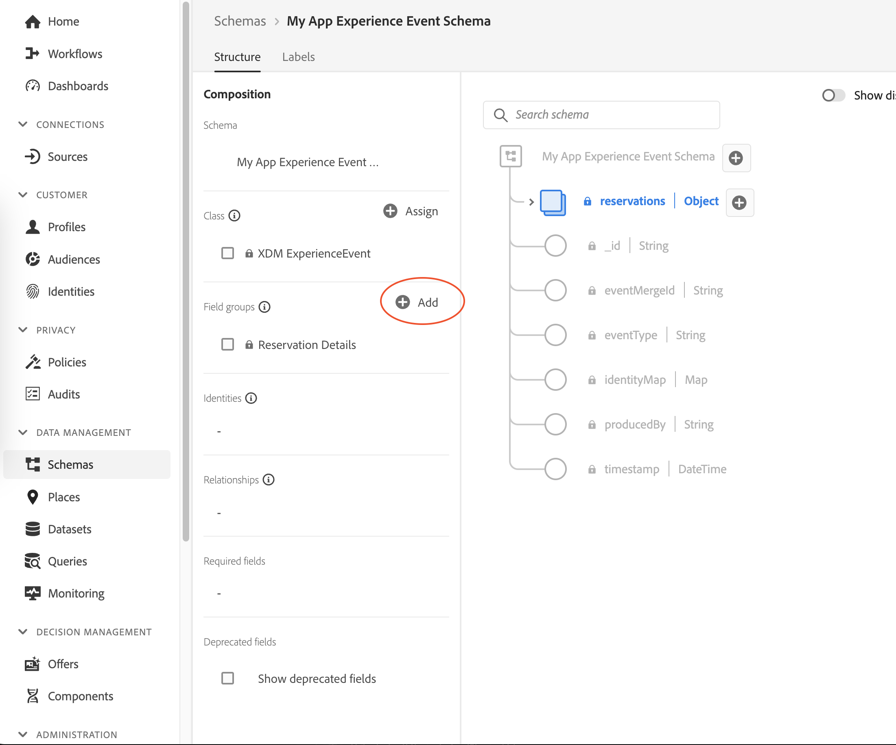
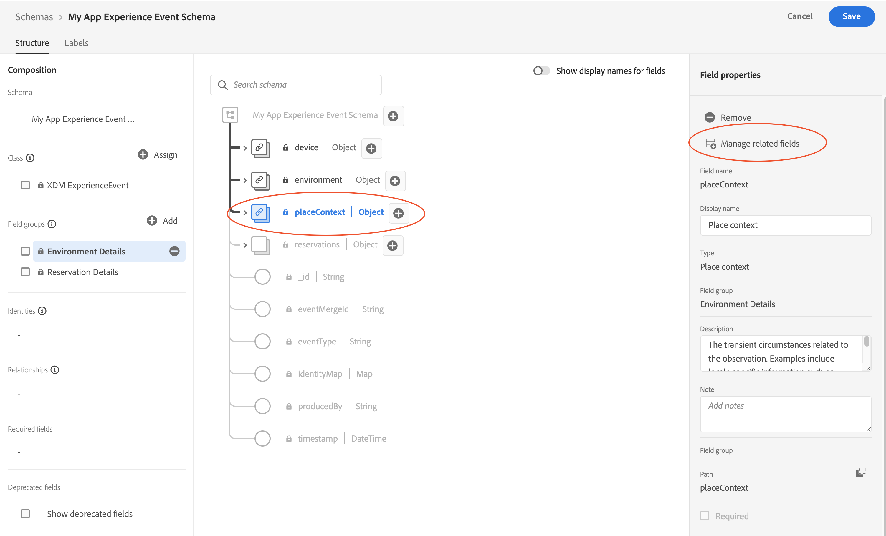
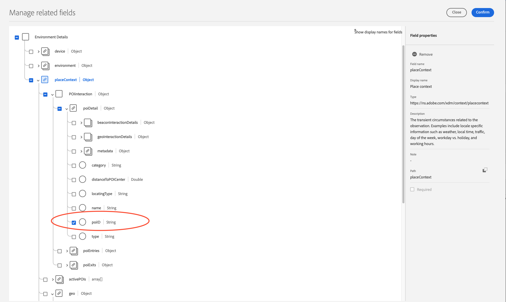
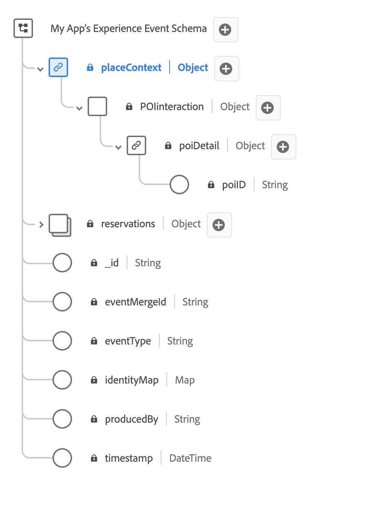
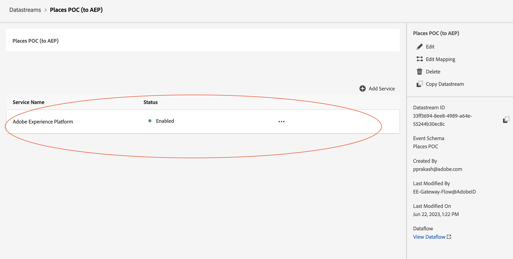
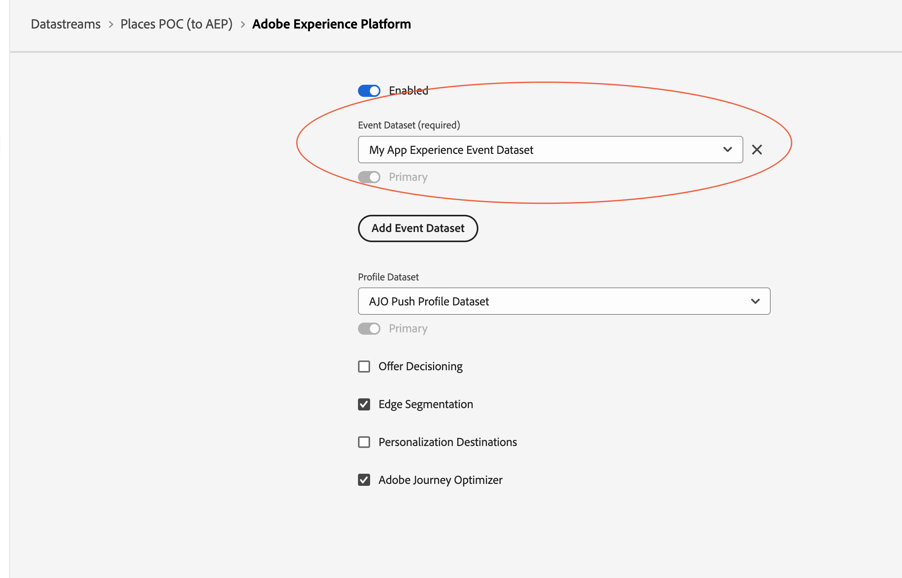

# Places Service event forwarding to Adobe Experience Platform

## Capablities

1. Enriches Adobe Journey Optimizer's ability to engage with users based on location entry and exit triggers.
2. Allows creating audiences based on points of interest (POI) visits.

## Mobile SDK

Upgrade your Mobile SDK to following Places extension version

| Platform | Version Supported|
|---|---|
|iOS|4.1.0 and above|
|Android|2.1.0 and above|

## Experience Platform Configuration

### Choose your Application's Experience Event Schema

* In the browser, navigate to the [Platform](https://experience.adobe.com/#/platform/) and login with your credentials.
* If your organization is enabled for multiple sandboxes, first select the appropirate sandbox from the top right corner. For more details about sandboxes, please read the [sandboxes overview](https://experienceleague.adobe.com/docs/experience-platform/sandbox/home.html).
* From the left panel, select **Schemas**.
* Select your Application's Experience Event Schema from the list of schemas.

### Adding PlacesContext to your schema

* Under the Field groups section, select **Add**.

* Search and add **Environment Details** field group.

### Mask/Remove the unnecessary fields from EnvironmentDetails Field groups.

* In the Field Group section, select **Environmen Details** followed by **placeContext** and on the right pane, select on **Manage related fields**

* Uncheck all the fields except for poiID (placeContext -> poiDetail -> poiID).

<InlineAlert variant="info" slots="text"/>

Also mask the **devices** and **environment** fields if they are not relevant to your application.

* Save your schema and
select confirm. Your schema's **placeContext** field-group should look like:

## Datastream Configuration

* In the browser, navigate to the [Data Collection UI](https://experience.adobe.com/#/data-collection).
* From the left panel, select **Datastreams** and from the list select the datastream that is configured for your application. For more details about configuring datastream, please read [this section](../getting-started/configure-datastreams.md).
* Find **Adobe Experience Platform** service, select `...` and choose **Edit**.

* Make sure you have set up the dataset with `placeContext` field-group enabled schema as one of your event datasets in the datastream configuration.

* Make sure the **Adobe Journey Optimizer** check box is enabled.

<InlineAlert variant="warning" slots="text"/>

Please remove the `AJO Push Tracking dataset` if it exist in the list of event dataset in your datastream. This is a system dataset and is not meant to be configured in the datastream.

## Data Collection Tag Configuration

* In the browser, navigate to the [Data Collection UI](https://experience.adobe.com/#/data-collection).
* From the left panel, select **Tags** tab and from the list select the Tag that is configured for your application.
* From the left panel, select **Extensions** tab.
* Update the Places Launch Card to 1.3.0 or greater. No additional configuration is required.
* Make sure the **Adobe Experience Edge Network**, **Identity** and **Consent** (optional) extensions are installed.
* Make sure the **Adobe Experience Edge Network** is configured with the appropriate datastream which has a dataset with the `placeContext` field group enabled in their schema.

