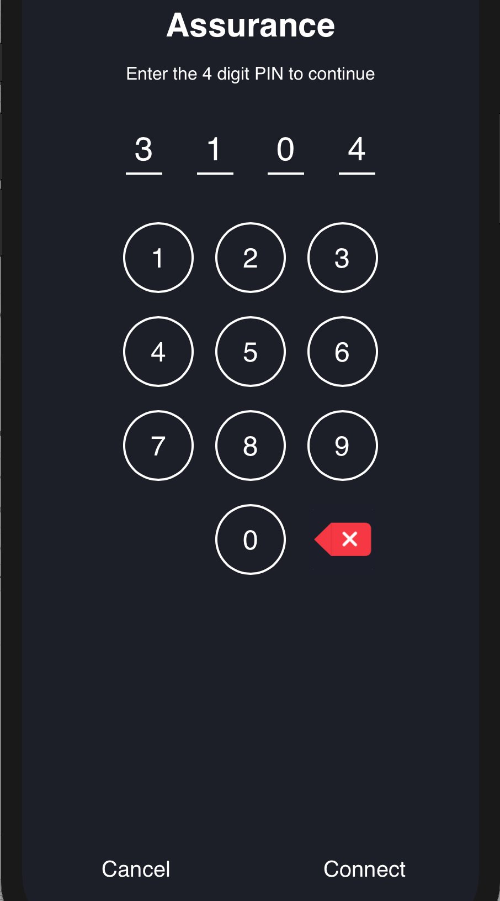
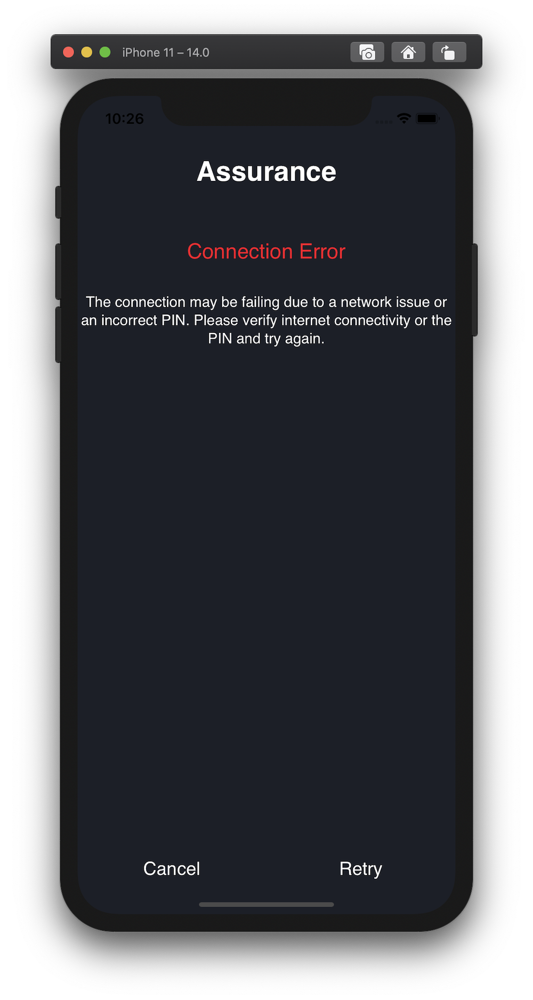
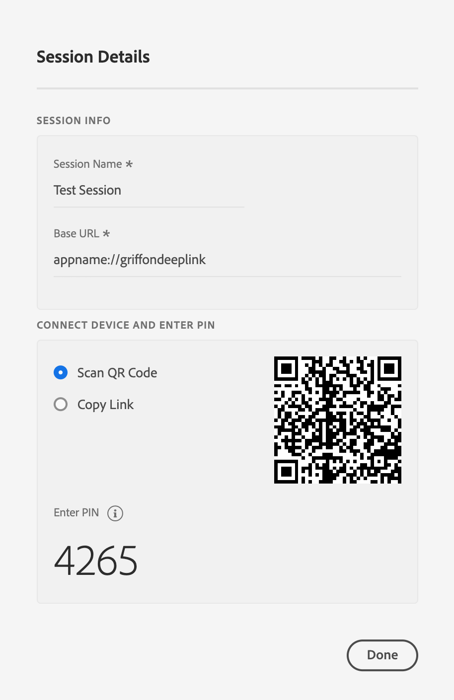
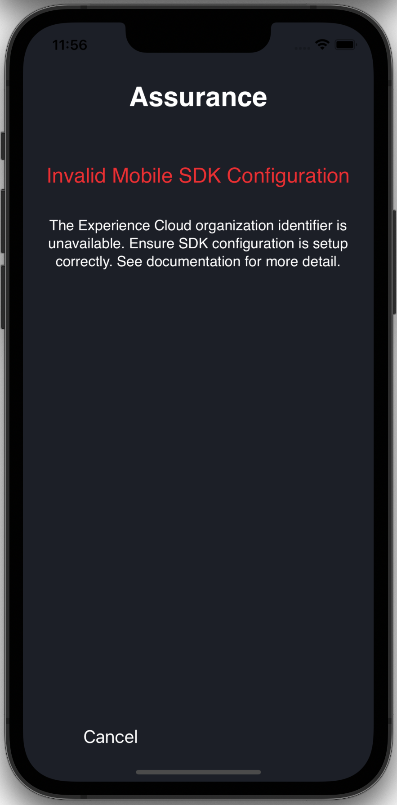
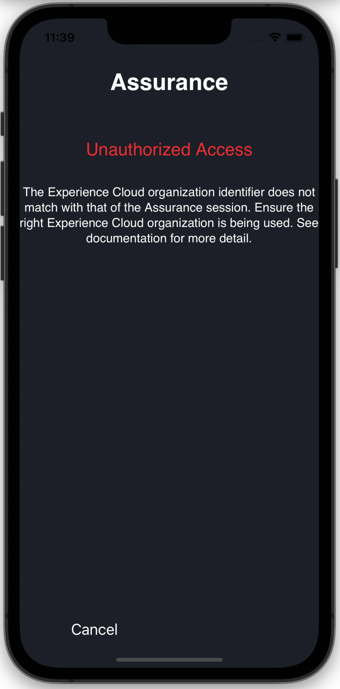

import Tabs from './tabs/common-issues.md'

# Resolving common issues

## Unable to open app with QR code or generated link

If scanning the QR code or opening the deep link in Adobe Experience Platform Assurance does not open your app, deep linking may not be correctly configured in your mobile application.

Please follow OS developer documentation to learn more on setting up deep linking.

<TabsBlock orientation="horizontal" slots="heading, content" repeat="2"/>

Android

<Tabs query="platform=android&task=unable-to-open-app"/>

iOS

<Tabs query="platform=ios&task=unable-to-open-app"/>

## PIN screen does not appear

When the generated link or QR code from Adobe Experience Platform Assurance is opened on device, it should launch your app and show a PIN screen to establish a Assurance session (as shown below). If this screen does not appear, ensure the following:



### Register Assurance SDK extension with Mobile Core

Please refer to the [Assurance overview](../index.md#register-aepassurance-with-mobile-core) for more details.

### Copy link or open QR code from Adobe Experience Platform Assurance

The PIN screen may not show if the link or QR code is incorrect (or doesn't contain the query parameter `adb_validation_sessionid`). You may detect this error by seeing console logs with the following strings:

<TabsBlock orientation="horizontal" slots="heading, content" repeat="2"/>

Android

<Tabs query="platform=android&task=copy-link"/>

iOS

<Tabs query="platform=ios&task=copy-link"/>

This issue may be resolved by scanning the right QR code or correctly copying the link generated in Assurance.

## Connection error

After you enter the PIN, if you see the following Connection Error:



You may resolve it by double-checking the PIN is entered correctly from the session associated link or QR code:



Or ensuring internet connectivity on the device/simulator.

## Invalid Mobile SDK configuration

If you see an Invalid Mobile SDK Configuration error (see screenshot below), verify the following:

1. Mobile Core is [configured](../mobile-core/configuration/api-reference.md)
2. Configuration in the Data Collection UI is [published](../getting-started/create-a-mobile-property.md#publish-the-configuration)
3. Ensure the device/simulator has internet connectivity



#### Sample logs

<TabsBlock orientation="horizontal" slots="heading, content" repeat="2"/>

Android

<Tabs query="platform=android&task=invalid-configuration-sample-logs"/>

iOS

<Tabs query="platform=ios&task=invalid-configuration-sample-logs"/>

## Unauthorized access

This error may happen when you have access to multiple organizations in your Adobe Experience Cloud interface. To resolve, ensure the organization which houses the mobile property is the same one as that where you are using Adobe Experience Platform Assurance.



#### Sample logs

<TabsBlock orientation="horizontal" slots="heading, content" repeat="2"/>

Android

<Tabs query="platform=android&task=unauthorized-access-sample-logs"/>

iOS

<Tabs query="platform=ios&task=unauthorized-access-sample-logs"/>

## Timeout

This SDK log message is not an error and is displayed during the routine course of SDK initialization. This message is expected if the app was not launched with an Adobe Experience Platform Assurance deep link. You may ignore this message if Assurance works as expected.

#### Sample logs

<TabsBlock orientation="horizontal" slots="heading, content" repeat="2"/>

Android

<Tabs query="platform=android&task=timeout-sample-logs"/>

iOS

<Tabs query="platform=ios&task=timeout-sample-logs"/>

## Failed to show fullscreen takeover

This log message is not an error and will appear with routine usage on Android devices & simulators. You may ignore this log if Assurance works as expected.

#### Sample log

```text
W/AdobeExperienceSDK: Assurance - Failed to show fullscreen takeover, could not get fullScreenTakeover object.
```

