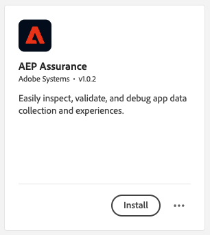

import Tabs from './tabs/index.md'

# Adobe Experience Platform Assurance extension

This extension enables capabilities for [Adobe Experience Platform Assurance](../platform-assurance/index.md).

To get started with Assurance in your app, you'll need to:

1. Install the AEP Assurance extension in the [Data Collection UI](https://experience.adobe.com/#/data-collection)
2. Add AEP Assurance SDK extension library to your app
   1. Import AEP Assurance into your app
   2. Register and implement extension APIs

## Install the AEP Assurance extension in the Data Collection UI

Go to the [Experience Platform Data Collection UI](https://experience.adobe.com/#/data-collection/) and select your mobile property:

1. In the Data Collection UI, select the **Extensions** tab.
2. On the **Catalog** tab, locate the **AEP Assurance** extension, and select **Install**.
3. Follow the publishing process to update the Mobile SDK configuration.

## Add the AEP Assurance extension to your app

### Import the library to your app code

<TabsBlock orientation="horizontal" slots="heading, content" repeat="2"/>

Android

<Tabs query="platform=android&task=import-library"/>

iOS

<Tabs query="platform=ios&task=import-library"/>

<!--- React Native

<Tabs query="platform=react-native&task=import-library"/>

Flutter

<Tabs query="platform=flutter&task=import-library"/> --->

### Register AEPAssurance with Mobile Core

The `MobileCore.registerExtensions()` API can be used to register the Assurance extension with the Mobile Core extension. This API allows the extension to send and receive events to and from the Mobile SDK.

<TabsBlock orientation="horizontal" slots="heading, content" repeat="2"/>

Android

<Tabs query="platform=android&task=register-assurance"/>

iOS

<Tabs query="platform=ios&task=register-assurance"/>

<!--- React Native

<Tabs query="platform=react-native&task=register-assurance"/>

Flutter

<Tabs query="platform=flutter&task=register-assurance"/> --->

### Connect to an Assurance session

<TabsBlock orientation="horizontal" slots="heading, content" repeat="2"/>

Android

<Tabs query="platform=android&task=implement-assurance"/>

iOS

<Tabs query="platform=ios&task=implement-assurance"/>

