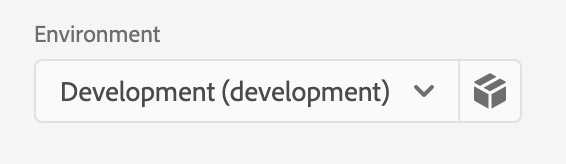

<Variant platform="android" task="import-library" repeat="4"/>

1. Add the following libraries in your project's `build.gradle` file:

```java
implementation 'com.adobe.marketing.mobile:core:1+'
implementation 'com.adobe.marketing.mobile:assurance:1+'
```

2. Import the Assurance library along with the other Mobile SDK libraries:

```java
import com.adobe.marketing.mobile.Assurance;
import com.adobe.marketing.mobile.MobileCore;
```

<Variant platform="ios-aep" task="import-library" repeat="7"/>

Add the library to your project via your [Cocoapods](https://cocoapods.org/pods/AEPAssurance) `Podfile`:

```pod
pod 'AEPCore','~> 3.0'
pod 'AEPAssurance','~> 3.0'
```

Import the Assurance extension along with the other Adobe Mobile SDK extensions:

#### Swift

```swift
import AEPCore
import AEPAssurance
```

#### Objective-C

```objectivec
@import AEPCore;
@import AEPAssurance;
```

<Variant platform="ios-acp" task="import-library" repeat="7"/>

Add the library to your project via your [Cocoapods](https://cocoapods.org/pods/AEPAssurance) `Podfile`:

```pod
pod 'ACPCore'
pod 'AEPAssurance','~> 1.0'
```

Import the Assurance extension along with the other Adobe Mobile extensions:

#### Swift

```swift
import ACPCore
import AEPAssurance
```

#### Objective-C

```objectivec
#import "ACPCore.h"
#import "AEPAssurance.h"
```

<Variant platform="react-native" task="import-library" repeat="13"/>

1. Install the AEP Assurance package.

```bash
npm install @adobe/react-native-aepassurance
```

2. Link the module.

**React Native 0.60+**

[CLI autolink feature](https://github.com/react-native-community/cli/blob/master/docs/autolinking.md) links the module while building the app.

**React Native &lt;= 0.59**

```bash
react-native link @adobe/react-native-aepassurance
```

**Note** For `iOS` using `cocoapods`, run:

```bash
cd ios/ && pod install
```

3. Import the extension.

```jsx
import {AEPAssurance} from '@adobe/react-native-aepassurance';
```

4. Get the extension version.

```jsx
AEPAssurance.extensionVersion().then(version => console.log("AdobeExperienceSDK: AEPAssurance version: " + version));
```

<Variant platform="flutter" task="import-library" repeat="7"/>

#### JavaScript

1. Install the AEP Assurance package.

Installation instructions can be found in the [Flutter documentation](https://pub.dev/packages/flutter_assurance/install).

2. Import the extension.

```dart
import 'package:flutter_assurance/flutter_assurance.dart';
```

3. Get the extension version.

```dart
String version = await FlutterAEPAssurance.extensionVersion;
```

<Variant platform="cordova" task="import-library" repeat="5"/>

#### JavaScript

1. After creating your Cordova app and adding the Android and iOS platforms, the AEPAssurance extension for Cordova can be added with this command:

```js
cordova plugin add https://github.com/adobe/cordova-aepassurance.git
```

2. Get the extension version.

```jsx
AEPAssurance.extensionVersion(function(version) {  
    console.log("AEPAssurance version: " + version);
}, function(error) {  
    console.log(error);  
});
```

<Variant platform="unity" task="import-library" repeat="5"/>

#### C#

1. After importing the [AEPAssurance.unitypackage](https://github.com/adobe/unity-aepassurance/tree/master/bin), the AEP Assurance extension for Unity can be added with the following code in the MainScript:

```csharp
using com.adobe.marketing.mobile;
```

2. Get the extension version.

```csharp
AEPAssurance.extensionVersion();
```

<Variant platform="xamarin" task="import-library" repeat="5"/>

#### C#

1. After adding the [iOS](https://www.nuget.org/packages/Adobe.AEPAssurance.iOS/) or [Android](https://www.nuget.org/packages/Adobe.AEPAssurance.Android/) AEP Assurance NuGet package, the Assurance extension can be added by this import statement:

```csharp
using Com.Adobe.Marketing.Mobile;
```

2. Get the extension version.

```csharp
AEPAssurance.ExtensionVersion();
```

<Variant platform="android" task="register-assurance" repeat="7"/>

To start using the extension library, you must first register the extension with the [Mobile Core](../mobile-core/index.md) extension.

#### Java

Register the extension when you register other extensions.

To find your app ID, which is mentioned below, please read the [Mobile Install Instructions](../mobile-core/configuration/index.md#configure-with-app-id-per-environment). Within the "Publishing Flow", select the small gray box next to the "Environment" dropdown.
   


```java
 public class MobileApp extends Application {
    @Override
    public void onCreate() {
        super.onCreate();
        MobileCore.setApplication(this);

        try {
        // register other necessary extensions
        Assurance.registerExtension();            
        MobileCore.start(new AdobeCallback() {
            @Override
            public void call(final Object o) {
                MobileCore.configureWithAppID("yourAppId");
            }});
        } catch (Exception e) {
        // Log the exception
        }
    }
}
```

<Variant platform="ios-aep" task="register-assurance" repeat="5"/>

To start using the extension library, you must first register the extension with the [Mobile Core](../mobile-core/index.md) extension.

#### Swift

```swift
    func application(_ application: UIApplication, didFinishLaunchingWithOptions launchOptions: [UIApplication.LaunchOptionsKey: Any]?) -> Bool {

        let extensions = [Assurance.self, ...]
        MobileCore.registerExtensions(extensions, {
            // set app id from the Data Collection UI    
		        MobileCore.configureWith(appId: "yourAppId")  
        })

        return true
    }
```

#### Objective-C

```objectivec
- (BOOL)application:(UIApplication *)application didFinishLaunchingWithOptions:(NSDictionary *)launchOptions {

    NSArray *extensionsToRegister = @[AEPMobileAssurance.class, ...];
    [AEPMobileCore registerExtensions:extensionsToRegister completion:^{
        // set app id from the Data Collection UI
        [AEPMobileCore configureWithAppId: @"yourAppId"];
    }];

    return YES;
}
```

<Variant platform="ios-acp" task="register-assurance" repeat="5"/>

To start using the extension library, you must first register the extension with the [Mobile Core](../mobile-core/index.md) extension.

#### Swift

```swift
func application(_ application: UIApplication, didFinishLaunchingWithOptions launchOptions: [UIApplication.LaunchOptionsKey: Any]?) -> Bool {
	   // set app id from the Data Collection UI
     ACPCore.configure(withAppId: "yourAppId")
     AEPAssurance.registerExtension()
     ACPCore.start(nil)
     return true;
}
```

#### Objective-C

```objectivec
- (BOOL)application:(UIApplication *)application didFinishLaunchingWithOptions:(NSDictionary *)launchOptions {
    [ACPCore configureWithAppId:@"yourAppId"]; // set app id from the Data Collection UI
    [AEPAssurance registerExtension];
    [ACPCore start:nil];
    return YES;
 }
```

<Variant platform="react-native" task="register-assurance" repeat="2"/>

#### JavaScript

When using React Native, register AEP Assurance with Mobile Core in native code as shown on the Android and iOS tabs.

<Variant platform="flutter" task="register-assurance" repeat="2"/>

#### Dart

When using Flutter, register AEP Assurance with Mobile Core in native code as shown on the Android and iOS tabs.

<Variant platform="cordova" task="register-assurance" repeat="2"/>

#### JavaScript

When using Cordova, register AEP Assurance with Mobile Core in native code as shown on the Android and iOS tabs.

<Variant platform="unity" task="register-assurance" repeat="3"/>

#### C#

Register the extension in the `start()` function:

```csharp
using com.adobe.marketing.mobile;
using using AOT;

public class MainScript : MonoBehaviour
{
    [MonoPInvokeCallback(typeof(AdobeStartCallback))]
    public static void HandleStartAdobeCallback()
    {   
        // set app id from the Data Collection UI
        ACPCore.ConfigureWithAppID("yourAppId");
    }

    // Start is called before the first frame update
    void Start()
    {   
        AEPAssurance.registerExtension();
        ACPCore.Start(HandleStartAdobeCallback);
    }
}
```

<Variant platform="xamarin" task="register-assurance" repeat="6"/>

**iOS**

Register the AEPAssurance extension in your app's `FinishedLaunching()` function:

```csharp
public override bool FinishedLaunching(UIApplication app, NSDictionary options)
{
  global::Xamarin.Forms.Forms.Init();
  LoadApplication(new App());
  AEPAssurance.RegisterExtension();
  // start Mobile Core
  ACPCore.Start(startCallback);
  return base.FinishedLaunching(app, options);
}

private void startCallback()
{
  // set app id from the Data Collection UI
  ACPCore.ConfigureWithAppID("yourAppId");
}
```

**Android**

Register the AEPAssurance extension in your app's `OnCreate()` function:

```csharp
protected override void OnCreate(Bundle savedInstanceState)
{
  base.OnCreate(savedInstanceState);
  global::Xamarin.Forms.Forms.Init(this, savedInstanceState);
  LoadApplication(new App());
  AEPAssurance.RegisterExtension();

  // start Mobile Core
  ACPCore.Start(new CoreStartCompletionCallback());
}

class CoreStartCompletionCallback : Java.Lang.Object, IAdobeCallback
{
  public void Call(Java.Lang.Object callback)
  {
    // set app id from the Data Collection UI
    ACPCore.ConfigureWithAppID("yourAppId");
  }
}
```

<Variant platform="ios-aep" task="implement-assurance" repeat="11"/>

#### Swift

**Example**

```swift
    func application(_ app: UIApplication, open url: URL, options: [UIApplication.OpenURLOptionsKey: Any] = [:]) -> Bool {
        Assurance.startSession(url: url)
        return true
    }
```

In iOS 13 and later, for a scene-based application, use the `UISceneDelegate`'s `scene(_:openURLContexts:)` method as follows:

```swift
    func scene(_ scene: UIScene, openURLContexts URLContexts: Set<UIOpenURLContext>) {
        // Called when the app in background is opened with a deep link.
        if let deepLinkURL = URLContexts.first?.url {
            Assurance.startSession(url: deepLinkURL)
        }
    }

    func scene(_ scene: UIScene, willConnectTo session: UISceneSession, options connectionOptions: UIScene.ConnectionOptions) {
        // Called when the app launches with the deep link
        if let deepLinkURL = connectionOptions.urlContexts.first?.url {
            Assurance.startSession(url: deepLinkURL)
        }
    }
```

#### Objective-C

**Syntax**

```objectivec
static func startSession(url: URL?)
```

**Example**

```objectivec
- (BOOL)application:(UIApplication *)app openURL:(nonnull NSURL *)url options:(nonnull NSDictionary<UIApplicationOpenURLOptionsKey,id> *)options {
    [AEPMobileAssurance startSessionWithUrl:url];
    return true;
}
```

In iOS 13 and later, for a scene-based application, use the `UISceneDelegate`'s `scene(_:openURLContexts:)` method as follows:

```objectivec

- (void)scene:(UIScene *)scene willConnectToSession:(UISceneSession *)session options:(UISceneConnectionOptions *)connectionOptions {    
    NSURL *deepLinkURL = connectionOptions.URLContexts.allObjects.firstObject.URL;
    [AEPMobileAssurance startSessionWithUrl:deepLinkURL];
}


- (void)scene:(UIScene *)scene openURLContexts:(NSSet<UIOpenURLContext *> *)URLContexts {
    [AEPMobileAssurance startSessionWithUrl:URLContexts.allObjects.firstObject.URL];
}
```

<Variant platform="ios-acp" task="implement-assurance" repeat="12"/>

#### Swift

**Example**

```swift
func application(_ app: UIApplication, open url: URL, options: [UIApplication.OpenURLOptionsKey : Any] = [:]) -> Bool {
    AEPAssurance.startSession(url)
    return true
}
```

In iOS 13 and later, for a scene-based application, use the `UISceneDelegate`'s `scene(_:openURLContexts:)` method as follows:

```swift
func scene(_ scene: UIScene, openURLContexts URLContexts: Set<UIOpenURLContext>) {
    AEPAssurance.startSession((URLContexts.first!).url)
}
```

#### Objective-C

**Syntax**

```objectivec
+ (void) startSession: (NSURL* _Nonnull) url;
```

**Example**

```objectivec
- (BOOL)application:(UIApplication *)app openURL:(nonnull NSURL *)url options:(nonnull NSDictionary<UIApplicationOpenURLOptionsKey,id> *)options {
    [AEPAssurance startSession:url];
    return true;
}
```

In iOS 13 and later, for a scene-based application, use the `UISceneDelegate`'s `scene(_:openURLContexts:)` method as follows:

```objectivec
- (void) scene:(UIScene *)scene openURLContexts:(NSSet<UIOpenURLContext *> *)URLContexts {
    UIOpenURLContext * urlContext = URLContexts.anyObject;
    if (urlContext != nil) {
        [AEPAssurance startSession:urlContext.URL];
    }
}
```