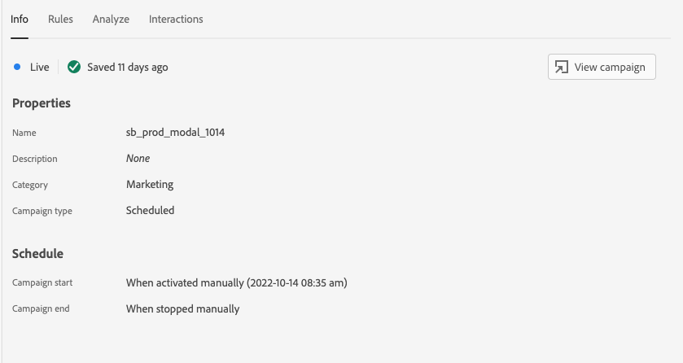
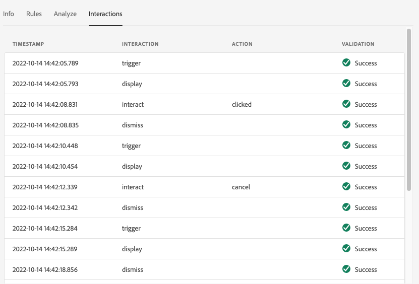

# In-App Messaging

## Overview

The In-App Messaging View provides the ability to validate your app, monitor in-app messages that are delievered to your device, and simulate messages to your device.

## Messages on Device

At the top of the "Messages on Device" tab is a "Message" dropdown. This will include all the messages that have been received in the Assurance session. If a message is not in this list, it means the app never recieved it.


Selecting a message will show a lot of information about that message as described in the sections below.

### Message Preview

In the right panel is a "Message Preview" pane, which shows a preview of the message. Clicking the "Simulate on Device" button will send that message to any devices that are currently connected to the session.


### Message Behavior

Below the "Message Preview" pane is the "Message Behavior" tab. This has all the details around how the message is displayed. This information includes positioning information, animations, swipe gestures, and appearance settings.


### Info Tab

In the left section, there are four tabs that show details about the message. The "Info" tab shows information loaded from AJO about the message campaign.

There is also a "View campaign" button that opens the message in AJO for inspection or editing.



### Rules Tab

The "Rules" tab shows what needs to happen for this message to be displayed. This gives insight into exactly what will trigger a message to be displayed. Looking at this example:


The example shows three different conditions for the rule. If you select an event (from an events list, the Analyze tab, or in the timeline), that event will be evaluated against these rules. If the event matches a condition, it will show a green checkmark:


If the event does not match, it will show a red icon:


If all three conditions match the current event, the message will be displayed.

### Analyze Tab

The "Analyze" tab provides additional insights into the rules. Here, we filter every event in the session based on how close our message rule matches the event.


In our example in the "Rules Tab", we had 3 conditions in our rule. This tab shows what percentage of the rule each event matches. Here we see a bunch of events that match at 33% (one of three conditions) and a few that match at 100%.

The idea here is to help you find events that are close to matching but not fully matching the rule.


The "Match Threshold" slider lets you fine tune which events should be displayed. For example, I could set it to 50% - 90% to get a list of events that match exact two of the three conditions.

### Interactions Tab

The "Interactions" tab shows a list of interaction events that were sent to the Edge for tracking purposes.



There are usually four interaction events whenever a message is displayed:

```
trigger > display > interact > dismiss
```

The "interact" interaction has an additional "action" value associated with it. This can be "clicked", "cancel", etc.

The validation column shows if the interaction event was properly recieved and processed by the Edge.

## Validation

The "Validation" tab runs validations against your current session, checking to see if the app has been configured for In-App Messaging correctly:


If any errors were found, details on how to fix those errors will be provided.

## Event List


The "Event List" tab provides a quick look at all the events in the Assurance session that are related to In-App Messaging. Some of the events you may see here are:

* Requests and responses to retrieve messages
* Display message events
* Interaction tracking events

Many of the standard Event List features are present in this view. There are options to apply searches and filters. Columns can be added and removed. Data can be exported.

To see more details about an event, simple click that event to select it. Selecting an event will show the raw details of the event in the right panel. It also may change information seen in the "Messages on Device" panel.

From the right details panel, the selected event can be flagged. This is helpful to mark something that should be reviewed by another person.
