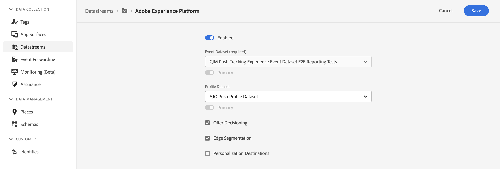

# Optimize Setup Validation view

## Overview

You can use the Optimize Setup Validation view to check if your application has been set up successfully to use Adobe Experience Platform Optimize. The view validates all pre-requisites have been met, and offers feedback on how to fix your setup in cases where requirements have been missed.

## Getting Started

To use this view, follow the steps outlined below:

1. [Set up Adobe Experience Platform Assurance](../set-up.md)
2. [Create](./index.md#creating-sessions) and [connect](./index.md#connecting-to-a-session) to an Assurance session
3. In the **Home** view, select **Validate Setup**

## Datastream Setup Validation

At the top of the Optimize Setup Validation view, Platform Assurance inspects your current application's datastream to see if Target or Offer Decisioning has been enabled. In order to use optimize, at least one of extensions needs to be enabled inside your datastream.

To enable Target in your datastream, go to the datastream view for application app inside the Data Collection UI, and ensure that Adobe Target has been added and enabled.

To enable Offer Decisioning in your datastream, go to datastream view for your application in the Data Collection UI, and select Edit in the actions menu for Adobe Experience Platform. The toggle shows if Offer Decisioning is enabled.

## SDK Setup Validation

Below the datastream validation section, the SDK Setup Validation section offers feedback on two major issues you could face in your application. Firstly, it offers validation that all SDKs have been installed that are required by Optimize to work correctly. Secondly, it validates that the request and response events are flowing from your application in the way the platform expects them to. Errors may arise if your schemas have been improperly implemented, or your application is sending requests that do not receive an appropriate response. This section will provide feedback and identify the events in error, so you can diagnose what went wrong.

