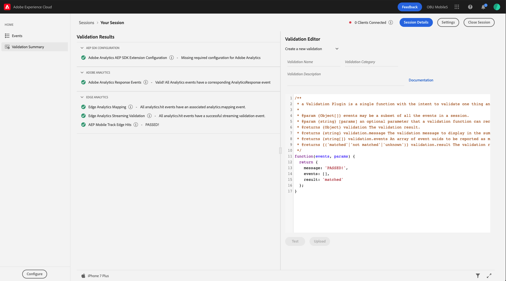
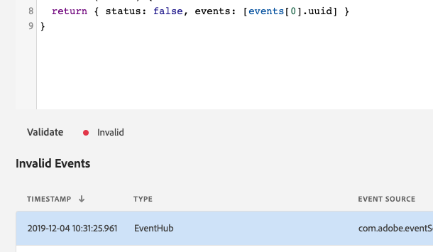
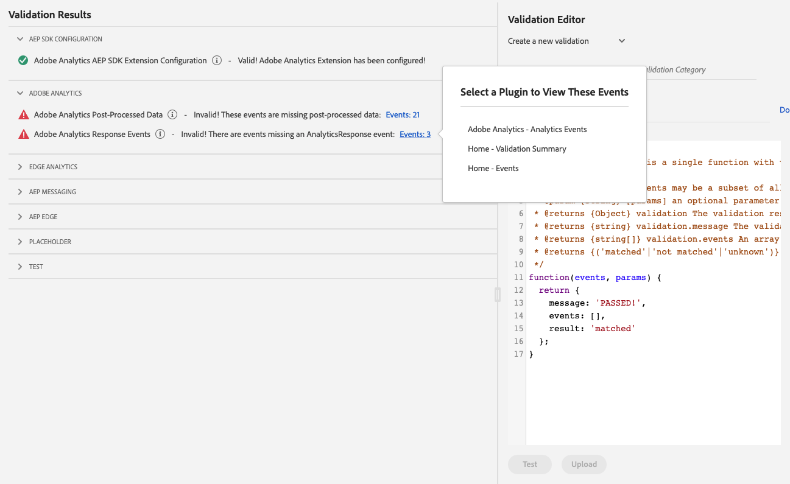

# Validation Summary

## Overview

You may use the Validation Summary feature to quickly and easily manage JavaScript functions to validate events in an Adobe Experience Platform Assurance session. Each function receives the events in an Assurance session. You can write functions to validate your client configuration, event conditions, tests and use cases.

## Getting Started

To use this view, complete the following steps:

1. [Set up Adobe Experience Platform Assurance](../set-up.md)
2. [Create](./index.md#creating-sessions) and [connect](./index.md#connecting-to-a-session) to a Assurance session
3. In the **Home** view, select **Validation Summary**

## Validation Management

When the view is loaded, it provides a panel on the left that contains a categorized list of validation results and a panel on the right to create and edit JavaScript validation functions.

## Writing a Validation Function

This feature allows you to create, edit, or delete validation functions for your Adobe Experience Platform Assurance sessions.

1. Select **Create a New Validation**.
2. Enter a **name** to identify the validation, then provide a **category** and a **description**.
3. Edit the code in the editor to validate the events for your Assurance session.
4. Select **Test** to preview the results of the function in the left panel.

After you have tested your function, you can select **Upload** to save your validation.

### Event Definition

| Key | Type | Description |
| :--- | :--- | :--- |
| `uuid` | String | Universally unique identifier for the event. |
| `timestamp` | Number | Timestamp from the client when the event was sent to Assurance. |
| `eventNumber` | Number | Used to order when the event was sent. This key is useful when events have the same timestamp. |
| `vendor` | String | Vendor identification string in the reverse domain name format (for example, com.adobe.assurance). |
| `type` | String | Used to denote the type of event. |
| `payload` | Object | Defines the data for the event and contains unique and common properties. Some common properties include `ACPExtensionEventSource and ACPExtensionEventType`. |
| `annotations` | Array | An array of annotation objects. |

### Annotation Definition

| Key | Type | Description |
| :--- | :--- | :--- |
| `uuid` | String | Universally unique identifier for the annotation. |
| `type` | String | Used to denote the type of annotation and is usually the name of the plugin (for example, analytics). |
| `payload` | Object | Defines the data that should supplement the event. For Adobe Analytics, this is where the post-processed hit data is contained. |

### Returning Validation Results

To execute the function in the code editor, select **Test**. The function is expected to return an object that contains the following:

| Key | Type | Description |
| :--- | :--- | :--- | 
| `message` | String | The validation message to display in the summary results. |
| `events` | Array | An array of event uuids to be reported as matched or not matched. |
| `result` | String | This is the validation result and is expected to be one of the enumerated strings: "matched", "not matched", "unknown" |

## Viewing Results

The left panel displays the results of all enabled validations, including the tested function in the right panel.

When a validation result is `unknown` or `not matched` and the `events` array has one or more `uuids`, the left panel will render a link with the count of events that are not matched. Selecting the link will render a popover that contains a list of views. Selecting one of the views will navigate you to that view and will select those events not matched.

## Troubleshooting

If an error occurs in the JavaScript code editor, an `ERROR` status is displayed, and the reason for the error is output to the browser's developer console.

Additionally, you can also reach out to our team on our Slack Channel at [https://projectgriffon.slack.com/](https://projectgriffon.slack.com/).

To learn more about validations, you can visit the [Adobe Experience Platform Assurance Validations](https://github.com/adobe/assurance-validation-plugins) GitHub. There you can find examples from validations owned by Adobe, as well as the [wiki](https://github.com/adobe/assurance-validation-plugins/wiki) that describes validations in more detail.

