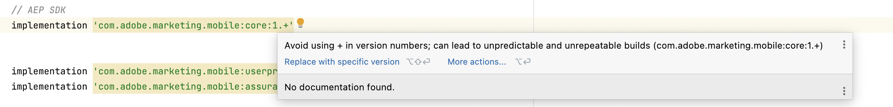
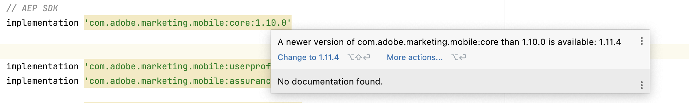

# Manage dependencies using Gradle

Installation via [Maven](https://maven.apache.org/) and [Gradle](https://gradle.org/) is recommended, as it's the easiest way to get the Adobe Experience Platform Mobile SDK into your Android app.

The Android installation instructions generated for mobile properties in the Data Collection UI, as indicated in the [getting started guide](./getting-started/get-the-sdk.md), use dynamic versioning for Gradle dependencies. This is done to simplify getting started with the latest versions of our SDKs. Use of dynamic dependency versions is **not** recommended, as it makes builds non-deterministic, which can cause builds to break without any obvious change, and worse, can be caused by a transitive dependency that the build author has no control over.

To have predictable builds, follow one of the following approaches when managing gradle dependencies. 

## Resolve dependencies using IDE

To ensure consistent builds, explicitly specify the versions of dependencies and manually update them as necessary. This allows for full control over version updates and the ability to thoroughly review the dependency changelog and assess the changes before implementation.

IDEs such as Android Studio or IntelliJ highlight dynamic or outdated dependencies as warnings. Follow the provided suggestions to update dependencies to appropriate versions.

## Locking dependency versions

Gradle dependency locking is a feature that allows developers to lock the versions of dependencies used in a project, ensuring that the same versions are used consistently across different builds and environments. This increases a build's stability and predictability, and prevents version conflicts or unexpected behavior caused by using different versions of dependencies.

Please refer to the gradle [locking dependency versions guide](https://docs.gradle.org/current/userguide/dependency_locking.html) to enable dependency locking in your project.