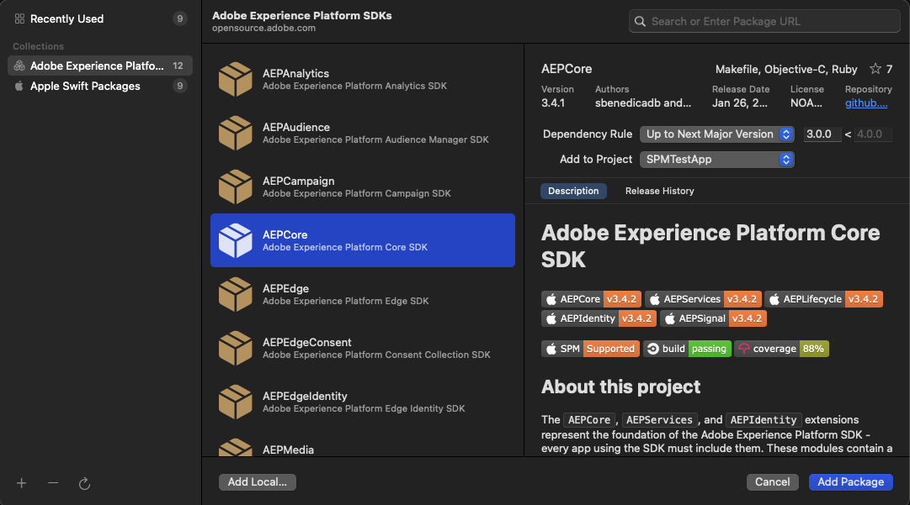

# Manage dependencies using Swift Package Manager

The [Swift Package Manager (SPM)](https://www.swift.org/package-manager/) is a tool for managing the distribution of Swift code that's integrated with the Swift build system to automate the process of downloading, compiling, and linking dependencies. The Adobe Experience Platform SDKs support installation using SPM. 

## Swift Package Collection 

In Swift 5.5, the Swift Package Manager (SPM) adds support for [package collections](https://www.swift.org/blog/package-collections). You can configure package collection in Xcode for easy installation of the Swift SDKs. The Swift package collection for the Adobe Experience Platform SDKs is available at the [Adobe Open Source site](https://opensource.adobe.com/aepsdk-core-ios/swift/packages/aep.json).

To add the Swift package collection in Xcode, select **File** followed by **Add Packages**, selecting the plus sign on the bottom left and choosing **Add Swift Package Collection**


Next, enter the package collection URL and click **Load**. After the package collection has loaded, click **Add Collection** to add the collection.


You should now see the added package collection on the left pane. Once selected, you will see all of the packages included in the collection listed.



## Install via Xcode

To add the Swift Packages to your application, from the Xcode menu select **File**, followed by **Add Packages**.

If you have configured package collection, select each package you would like to add to your project and click **Add Package** on the bottom right.

If not, enter the Package URL for the Swift SDK repositories: 

- AEPCore: `https://github.com/adobe/aepsdk-core-ios.git`

For each package, specify the Dependency rule as a specific version or a range of versions and select the Project. 

When prompted, select all the `AEP*` libraries, then click `Add Package`.

## Install via Package.swift

Alternatively, if your project has a `Package.swift` file, you can add Swift SDKs directly to your dependencies and also add required `AEP*` libraries as targets.

```ruby
dependencies: [
    .package(url: "https://github.com/adobe/aepsdk-core-ios.git", .upToNextMajor(from: "3.0.0"))
],
targets: [
    .target(name: "YourTarget",
            dependencies: [
                .product(name: "AEPCore", package: "AEPCore"),
                .product(name: "AEPIdentity", package: "AEPCore"),
                .product(name: "AEPSignal", package: "AEPCore"),
                .product(name: "AEPLifecycle", package: "AEPCore"),
                .product(name: "AEPServices", package: "AEPCore"),
            ],
            path: "your/path"),
]
```
