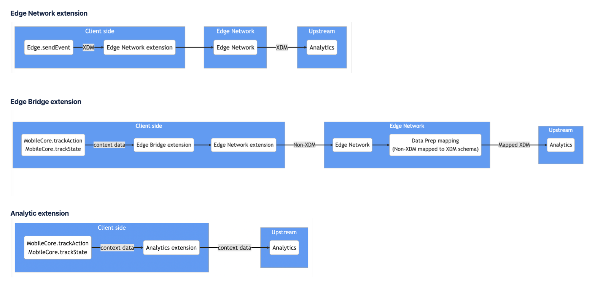

# Migrate from Analytics mobile extension to Adobe Experience Platform Edge Network

## Overview

Are you currently using the Adobe Analytics mobile extension and considering a migration to Edge Network? If so, you've come to the right place!

This guide outlines the available options for migrating to Edge Network and Analytics service:

* Implement the Edge Network extension using the `Edge.sendEvent` API.
* Implement the Edge Bridge extension using the `MobileCore.trackAction` and `MobileCore.trackState` APIs.

The **Edge Network extension** and its `sendEvent` API is the recommended implementation path for sending data to Analytics through Edge Network. It sends Experience Data Model (XDM) formatted data directly to Edge Network, which is well understood by Experience Platform and upstream services. That means the same XDM events can be used in Analytics and other powerful solutions within Experience Platform, such as Journey Optimizer, Journey Orchestration, and Server-Side Forwarding.

The **Edge Bridge extension** offers a drop in solution for migrating existing Analytics extension implementations using the `MobileCore.trackAction` / `MobileCore.trackState` APIs. Edge Bridge automatically routes those API calls to the Edge Network. However, the data from these events must be mapped to an XDM schema using Data Prep for Data Collection before the Experience Platform and upstream services can use it.

<InlineAlert variant="info" slots="text"/>

Edge Bridge only supports the Analytics drop-in migration case. If you are looking to migrate your Adobe Target implementation, please refer to the [Adobe Journey Optimizer Decisioning documentation](../../edge-extensions/adobe-journey-optimizer-decisioning/index.md) for more details.

## Extensions comparison

|       |  API for sending data | Extensions| XDM transform location |  Platform support with latest Mobile SDKs | Can send to other services (configurable in Datastreams)  |
| ----------- | ----------- |-----------|-----------|-----------|-----------|
| **Edge Network extension** | Edge.sendEvent | 1. Edge Network extension   2. Identity for Edge Network extension | Client-side| iOS, Android, tvOS, Flutter, React Native | Yes |
| **Edge Bridge extension** | MobileCore.trackAction   MobileCore.trackState | 1. Edge Bridge extension   2. Edge Network extension   3. Identity for Edge Network extension| Server-side through Data Prep mapping| iOS, Android, tvOS, Flutter, React Native | Yes |
| **Analytics extension** | MobileCore.trackAction    MobileCore.trackState | 1. Analytics extension   2. Identity for Experience Cloud ID Service extension | N/A| iOS, Android, tvOS   (Not supported on Flutter, React Native)| N/A |

<InlineAlert variant="info" slots="text"/>

Other foundational extensions include the [Consent for Edge Network extension](../../edge-extensions/consent-for-edge-network/index.md) which enables consent preferences collection from your mobile app, and the [Assurance extension](../../base-extensions/platform-assurance-sdk/index.md) for validating your app implementation.

### Workflow comparison

  
## Get started with the migration

| Steps  |  Edge Network extension | Edge Bridge extension |
| ----------- | ----------- | ----------- |
| 1. [Set up an XDM schema](https://experienceleague.adobe.com/docs/experience-platform/xdm/home.html). Experience Data Model (XDM) is the open and publicly documented data model standard created by Adobe to standardize data collection, and is used across applications that leverage Experience Platform.   **NOTE:** Take advantage of [automatic Analytics variable mapping](https://experienceleague.adobe.com/docs/analytics/implementation/aep-edge/variable-mapping.html) of XDM fields to Analytics dimensions by using the Adobe managed XDM schemas for Lifecycle, Media, Commerce, and more.| ✅  | ✅ |
| 2. [Configure a datastream](https://experienceleague.adobe.com/docs/experience-platform/edge/datastreams/overview.html). A datastream is the server-side configuration used when implementing the Experience Platform Mobile SDK. | ✅  | ✅ |
| 3. **Add the Adobe Analytics service** to your datastream. The datastream controls both whether and how data is sent to Adobe Analytics. You will need your Analytics report suite ID (RSID) for this step.  | ✅ | ✅ |
| 4. **Install the *Edge Network* and *Identity for Edge Network extensions*** in the mobile property (tag) in Data Collection UI, and set the datastream in the Edge Network extension configuration. |  ✅ | ✅ |
| 5. **In your app code**, register the **Edge Network** and **Identity for Edge Network extensions** and set your mobile tag property configuration. | ✅ | ✅ |
| 5b. **In your app code**, also register the **Edge Bridge extension** with registering *Edge Network* and *Identity for Edge Network extensions*. |  | ✅ |
| 6. **Remove the Analytics extension** dependency and extension registration from your mobile app code.   **NOTE:** You should still keep the Analytics extension installed in the mobile property (tag) to ensure published versions of your app (pre-migration) continue to work seamlessly. |  ✅ | ✅ |
| 7 .**Use Edge.sendEvent API** to send data in XDM format to Edge Network based on the schema you have defined. |  ✅ |  |
| 8. **Keep existing MobileCore.trackAction / MobileCore.trackState API calls** to send data in context data format to Experience Platform.|  | ✅ |
| 9. **Map your context data to XDM** in Data Prep for Data Collection.|  | ✅ |

### Implement the Edge Network extension

To learn about the end to end Edge Network extension implementation process, follow the tutorials below:

* [iOS tutorial](https://github.com/adobe/aepsdk-edge-ios/tree/main/Documentation/Tutorials)
* [Android tutorial](https://github.com/adobe/aepsdk-edge-android/tree/main/Documentation/Tutorials)

### Implement the Edge Bridge extension

To learn about the end to end Edge Bridge extension implementation process, follow the tutorials below:

* [iOS tutorial](https://github.com/adobe/aepsdk-edgebridge-ios/tree/main/Documentation/tutorials)  
* [Android tutorial](https://github.com/adobe/aepsdk-edgebridge-android/tree/main/Documentation/tutorials)
  
## Other migration considerations

### Not yet on latest Mobile SDK?

If you are not using the latest version of the Mobile SDK (IE: v4 Mobile SDK or the ACP-prefixed Mobile SDK), you should first migrate to the [latest version](https://developer.adobe.com/client-sdks/documentation/current-sdk-versions), and then continue with this guide.

### Consent for Edge Network extension

The Consent for Edge Network mobile extension enables consent preference collection from your mobile app when using the Experience Platform Mobile SDK and Edge Network.

The privacy status setting (MobilePrivacyStatus.OPT_IN, OPT_OUT, UNKNOWN) set in the mobile tag property which is used by Adobe Experience Cloud mobile extensions (for example, Analytics and Target), are not read nor used by the Edge Network extensions. The Edge Network extensions rely on the Consent for Edge Network extension for this setting.

For more details, please refer to the [Consent for Edge Network extension documentation](https://developer.adobe.com/client-sdks/documentation/consent-for-edge-network).

### Identity consideration for the migration

When using Identity for Edge Network extension, the Mobile SDK automatically migrates an existing ECID (previously known as MID) to the new XDM IdentityMap format out of the box. If you are using custom identities with the `syncIdentifier` / `syncIdentifiers` APIs, you should consider migrating your IDs to the XDM format.

The previous Identity for Experience Cloud ID Service extension can be safely removed from the SDK registration process if there are no other extensions which rely on it, such as Target, Campaign and others.

If you need further assistance, please contact [Adobe Experience Cloud customer care](https://experienceleague.adobe.com/?support-solution=General#support).

## Next steps

To learn more about latest versions available for the Edge Network and Edge Bridge extensions, see the [Current SDK versions page](../../home/current-sdk-versions.md).
