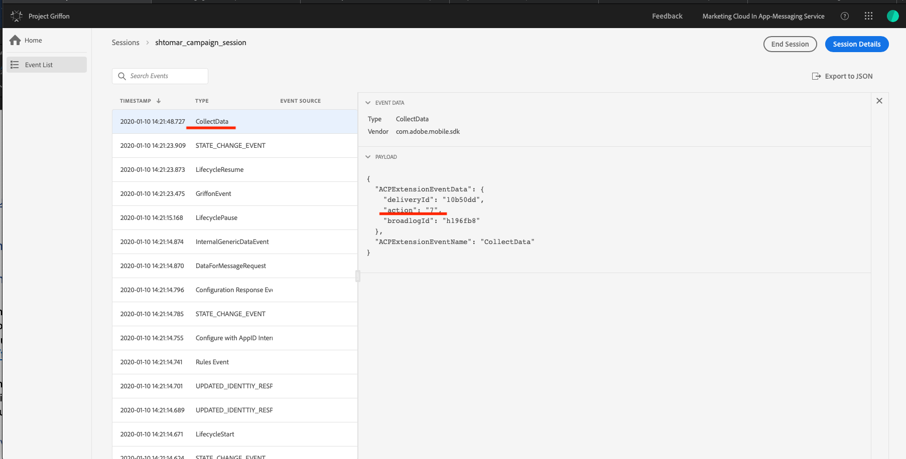
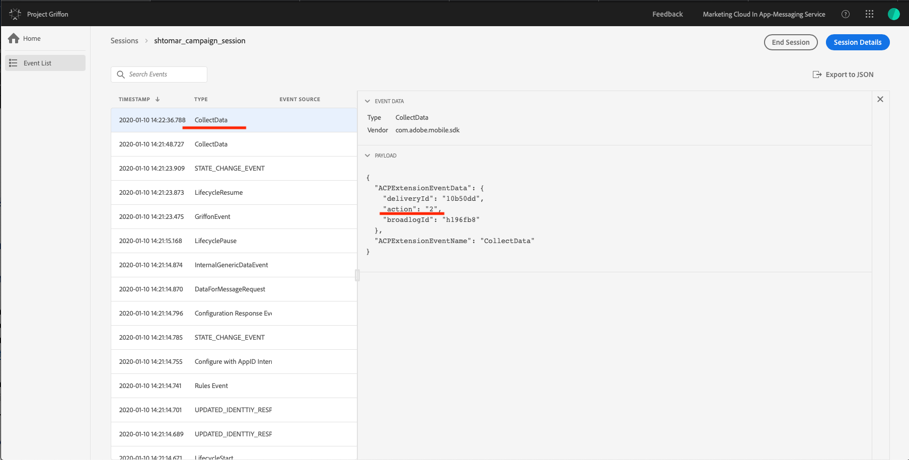
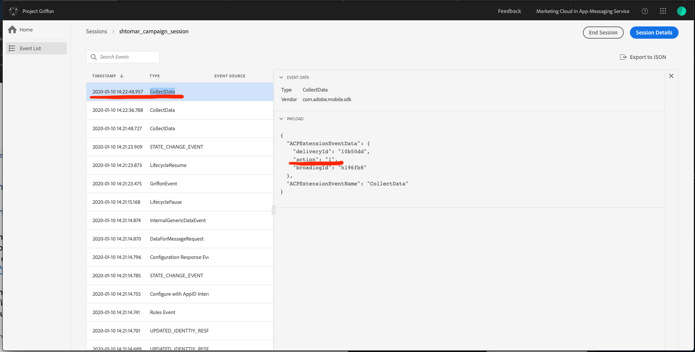
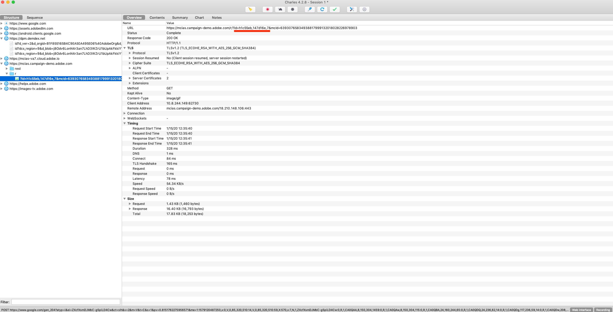
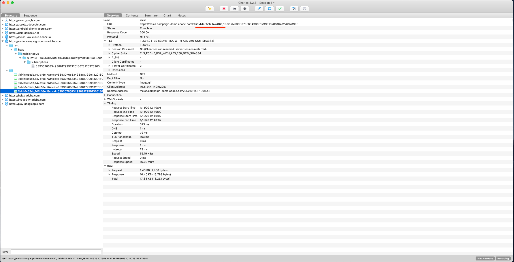

import Tabs from './tabs/push-notifications.md'

# Troubleshooting Campaign push notifications

To set up server key/APNS server certificate in the Campaign instance, complete the following steps:

<TabsBlock orientation="horizontal" slots="heading, content" repeat="2"/>

Android

<Tabs query="platform=android&task=campaign"/>

iOS

<Tabs query="platform=ios&task=campaign"/>

For more information about configuration, see [Channel specific application configuration in Adobe Campaign](https://experienceleague.adobe.com/docs/campaign-standard/using/administrating/configuring-channels/configuring-a-mobile-application.html?lang=en).

## Set up an Android or iOS app to receive push notifications

<TabsBlock orientation="horizontal" slots="heading, content" repeat="2"/>

Android

<Tabs query="platform=android&task=receive"/>

iOS

<Tabs query="platform=ios&task=receive"/>

## Troubleshooting push notification events tracking

The following events are related to the tracked push notifications:

- Impression: Notification is delivered.
- Click: User clicked the notification.
- Open: App opened in response to user's click on notification.

For more information about implementing the tracking of push notification events, see [Implementing Push Tracking](https://experienceleague.adobe.com/docs/campaign-standard/using/administrating/configuring-mobile/push-tracking.html?lang=en).

### Troubleshooting using Adobe Experience Platform Assurance

You can verify the push notification tracking in Assurance.

1. Connect your app to an Assurance session.
1. Send a push notification to app from your Campaign instance. To know more about how to send push notification, see [Preparing and sending a push notification](https://experienceleague.adobe.com/docs/campaign-standard/using/communication-channels/push-notifications/preparing-and-sending-a-push-notification.html?lang=en).
1. Receive a push notification in the device.
1. Click on the push notification to launch the app.
1. In the list of events, verify that you have an event with type CollectData.
1. In the Details panel on the right, verify the value of the action. 
The value of the action should be 7 for impression, 2 for the click, and 1 for open. 

Impression event tracking (action value 7)

Click event tracking (action value 2)

Open event tracking (action value 1)

### Troubleshooting using Charles

To verify that a successful network call is made to track the push notification interaction event, look for the `GET` request with the query string `id=broadlogID,deliveryID,action` to the Campaign server. See the screenshots below for more details about what to look for.

Impression event tracking (action value 7)

Click event tracking (action value 2)

Open event tracking (action value 1)

