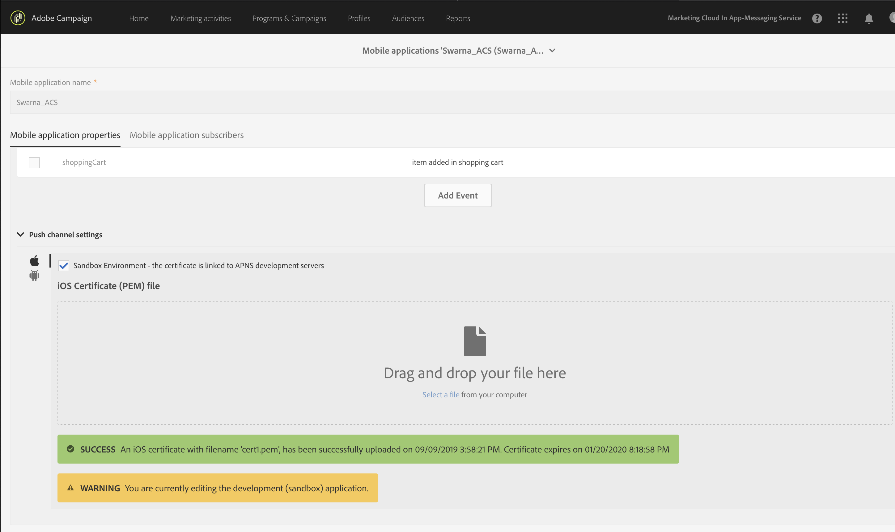

#### iOS

**Set up the APNS server certificate**

1. Add Push Notification entitlement to your app. For more information, see [Enable the Push Notifications Capability](https://developer.apple.com/documentation/usernotifications/registering_your_app_with_apns?language=objc).
1. To configure the APNS certificate, register the app on your Apple developer account and generate the certificate. For more information, see [Establishing a Certificate-Based Connection to APNs](https://developer.apple.com/documentation/usernotifications/setting_up_a_remote_notification_server/establishing_a_certificate-based_connection_to_apns?language=objc).
1. Verify that the APNS server certificate is configured in the Campaign instance by clicking **Adobe Campaign > Administrator > Channels > Mobile App (AEP SDK)**.
1. Select the mobile app from the list and verify that push channel settings status for iOS is _iOS certificate with filename *.pem is successfully uploaded_.
1. Verify that you are using production certificate for production environment and development certificate for development environment. 