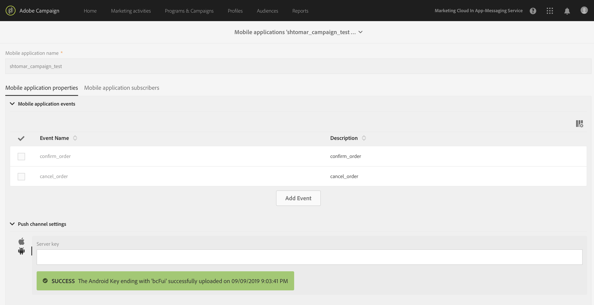
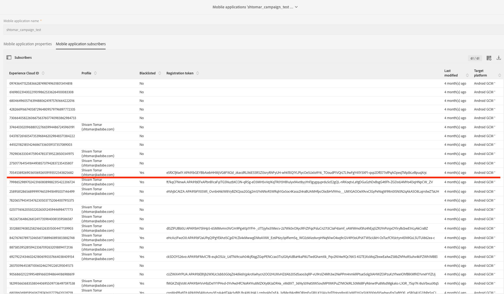
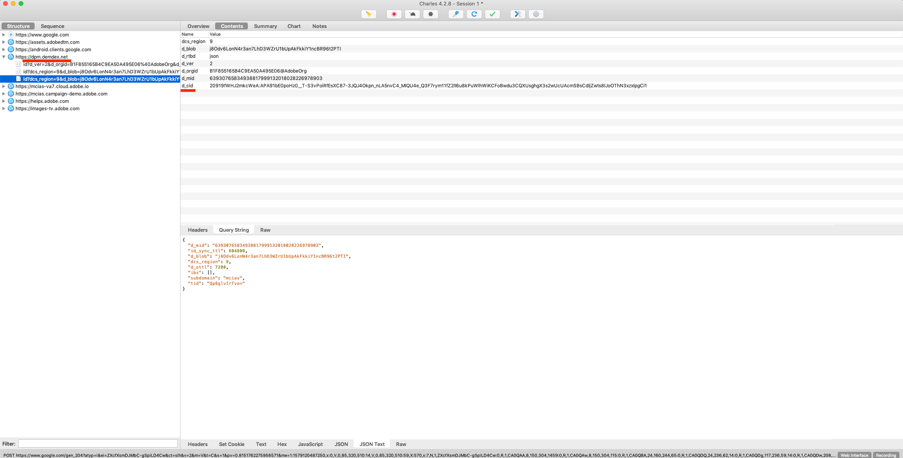
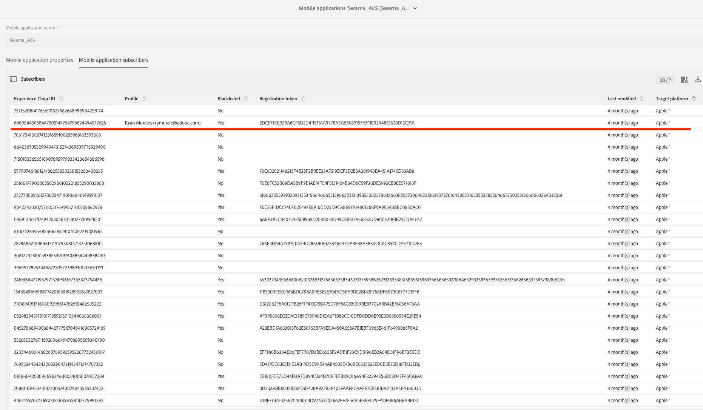

<Variant platform="android" task="campaign" repeat="2"/>

#### Set up a server key

1. To configure the app in Google Firebase, see [Firebase Console](https://console.firebase.google.com/) and sign in using your Google Developer credentials. 
2. Add a project and add your app under that project using the application ID that you used in the app.

   For more information, see [Add Firebase to your Android project](https://firebase.google.com/docs/android/setup#console).

3. Add the generated **“google-service.json”** to the project and set up the project and module level gradle files.

   For more information, see [Add Firebase to your Android project](https://firebase.google.com/docs/android/setup#console).

4. Verify that Firebase server key is configured in the Campaign instance by clicking **Adobe Campaign &gt; Administrator &gt; Channels &gt; Mobile App (AEP SDK)**.
5. Select the mobile app from the list and verify that the push channel settings status for Android is _Android key set up success_.

   

<Variant platform="ios" task="campaign" repeat="2"/>

#### Set up the APNS server certificate

1. Add Push Notification entitlement to your app.

   For more information, see [Enable the Push Notifications Capability](https://developer.apple.com/documentation/usernotifications/registering_your_app_with_apns?language=objc).

2. To configure the APNS certificate, register the app on your Apple developer account and generate the certificate.

   For more information, see [Establishing a Certificate-Based Connection to APNs](https://developer.apple.com/documentation/usernotifications/setting_up_a_remote_notification_server/establishing_a_certificate-based_connection_to_apns?language=objc).

3. Verify that the APNS server certificate is configured in the Campaign instance by clicking **Adobe Campaign &gt; Administrator &gt; Channels &gt; Mobile App (AEP SDK)**.
4. Select the mobile app from the list and verify that push channel settings status for iOS is _iOS certificate with filename *.pem is successfully uploaded_.
5. Verify that you are using production certificate for production environment and development certificate for development environment. 

<Variant platform="android" task="receive" repeat="5"/>

#### Set up the Android app

1. Create the Firebase Messaging Service and add it to the Android Manifest file.

   For more information, see [Set up a Firebase Cloud Messaging client app on Android](https://firebase.google.com/docs/cloud-messaging/android/client).

2. Generate a push token for the app using FireBase Instance ID class.
3. In the `onComplete` function of `OnCompleteListener`, set the Push identifier by calling the API `MobileCore.setPushIdentifier`.

   For more information, see [setPushIdentifier](https://aep-sdks.gitbook.io/docs/using-mobile-extensions/adobe-analytics-mobile-services#set-up-push-messaging).

#### Verify that the push token has successfully synced with the Experience Cloud ID service

If SDK privacy status is `optedout`, the push identifier will not be set.

1. Verify the push token sync with the Experience Cloud ID service (ECID).  
2. To verify, launch your app connected to an Adobe Experience Platform Assurance session.   
3. In the list of events, verify that you have an event with type _SetPushIdentifier_.
4. In the details panel on the right, verify the value of the push token for this device. The value in pushIdentifier is the same value that is sent to the ECID service. 
5. To verify that app’s push token is mapped to the correct Experience Cloud ID (ECID) in the Campaign instance, click **Adobe Campaign &gt; Administrator &gt; Channels &gt; Mobile App (AEP SDK)**.
6. Select your app, under the mobile application subscribers verify that the Experience Cloud ID and the Registration token for the user is displayed. 
7. If you are using Charles, verify that the push token has successfully synced with the ECID service.
8. Check for the _demdex request_, which is marked with the red line in the screenshot below.  
9. Verify the successful response(200) for this network call.

   

<Variant platform="ios" task="receive" repeat="5"/>

#### Set up the iOS app

1. After you launch the app, call `registerForRemoteNotifications` to register the app and receive the APNS token.

   This API generates and returns the APNS token through the `application:didRegisterForRemoteNotificationsWithDeviceToken:` delegate function.

   For more information, see [Registering Your App with APNs](https://developer.apple.com/documentation/usernotifications/registering_your_app_with_apns?language=objc)

2. In `application:didRegisterForRemoteNotificationsWithDeviceToken:`, call `setPushIdentifier` to set the Push identifier.

    For more information, see [setPushIdentifier](../mobile-core/api-reference.md#setpushidentifier).

#### Verify that the push token has successfully synced with the Experience Cloud ID service

If SDK privacy status is `optedout`, the push identifier will not be set.

1. Verify the push token sync with the Experience Cloud ID service (ECID).  
2. To verify, launch your app connected to an Adobe Experience Platform Assurance session.   
3. In the list of events, verify that you have an event with type _SetPushIdentifier_.
4. In the details panel on the right, verify the value of the push token for this device.

   The value in pushIdentifier is the same value that is sent to the ECID service. 

5. To verify that app’s push token is mapped to the correct Experience Cloud ID (ECID) in the Campaign instance, click **Adobe Campaign &gt; Administrator &gt; Channels &gt; Mobile App (AEP SDK)**.
6. Select your app, under the mobile application subscribers verify that the Experience Cloud ID and the Registration token for the user is displayed. 
7. If you are using Charles, verify that the push token has successfully synced with the ECID service.
8. Check for the **demdex request**, which is marked with the red line in the screenshot below.  
9. Verify the successful response (200) for this network call.

   
