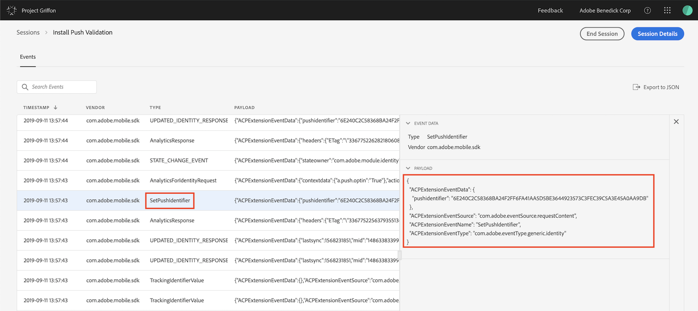
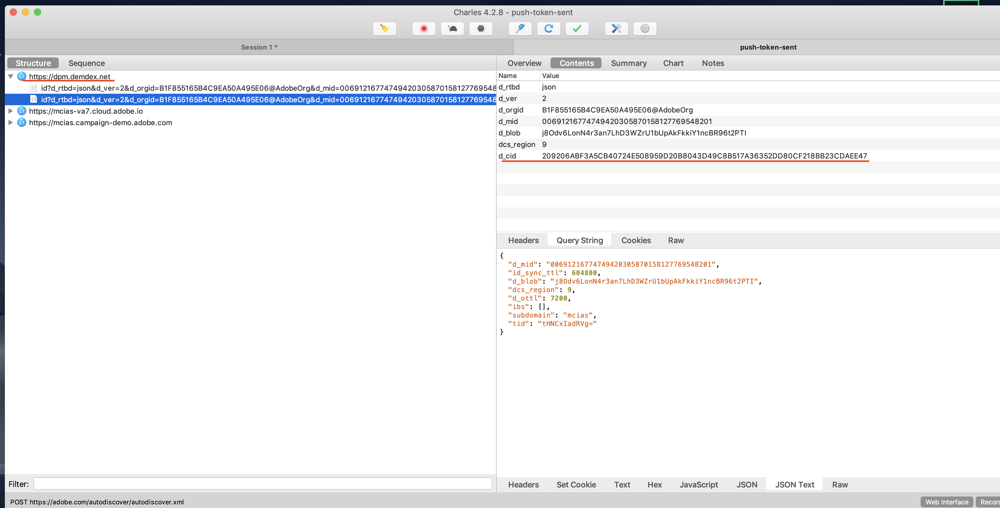

#### iOS

**Set up the iOS app**

1. After you launch the app, call `registerForRemoteNotifications` to register the app and receive the APNS token. This API generates and returns the APNS token through the `application:didRegisterForRemoteNotificationsWithDeviceToken: delegate` function. For more information, see [Registering Your App with APNs](https://developer.apple.com/documentation/usernotifications/registering_your_app_with_apns?language=objc).
1. In `application:didRegisterForRemoteNotificationsWithDeviceToken:`, call `setPushIdentifier` to set the Push identifier. or more information, see [setPushIdentifier](../adobe-analytics-mobile-services/index.md#set-up-push-messaging).

**Verify that the push token has successfully synced with the Experience Cloud ID service**

<InlineAlert variant="info" slots="text"/>

If SDK privacy status is optedout, the push identifier will not be set.

1. Verify the push token sync with the Experience Cloud ID service (ECID).
1. To verify, launch your app connected to an Adobe Experience Platform Assurance session.
1. In the list of events, verify that you have an event with type `SetPushIdentifier`.
1. In the details panel on the right, verify the value of the push token for this device. The value in pushIdentifier is the same value that is sent to the ECID service.  
1. To verify that app’s push token is mapped to the correct Experience cloud ID(ECID) in the Campaign instance, click **Adobe Campaign > Administrator > Channels > Mobile App (AEP SDK)**.
1. Select your app, under the mobile application subscribers verify that the Experience Cloud ID and the Registration token for the user is displayed. 
1. If you are using Charles, verify that the push token has successfully synced with the ECID service.
1. Check for the _demdex request_, which is marked with the red line in the screenshot below.
1. Verify the successful response(200) for this network call. 