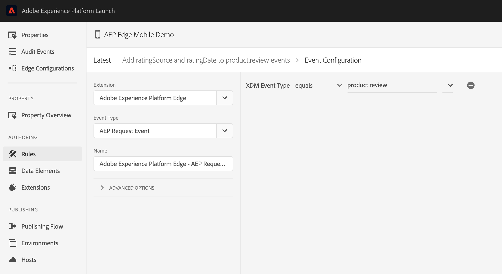

# Rules & XDM events

## Prerequisites for this tutorial

Before starting this tutorial, please read and follow the steps in the [sample XDM implementation tutorial](./sample-xdm-implementation.md), including downloading the sample application and setting up the required fields.

## Attach data to XDM events

### Update the Product reviews schema

1. In the browser, navigate to [Adobe Experience Platform](https://experience.adobe.com/platform) and login with your credentials.
2. Update the previously created `Product reviews` schema created by adding two new fields.
   * From the left panel, select `Schemas` and then select the `Product reviews` schema you have created for the previous assignment.
   * Select the `Product review` field group.
   * Select the plus icon `+` next to the schema name and add the following fields. Select `Apply` after each field added.

     | Field name | Display name | Type | Required |
     | :--- | :--- | :--- | :--- |
     | ratingSource | Rating Source | String | No |
     | ratingDate | Rating Date | DateTime | No |

   * Select `Save` to update the schema.

### Create a mobile rule in the Data Collection UI

1. Navigate to the [Data Collection UI](https://experience.adobe.com/#/data-collection/) and select the mobile property you created in the previous assignments.
2. Select `Extensions` from the left panel and update the `Adobe Experience Platform Edge` extension to latest version.
3. Select `Data elements` from the left panel and the following data elements:
   1. Create `App ID` data element:
      * Select the `Create New Data Element` button.
      * Select the `Mobile Core` Extension and `App ID` Data Element Type.
      * Set the name for this data element to `App ID` and click `Save`.
   2. Create `Operating system version` data element:
      * Select the `Add Data Element` button.
      * Select the `Mobile Core` Extension and `OS Version` Data Element Type.
      * Set the name for this data element to `Operating system version` and click `Save`.
   3. Create `Event timestamp` data element:
      * Select the `Add Data Element` button.
      * Select the `Mobile Core` Extension and `Adobe Experience Platform Timestamp` Data Element Type.
      * Set the name for this data element to `Event timestamp` and click `Save`.
4. Select `Rules` from the left panel and create the following rule:
   * Select `Create New Rule`.
5. Select the `+ Add` button in the Events section.
   * Select `Adobe Experience Platform Edge` for Extension.
     * Select `AEP Request Event`.
     * Select the `+` button to Add XDM Event Type.
     * Select `XDM Event Type equals product.review`.
     * Select `Keep Changes`.



* Select the `+ Add` button in the Actions section.
  * Select `Mobile Core` from the Extensions drop-down and `Attach Data` as Action type.
  * In the JSON Payload box, add the following content and modify `_tenantId` to the organization identifier found in the `Product reviews` schema:

    ```json
     {
           "xdm": {
               "_tenantId": {
                   "ratingDate": "{%%Event timestamp%%}",
                   "ratingSource": "MobileApp {%%App ID%%} OS {%%Operating system version%%}"
               }
           }
       }
    ```

  * Note that the previously created three data elements are used here to populate the `ratingDate` and `ratingSource` XDM fields.
    * Select `Keep Changes`.
    * Set a name and click `Save` to keep the rule.
* Publish the new data elements and rule created:
  * Select `Publishing Flow` from the left panel.
  * Select the development library and click `+ Add All Changed Resources`.
  * Select `Save & Build for Development`.

<InlineAlert variant="info" slots="text"/>

Tag rules for mobile properties are executed on the client-side mobile application by the Platform Rules Engine extension.

### Test with the sample application

Run the Sample app in a simulator or a device and generate product review XDM events:

* In the sample app, navigate to the Edge tab.
* Select a product, add the review information and click `Submit Review`.
* In the console log search for this log message - `Attaching event data` (iOS) / `New EventData for Event` (Android) and check that `ratingDate` and `ratingSource` were attached correctly. 
* Verify if the logging messages are intuitive and descriptive for the use-case you are testing.

### Validate the event data with AEP Assurance

Connect to an Assurance Session to inspect that the Adobe Experience Platform Request Event has the correct data. To set up an Assurance session with the Sample app, follow the steps in the [using Adobe Experience Platform Assurance guide](./overview.md#using-aep-assurance).

* Once connected to Assurance, search for the Adobe Experience Platform Request Event in your session.
* Check that the XDM data for the `product.review` event is correctly updated with the two new fields  `ratingDate` and `ratingSource`.

### Extra credit: Update rule/add new rule of your choice

Add a new rule in the Data Collection UI or update the one created in the previous steps. Then validate that the rule was correctly executed for your use case using Adobe Experience Platform Assurance and/or Mobile SDK logging.

### Next steps

Find more details about the Adobe Experience Platform Mobile SDK Rules Engine and the supported rule types, please read the [Rules Engine documentation](../../mobile-core/rules-engine/index.md) and the [Rules Engine GitHub](https://github.com/adobe/aepsdk-rulesengine-ios).

For more rules examples in the Data Collection UI, see the following links:

* [Attach data to SDK events](../attach-data.md)
* [Modify data in SDK events](../modify-data.md)
* [Using data elements to define dynamic data in rules](../tags-data-elements.md)

