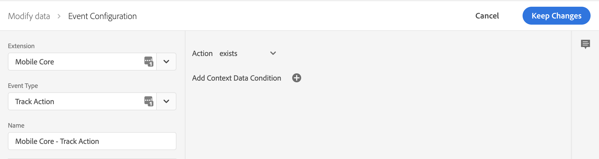
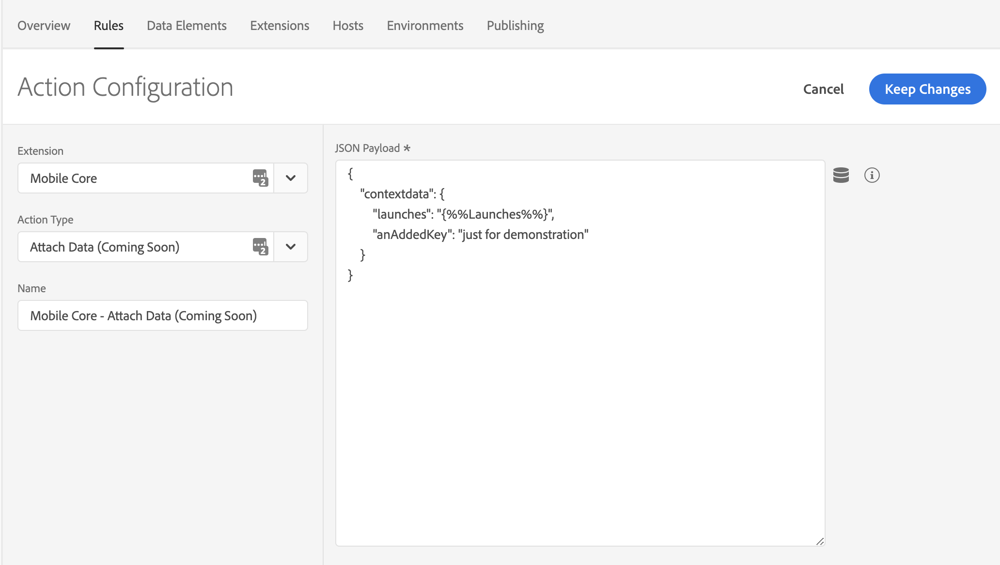
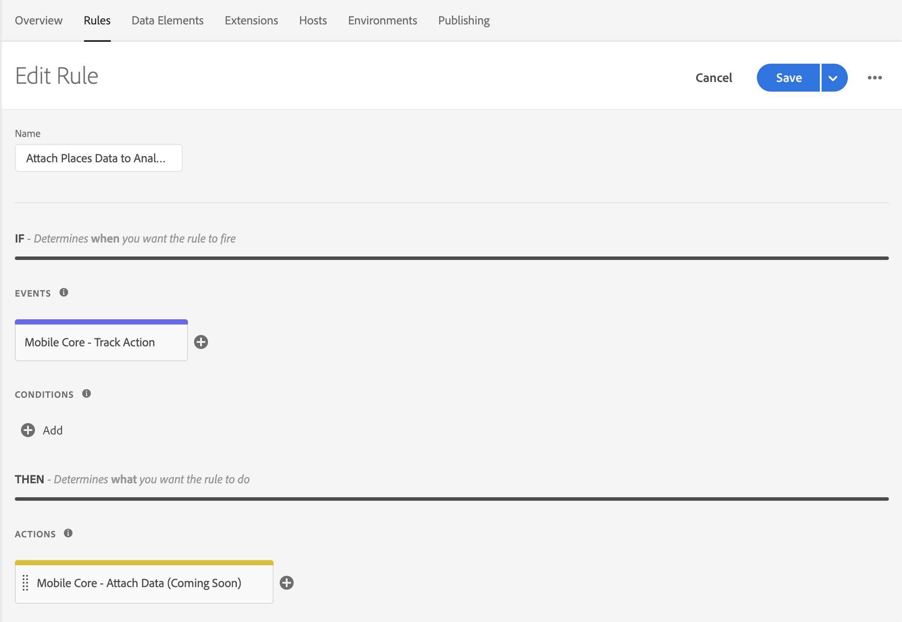

The following sample shows how to attach data to all outgoing `TrackAction` Analytics network requests. To create this type of rule, select your property in the Data Collection UI and complete the following steps.

#### Create a rule

1. On the **Rules** tab, select **Create New Rule**.

<InlineAlert variant="info" slots="text"/>

If you do not have existing rules for this property, the **Create New Rule** button will be in the middle of the screen. If your property has rules, the button will be in the top right of the screen.

#### Select an event

1. Give your rule an easily recognizable name in your list of rules.

   In this example, the rule is named "Attach Places Data to Analytics Track Action Events".

2. Under the **Events** section, select **Add**.
3. From the **Extension** dropdown list, select **Mobile Core**.
4. From the **Event Type** dropdown list, select **Track Action**.
5. Select **Keep Changes**.

#### Define the action

1. Under the **Actions** section, select **Add**.
2. From the **Extension** dropdown list, select **Mobile Core**.
3. From the **Action Type** dropdown list, select **Attach Data**.
4. On the right pane, in the **JSON Payload** field, type the data that will be added to this event.
5. Select **Keep Changes**.

On the right pane, you can add a freeform JSON payload that adds data to an SDK event before an extension that is listening for this event can hear the event. In this example, some context data is added to this event before the Adobe Analytics extension processes it. The added context data will now be on the outgoing Adobe Analytics hit.

In the following example, `launches` and `anAddedKey` keys are added to the `contextdata` of the Analytics event. Values for the new keys can either be hardcoded in the rule, or dynamically determined by the SDK when this event processes by using data elements.

#### Save the rule and rebuild your property

After you complete your configuration, verify that your rule looks like the following:

1. Select **Save**
2. Rebuild your mobile property and deploy it to the correct Environment.