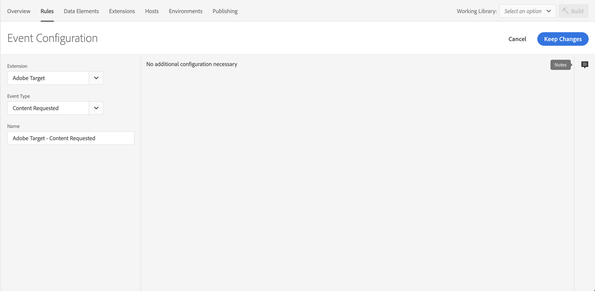
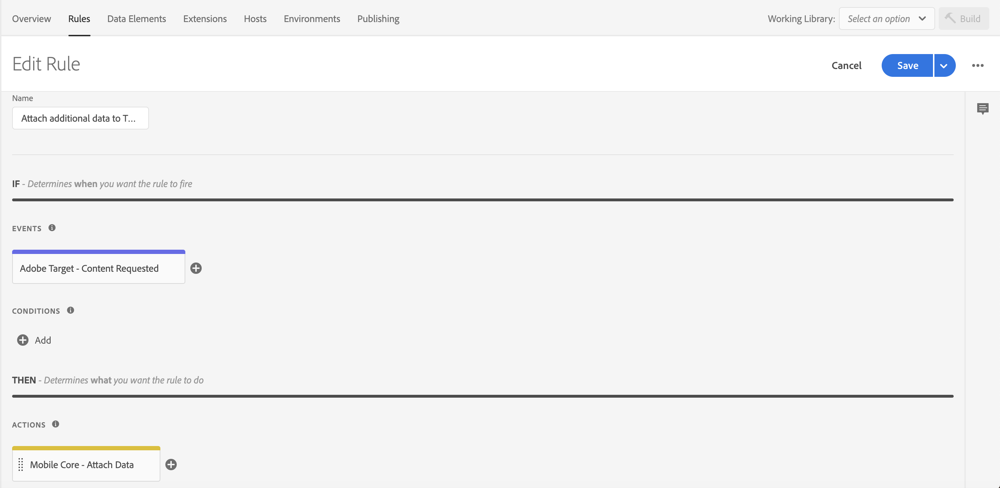
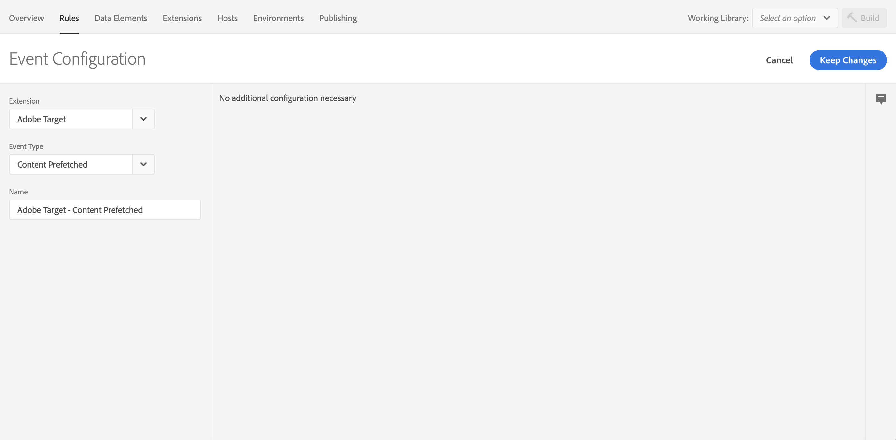
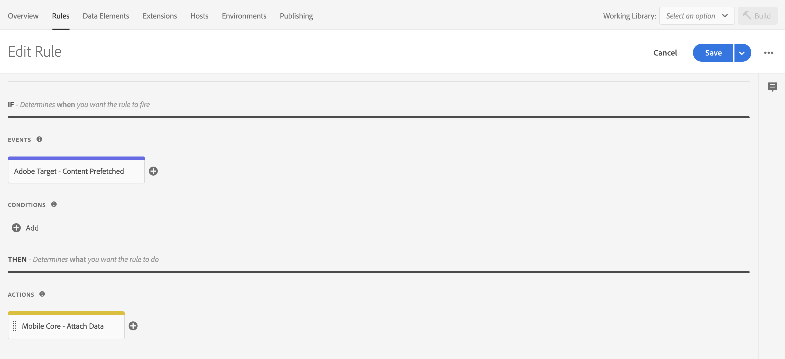
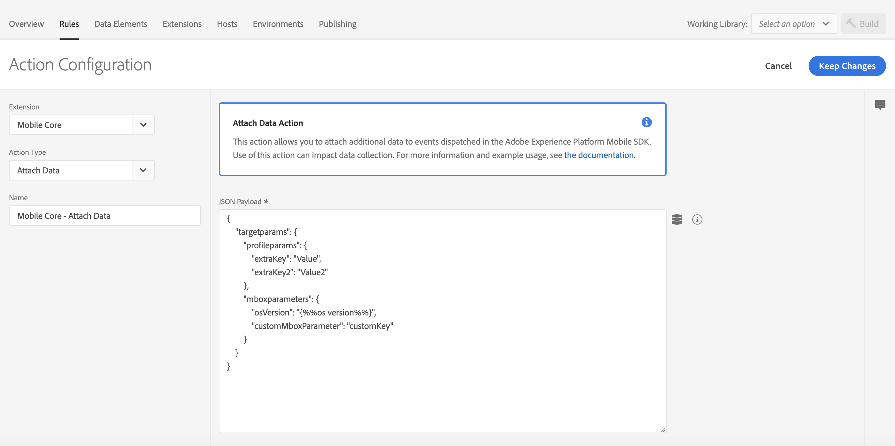
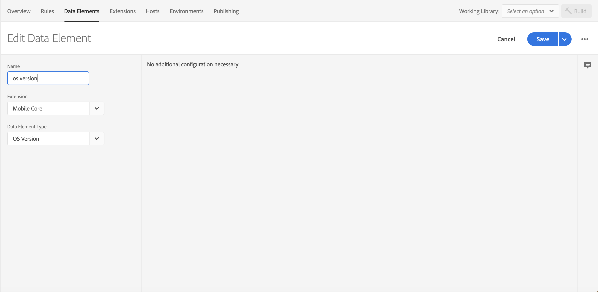
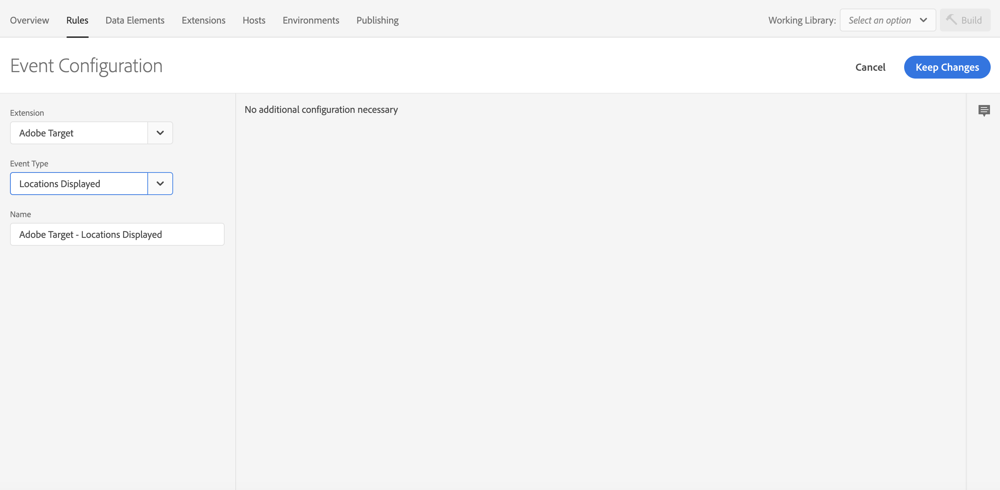
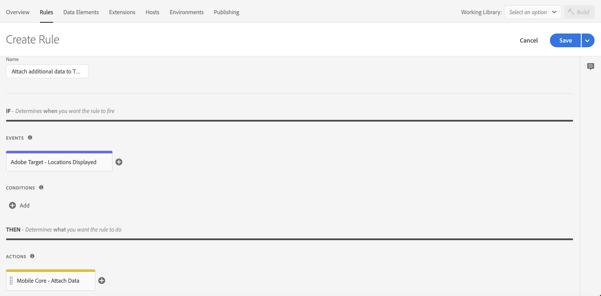

<InlineAlert variant="warning" slots="text"/>

The attach data feature applies **only** to the Target extension.

#### Attach additional data to Target to retrieve location events

The following sample shows how to attach data to all outgoing `retrieveLocationContent` Target network requests. To create this type of rule, select your property in the Data Collection UI and complete the following steps.

#### Create a rule

1. On the **Rules** tab, select **Create New Rule**.

<InlineAlert variant="info" slots="text"/>

If you do not have existing rules for this property, the **Create New Rule** button will be in the middle of the screen. If your property has rules, the button will be in the top right of the screen.

#### Select an event

1. Give your rule an easily recognizable name in your list of rules.

   In this example, the rule is named **Attach additional data to Target retrieve location Events**.

2. Under the **Events** section, select **Add**.
3. From the **Extension** dropdown list, select **Adobe Target**.
4. From the **Event Type** dropdown list, select **Content Requested**.
5. Select **Keep Changes**.



#### Define the action

1. Under the **Actions** section, select **Add**.
2. From the **Extension** dropdown list, select **Mobile Core**.
3. From the **Action Type** dropdown list, select **Attach Data**.
4. On the right pane, in the **JSON Payload** field, type the data that will be added to this event.
5. Select **Keep Changes**.

On the right pane, you can add a freeform JSON payload that adds data to an SDK event before an extension that is listening for this event can hear the event.

```json
{
    "request[*]": {
        "targetparams": {
            "profileparams": {
                "extraRetrieveLocationKey": "extraRetrieveLocationValue"
            },
            "mboxparameters": {
                "extraRetrieveLocationMboxKey": "extraRetrieveLocationMboxValue"
            }
        }
    }
}
```

In the above example,  the JSON payload adds custom parameters to each of the Target retrieve location objects.

#### Save the rule and rebuild your property

After you complete your configuration, verify that your rule looks like the following:



1. Select **Save**
2. Rebuild your mobile property and deploy it to the correct Environment.

#### Attach additional data to Target to prefetch content events

The following sample shows how to add a custom mbox to prefetch in all outgoing `prefetchContent` Target network requests. To create this type of rule, select your property in the Data Collection UI and complete the following steps.

#### Create a rule

1. On the **Rules** tab, select **Create New Rule**.

<InlineAlert variant="info" slots="text"/>

If you do not have existing rules for this property, the **Create New Rule** button will be in the middle of the screen. If your property has rules, the button will be in the top right of the screen.

#### Select an event

1. Give your rule an easily recognizable name in your list of rules.

   In this example, the rule is named "Attach additional data to Target prefetch content Events".

2. Under the **Events** section, select **Add**.
3. From the **Extension** dropdown list, select **Adobe Target**.
4. From the **Event Type** dropdown list, select **Content Prefetched**.
5. Select **Keep Changes**.



#### Define the action

1. Under the **Actions** section, select **Add**.
2. From the **Extension** dropdown list, select **Mobile Core**.
3. From the **Action Type** dropdown list, select **Attach Data**.
4. On the right pane, in the **JSON Payload** field, type the data that will be added to this event.
5. Select **Keep Changes**.

On the right pane, you can add a freeform JSON payload that adds data to an SDK event before an extension that is listening for this event can hear the event.

```json
{
    "prefetch[*]": {
        "targetparams": {
            "profileparams": {
                "extraPrefetchProfileKey": "extraPrefetchProfileValue"
            },
            "mboxparameters": {
                "extraPrefetchMboxKey": "extraPrefetchMboxValue"
            }
        }
    }
}
```

In the above example, the JSON payload adds custom mbox parameters to each of the Target prefetch objects.

#### Save the rule and rebuild your property

After you complete your configuration, verify that your rule looks like the following:



1. Select **Save**
2. Rebuild your mobile property and deploy it to the correct Environment.

#### Attach additional data to Target location-clicked events

The following sample shows how to add additional mbox and profile parameters in all outgoing `locationClicked` Target network requests. To create this type of rule, select your property in the Data Collection UI and complete the following steps.

#### Create a rule

1. On the **Rules** tab, select **Create New Rule**.

<InlineAlert variant="info" slots="text"/>

If you do not have existing rules for this property, the **Create New Rule** button will be in the middle of the screen. If your property has rules, the button will be in the top right of the screen.

#### Select an event

1. Give your rule an easily recognizable name in your list of rules.

   In this example, the rule is named "Attach additional data to Target location clicked Events".

2. Under the **Events** section, select **Add**.
3. From the **Extension** dropdown list, select **Adobe Target**.
4. From the **Event Type** dropdown list, select **Location Clicked**.
5. Select **Keep Changes**.


#### Define the action

1. Under the **Actions** section, select **Add**.
2. From the **Extension** dropdown list, select **Mobile Core**.
3. From the **Action Type** dropdown list, select **Attach Data**.
4. On the right pane, in the **JSON Payload** field, type the data that will be added to this event.
5. Select **Keep Changes**.

On the right pane, you can add a freeform JSON payload that adds data to an SDK event before an extension that is listening for this event can hear the event. In this example, custom mbox and profile parameters are added to the event before the Target extension processes it. The added mbox and profile parameters will now be added on outgoing Target location clicked requests.

In the following example, **extraKey** and **extraKey2** are added to the profile parameters. A key named `customMboxParameter` and a data element that was defined for the **OS version** are added to the mbox parameters of the Target event. Values for the new keys can either be hardcoded in the rule or be dynamically determined by the SDK when this event processes by using data elements.



The following example shows how the data element for this OS version was created.



#### Save the rule and rebuild your property

After you complete your configuration, verify that your rule looks like the following:


1. Select **Save**
2. Rebuild your mobile property and deploy it to the correct Environment.

#### Attach additional data to Target location-displayed events

The following sample shows how to add additional mbox and profile parameters in all outgoing `locationDisplayed` Target network requests. To create this type of rule, select your property in the Data Collection UI and complete the following steps.

#### Create a rule

1. On the **Rules** tab, select **Create New Rule**.

<InlineAlert variant="info" slots="text"/>

If you do not have existing rules for this property, the **Create New Rule** button will be in the middle of the screen. If your property has rules, the button will be in the top right of the screen.

#### Select an event

1. Give your rule an easily recognizable name in your list of rules.

   In this example, the rule is named "Attach additional data to Target location displayed Events".

2. Under the **Events** section, select **Add**.
3. From the **Extension** dropdown list, select **Adobe Target**.
4. From the **Event Type** dropdown list, select **Location Displayed**.
5. Select **Keep Changes**.



#### Define the action

1. Under the **Actions** section, select **Add**.
2. From the **Extension** dropdown list, select **Mobile Core**.
3. From the **Action Type** dropdown list, select **Attach Data**.
4. On the right pane, in the **JSON Payload** field, type the data that will be added to this event.
5. Select **Keep Changes**.

On the right pane, you can add a freeform JSON payload that adds data to an SDK event before an extension that is listening for this event can hear the event. In this example, custom mbox and profile parameters are added to the event before the Target extension processes it. The added mbox and profile parameters will now be added on outgoing Target location displayed requests.

In the following example, **extraKey** and **extraKey2** are added to the profile parameters. A key named `customMboxParameter` and a data element that was defined for the OS version are added to the mbox parameters of the Target event. Values for the new keys can either be hardcoded in the rule or be dynamically determined by the SDK when this event processes by using data elements.


#### Save the rule and rebuild your property

After you complete your configuration, verify that your rule looks like the following:



1. Select **Save**
2. Rebuild your mobile property and deploy it to the correct Environment.
