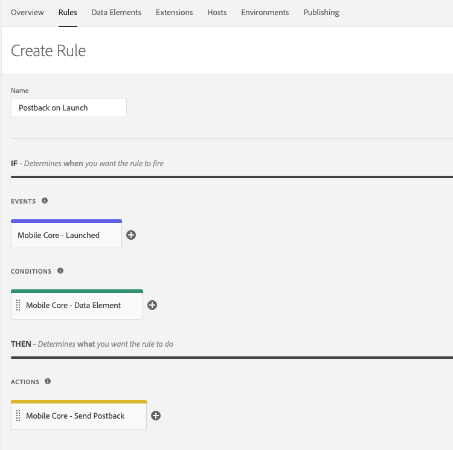

# Using data elements to define dynamic data in rules

Data elements are the building blocks for your data dictionary and are used to collect, organize, and deliver data across marketing and ad technology.

A data element is a variable where the value can be mapped to data in the Experience Platform Mobile SDK such as the visitor ID, the device name, the user profile, or the number of launches. In the Data Collection UI, you can reference this value by its variable name.

This collection of data elements becomes the dictionary of defined data that you can use to build rules for your application, and this dictionary is shared across the Data Collection UI where it can be used with any extension that is added to your property.

You can use data elements during rule creation to consolidate the definition of dynamic data. After defining your data elements, you can reuse them in multiple places.

<InlineAlert variant="info" slots="text"/>

As a best practice, you should reuse data elements.

Data elements are building blocks for rules and allow you create a data dictionary of commonly used data in the Experience Platform Mobile SDK, regardless of where they originate (shared state, event data) or which extension creates them. Data elements are populated with data when they are processed in the [Rules Engine](../mobile-core/rules-engine/index.md).

To use data elements at a high level, complete the following steps:

<InlineAlert variant="info" slots="text"/>

When a new extension is added to your property, new data elements might become available to use. To use data elements when creating new rules, repeat the following steps to create a data element.

## Create a data element

1. On the Property page, select the **Data Elements** tab, and then select **Add Data Element**.
2. Type a unique data element name.
3. In the **Extension** drop-down list, select the extension that will generate the data element type. Please note that you can only select extensions that are currently installed in your property.

4. In the **Data Element Type** drop-down list, select the required configuration parameters. Please note that most data element types do not require any configuration.

5. Select **Save**.

For example, to create a data element that maps to an Experience Cloud ID (ECID), on the Create New Data Element page, type **ECID** as the name, select the **Mobile Core** extension, and select the **Experience Cloud ID** data type.

## Use a data element

You can use data elements to define rules in the Data Collection UI. When a rule configuration allows the use of data elements, select the cylinder icon to display a list of data elements that are defined in the mobile property.

### Creating a rule to send a postback

In the following example, a rule is created to send a postback that contains the ECID when the application launches:

1. On the property page for your mobile property, select the **Rules** tab, followed by **Create New Rule**.
2. Type a unique name for the the rule.
3. In the **Events** section, select **Add** and perform the following actions: 
   1. In the **Extension** drop-down list, select **Mobile Core**. 
   2. In the **Event Type** drop-down list, select **Launched**. 
   3. Afterwards, select **Keep Changes**.
4. In the **Condition** section, select **Add** and perform the following actions:
   1. In the **Extension** drop-down list, select **Mobile Core**. 
   2. In the **Condition Type** drop-down list, select **Data Element**. 
   3. Enter a name for the condition. 
   4. After entering a name, next to the **Data Element** text field, select the cylinder icon and select the ECID that was created in the previous section.
5. In the **Action** section, select **Add** and perform the following actions: 
   1. In the **Extension** drop-down list, select **Mobile Core**. 
   2. In the **Action Type** drop-down list, select **Send Postback**. 
   3. In the **URL** text field, type a sample URL, for example, `https://my.company.com/launch?ecid=`. 
   4. Enter a name for the action. 
   5. After entering a name, next to the **Data Element** text field, select the cylinder icon and select the ECID that was created in the previous section.
6. Select **Save**.

## Publish the configuration

After the property is published, this new rule is made available for download by the applications that are configured for this property. For more information, please read the [publish the configuration tutorial](../getting-started/create-a-mobile-property.md#publish-configuration) and the[configure the SDK with an Environment ID tutorial](../getting-started/track-events.md#configure-the-sdk-with-an-environment-id). When the application launches, this rule is triggered and, if the ECID exists in the SDK, a postback is sent to the URL with the ECID value.

## Additional information

Here is some additional information about the Rules Engine and the Signal extension:

* [Rules Engine](../mobile-core/rules-engine/index.md)

  An overview and technical details of the Experience Platform Mobile SDK Rules Engine.

* [Signal extension and Rules Engine integration](./rules-engine-integration.md)

  This section provides an example of how to create rules to trigger actions in the Signals extension.

