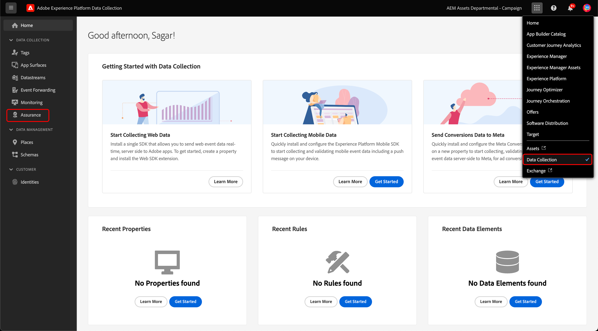
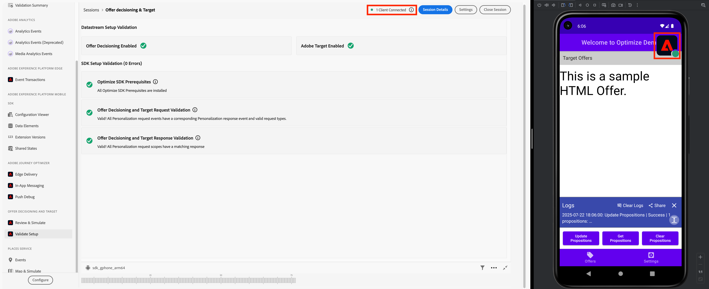
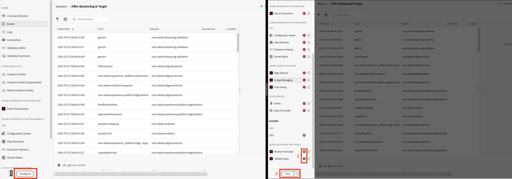

# Assurance setup

This document shows user how to setup Assurance for the document features to be used.

## Setup

1. To get started you will need Adobe Experience Platform Assurance Extension to be enabled and set up in the application. Follow the instruction provided in [**Assurance Overview**](../../home/base/assurance/index.md) for setup.

   If enabled, you would see Assurance Segment in the left panel of Data Collection App.

   
   
2. Next, you will need to create an Assurance session and connect to it. You can follow instructions provided in this link to do so - [**Connecting to Assurance**](https://experienceleague.adobe.com/en/docs/experience-platform/assurance/tutorials/using-assurance)

   Once setup, you should see the Assurance Session Bubble on the devices connected to the session and the number of connected devices in the Assurance portal. 

   

3. If you do not see any option in the **Assurance sessoin home panel**, make sure that the options are properly configured in the panel **Configure** menu.
   * Click on **+** icon to add the option to the panel and **-** to remove.

   
