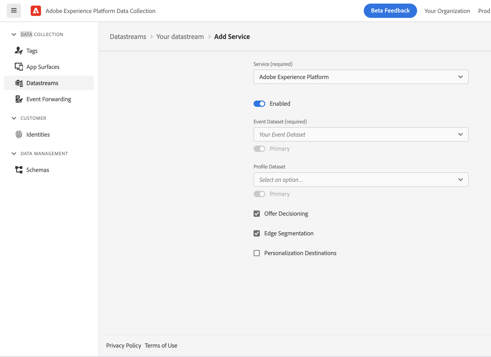
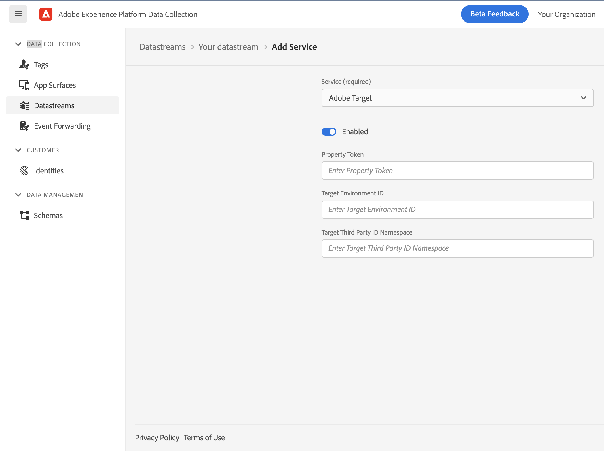
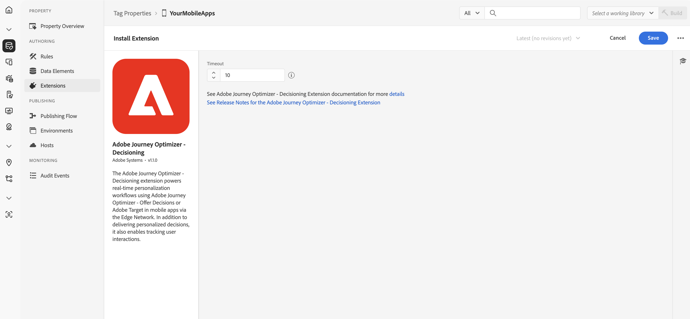
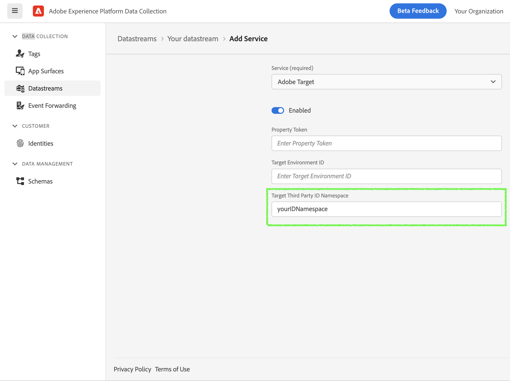
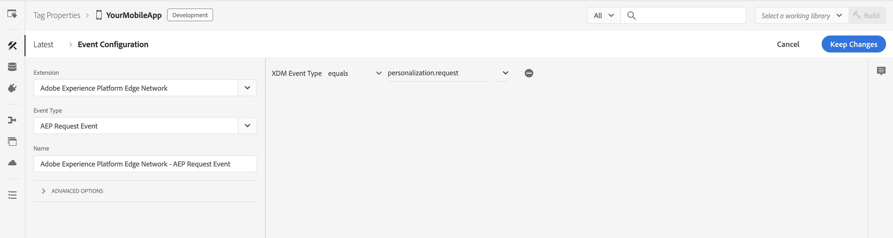
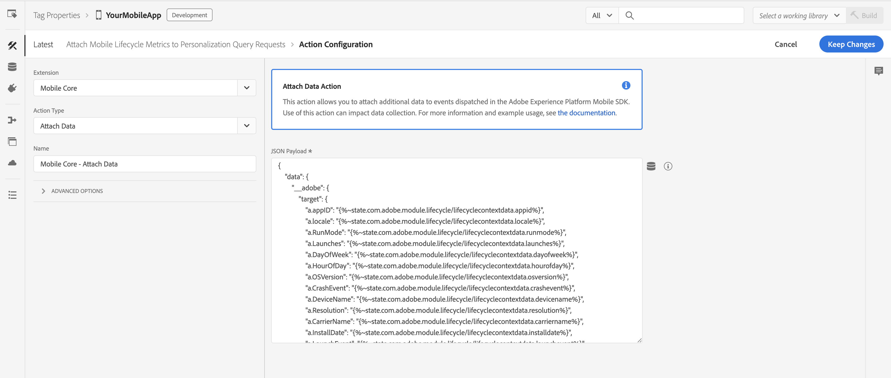
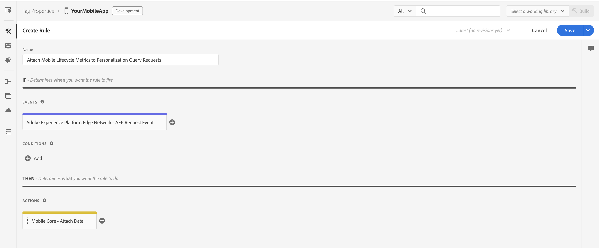

# Offer Decisioning and Target Extension

The Offer Decisioning and Target extension powers real-time personalization workflows using Adobe Journey Optimizer - Offer Decisioning or Adobe Target in mobile apps via the Edge Network. It helps deliver personalized decisions to your app and enables tracking user interactions with the proposed decisions.

## Prerequisites

Before starting, make sure the following steps are completed.

* Your organization is provisioned for edge decisioning.
* If using Adobe Target, Target activities are set up in your desired workspace in your organization on Target UI. For more details, see the [Target activities guide](https://experienceleague.adobe.com/docs/target/using/activities/target-activities-guide.html).
* If using Journey Optimizer - Offer Decisioning, decisions are set up in your desired sandbox in your organization on Experience Platform UI. For more details, see the [create decisions guide](https://experienceleague.adobe.com/docs/offer-decisioning/using/create-manage-activities/create-offer-activities.html).

## Adobe Experience Platform Data Collection setup

### Configure the Datastream for Adobe Target and/or Journey Optimizer - Offer Decisioning

On [Experience Platform Data Collection](https://experience.adobe.com/#/data-collection/), navigate to **Data Collection** > **Datatreams** using the left navigation panel. Select an existing datastream or create a new datastream. For more details, see the [configure datastreams guide](../../home/getting-started/configure-datastreams.md).

1. In the datastream, click on the desired environment from the list. Make sure **Adobe Experience Platform** section is enabled and configured with the required information like **Sandbox** and **Event Dataset**.
2. For Journey Optimizer - Offer Decisioning, navigate to **Adobe Experience Platform** section and enable **Offer Decisioning** checkbox.

3. For Adobe Target, navigate to **Adobe Target** section and enable it. Specify the configuration. For more information on the configuration settings, refer to the [Administer Target Overview](https://experienceleague.adobe.com/docs/target/using/administer/administrating-target.html).

1. Click **Save**.

### Configure Offer Decisioning and Target extension in Tag property for Mobile

On [Experience Platform Data Collection](https://experience.adobe.com/#/data-collection/), navigate to **Data Collection** > **Tags** using the left navigation panel. Select an existing mobile tag property or create a new property.

1. In your mobile property, navigate to **Extensions** in the left navigation panel and click on the **Catalog** tab.
2. In the extensions Catalog, search or locate the **Offer Decisioning and Target** extension, and click **Install**.
3. Optionally, specify a timeout value in seconds. The default value is 10 seconds.
4. Click **Save**.
5. Follow the publishing process to update SDK configuration. For more details, see the [publish the configuration guide](../../home/getting-started/create-a-mobile-property.md#publish-the-configuration).



## Add the Offer Decisioning and Target extension to your app

<InlineAlert variant="warning" slots="text"/>

For the AEPOptimize APIs to work properly, you need to integrate Mobile Core and Edge extensions in your mobile app. For more details see, documentation on [Mobile Core](../../home/base/mobile-core/index.md) and [Adobe Experience Platform Edge Network](../edge-network/index.md).

### Include the Optimize extension as an app dependency

Add MobileCore, Edge and Optimize extensions as dependencies to your project.

#### Android Kotlin

Add the required dependencies to your project by including them in the app's Gradle file.

```kotlin
implementation(platform("com.adobe.marketing.mobile:sdk-bom:3.+"))
implementation("com.adobe.marketing.mobile:core")
implementation("com.adobe.marketing.mobile:edgeidentity")
implementation("com.adobe.marketing.mobile:edge")
implementation("com.adobe.marketing.mobile:optimize")
```

<InlineAlert variant="warning" slots="text"/>

Using dynamic dependency versions is **not** recommended for production apps. Please read the [managing Gradle dependencies guide](../../resources/manage-gradle-dependencies.md) for more information.

#### Android Groovy

Add the required dependencies to your project by including them in the app's Gradle file.

```java
implementation platform('com.adobe.marketing.mobile:sdk-bom:3.+')
implementation 'com.adobe.marketing.mobile:core'
implementation 'com.adobe.marketing.mobile:edgeidentity'
implementation 'com.adobe.marketing.mobile:edge'
implementation 'com.adobe.marketing.mobile:optimize'
```

<InlineAlert variant="warning" slots="text"/>

Using dynamic dependency versions is **not** recommended for production apps. Please read the [managing Gradle dependencies guide](../../resources/manage-gradle-dependencies.md) for more information.

#### iOS CocoaPods

Add the required dependencies to your project using CocoaPods. Add following pods in your `Podfile`:

```swift
use_frameworks!
target 'YourAppTarget' do
    pod 'AEPCore', '~> 5.0'
    pod 'AEPEdge', '~> 5.0'
    pod 'AEPEdgeIdentity', '~> 5.0'
    pod 'AEPOptimize', '~> 5.0'
end
```

### Initialize Adobe Experience Platform SDK with Optimize Extension

Next, initialize the SDK by registering all the solution extensions that have been added as dependencies to your project with Mobile Core. For detailed instructions, refer to the [initialization](../../home/getting-started/get-the-sdk.md#2-add-initialization-code) section of the getting started page.

Using the `MobileCore.initialize` API to initialize the Adobe Experience Platform Mobile SDK simplifies the process by automatically registering solution extensions and enabling lifecycle tracking.

#### Android Kotlin

<InlineAlert variant="warning" slots="text"/>

This API is available starting from **Android BOM version 3.8.0**.

```kotlin
import com.adobe.marketing.mobile.LoggingMode
import com.adobe.marketing.mobile.MobileCore
...
import android.app.Application
...

class MainApp : Application() {
  override fun onCreate() {
    super.onCreate()
    MobileCore.setLogLevel(LoggingMode.DEBUG)
    MobileCore.initialize(this, "ENVIRONMENT_ID")
  }
}
```

#### Android Java

<InlineAlert variant="warning" slots="text"/>

This API is available starting from **Android BOM version 3.8.0**.

```java
import com.adobe.marketing.mobile.LoggingMode;
import com.adobe.marketing.mobile.MobileCore;
...
import android.app.Application;
...
public class MainApp extends Application {
  @Override
  public void onCreate(){
    super.onCreate();
    MobileCore.setLogLevel(LoggingMode.DEBUG);
    MobileCore.initialize(this, "ENVIRONMENT_ID");
  }
}
```

#### iOS Swift

<InlineAlert variant="warning" slots="text"/>

This API is available starting from **iOS version 5.4.0**.

```swift
// AppDelegate.swift
import AEPCore
import AEPServices
...

final class AppDelegate: NSObject, UIApplicationDelegate {
  func application(_: UIApplication, didFinishLaunchingWithOptions _: [UIApplication.LaunchOptionsKey: Any]? = nil) -> Bool {
    MobileCore.setLogLevel(.debug)
    MobileCore.initialize(appId: "ENVIRONMENT_ID")
    ...
  }
}
```

#### iOS Objective-C

<InlineAlert variant="warning" slots="text"/>

This API is available starting from **iOS version 5.4.0**.

```objectivec
// AppDelegate.m
#import "AppDelegate.h"
@import AEPCore;
@import AEPServices;
...
@implementation AppDelegate
- (BOOL)application:(UIApplication *)application didFinishLaunchingWithOptions:(NSDictionary *)launchOptions {
  [AEPMobileCore setLogLevel: AEPLogLevelDebug];  
  [AEPMobileCore initializeWithAppId:@"ENVIRONMENT_ID" completion:^{
      NSLog(@"AEP Mobile SDK is initialized");
  }];
  ...
  return YES;
}
@end
```

## Offer Decisioning and Target

### DecisionScope

The `DecisionScope` public class provides a constructor to create a scope object using the activityId, placementId, and optional itemCount. The decision scope activity and placement information can be obtained from the decision on the Experience Platform UI.

#### Android Java

```java
final DecisionScope decisionScope = DecisionScope("xcore:offer-activity:1111111111111111", "xcore:offer-placement:1111111111111111", 3);
```

#### iOS Swift

```swift
let decisionScope = DecisionScope(activityId: "xcore:offer-activity:1111111111111111", 
                                  placementId: "xcore:offer-placement:1111111111111111",
                                  itemCount: 3)
```

#### iOS Objective-C

```objc
AEPDecisionScope* decisionScope = [[AEPDecisionScope alloc] initWithActivityId:@"xcore:offer-activity:1111111111111111"         
                                                                   placementId:@"xcore:offer-placement:1111111111111111" 
                                                                     itemCount:3];
```

Alternately, another of the class's constructor can be used to create a scope object using the encoded decision scope. The encoded scope can also be read directly from the decision on the Experience Platform UI.

#### Android Java

```java
final DecisionScope decisionScope = DecisionScope("eyJ4ZG06YWN0aXZpdHlJZCI6Inhjb3JlOm9mZmVyLWFjdGl2aXR5OjEyYmEyZjM4MWJjYTY3NWUiLCJ4ZG06cGxhY2VtZW50SWQiOiJ4Y29yZTpvZmZlci1wbGFjZW1lbnQ6MTJiOWEwMDA1NTUwNzM1NyIsICJ4ZG06aXRlbUNvdW50IjozfQ==");
```

#### iOS Swift

```swift
let decisionScope = DecisionScope(name: "eyJ4ZG06YWN0aXZpdHlJZCI6Inhjb3JlOm9mZmVyLWFjdGl2aXR5OjEyYmEyZjM4MWJjYTY3NWUiLCJ4ZG06cGxhY2VtZW50SWQiOiJ4Y29yZTpvZmZlci1wbGFjZW1lbnQ6MTJiOWEwMDA1NTUwNzM1NyIsICJ4ZG06aXRlbUNvdW50IjozfQ==")
```

#### iOS Objective-C

```objc
AEPDecisionScope* decisionScope = [[AEPDecisionScope alloc] initWithName:@"eyJ4ZG06YWN0aXZpdHlJZCI6Inhjb3JlOm9mZmVyLWFjdGl2aXR5OjEyYmEyZjM4MWJjYTY3NWUiLCJ4ZG06cGxhY2VtZW50SWQiOiJ4Y29yZTpvZmZlci1wbGFjZW1lbnQ6MTJiOWEwMDA1NTUwNzM1NyIsICJ4ZG06aXRlbUNvdW50IjozfQ=="];
```

## Adobe Target

### Target location

The `DecisionScope` public class provides a designated initializer which can be used to create a Target location (or mbox).

#### Android Java

```java
final DecisionScope decisionScope = DecisionScope("myTargetLocation");
```

#### iOS Swift

```swift
let decisionScope = DecisionScope(name: "myTargetLocation")
```

#### iOS Objective-C

```objc
AEPDecisionScope* decisionScope = [[AEPDecisionScope alloc] initWithName:@"myTargetLocation"];
```

### Target Parameters

Target Parameters can be sent in a personalization query request to the Experience Edge network by adding them in `data` dictionary when calling the `updatePropositions` API.

#### Android Java

```java
final Map<String, Object> data = new HashMap<>();
final Map<String, String> targetParameters = new HashMap<>();

// Add mbox parameters
targetParameters.put("someKey", "someValue");

// Add profile parameters - prefix with profile.
targetParameters.put("profile.membershipLevel", "platinum");

// Add product parameters
targetParameters.put("productId", "111");
targetParameters.put("categoryId", "Books");

// Add order parameters
targetParameters.put("orderId", "10");
targetParameters.put("orderTotal", "110.56");
targetParameters.put("purchasedProductIds", "111");

data.put("__adobe", new HashMap<String, Object>() {
  {
    put("target", targetParameters);
  }
});


final DecisionScope decisionScope = DecisionScope("myTargetLocation") // Target location (or mbox)

final List<DecisionScope> decisionScopes = new ArrayList<>();
decisionScopes.add(decisionScope);

Optimize.updatePropositions(decisionScopes, null, data);
```

#### iOS Swift

```swift
var data: [String: Any] = [:]
var targetParameters: [String: String] = [:]

// Add mbox parameters
targetParameters["someKey"] = "someValue"

// Add profile parameters - prefix with profile.
targetParameters["profile.membershipLevel"] = "platinum"

// Add product parameters
targetParameters["productId"] = "111"
targetParameters["categoryId"] = "Books"

// Add order parameters
targetParameters["orderId"] = "10"
targetParameters["orderTotal"] = "110.56"
targetParameters["purchasedProductIds"] = "111"

data["__adobe"] = [
  "target": targetParameters
]

let decisionScope = DecisionScope(name: "myTargetLocation") // Target location (or mbox)
Optimize.updatePropositions(for: [decisionScope] withXdm: nil andData: data)
```

#### iOS Objective-C

```objc
NSMutableDictionary* data = [NSMutableDictionary dictionary];
NSMutableDictionary* targetParameters = [NSMutableDictionary dictionary];

// Add mbox parameters
targetParameters[@"someKey"] = @"someValue";

// Add profile parameters - prefix with profile.
targetParameters[@"profile.membershipLevel"] = @"platinum";

// Add product parameters
targetParameters[@"productId"] = @"111";
targetParameters[@"categoryId"] = @"Books";

// Add order parameters
targetParameters[@"orderId"] = @"10";
targetParameters[@"orderTotal"] = @"110.56";
targetParameters[@"purchasedProductIds"] = @"111";

[data setObject:[NSDictionary dictionaryWithObject:targetParameters forKey:@"target"] forKey:@"__adobe"];

AEPDecisionScope* decisionScope = [[AEPDecisionScope alloc] initWithName:@"myTargetLocation"]; // Target location (or mbox)
[AEPMobileOptimize updatePropositions:@[decisionScope] withXdm:nil andData:data];
```

### Target Third Party ID

To use Target Third Party ID in the Experience Edge mobile workflows, the corresponding namespace needs to be configured in Experience Platform Data Collection.

1. On [Experience Platform Data Collection](https://experience.adobe.com/#/data-collection/), navigate to **Data Collection** > **Datatreams** using the left navigation panel.
2. Select your configured datastream and click on the desired environment from the list.
3. Navigate to **Adobe Target** section, specify the **Target Third Party ID Namespace**.
4. Click **Save**.



In your mobile application, integrate the Identity for Edge Network extension to add the Target Third Party ID in the Identity Map in the personalization query request to the Edge network when calling the `updatePropositions` API. For more details, see the [Identity for Edge Network - updateIdentities API](../identity-for-edge-network/api-reference.md#updateidentities).

#### Android Java

```java
final IdentityItem item = new IdentityItem("1111", AuthenticatedState.AUTHENTICATED, true);
final IdentityMap identityMap = new IdentityMap();
identityMap.addItem(item, "userCRMID") // userCRMID being used as Third Party ID
Identity.updateIdentities(identityMap);
```

#### iOS Swift

```swift
let identityMap = IdentityMap()
identityMap.add(item: IdentityItem(id: "1111", authenticatedState: AuthenticatedState.authenticated, primary: true),
                withNamespace: "userCRMID") // userCRMID being used as Third Party ID
Identity.updateIdentities(with: identityMap)
```

#### iOS Objective-C

```objc
AEPIdentityItem *item = [[AEPIdentityItem alloc] initWithId:@"1111" authenticatedState:AEPAuthenticatedStateAuthenticated primary:true];

AEPIdentityMap *identityMap = [[AEPIdentityMap alloc] init];
[identityMap addItem:item withNamespace:@"userCRMID"]; // userCRMID being used as Third Party ID

[AEPMobileEdgeIdentity updateIdentities:identityMap];
```

### Target Audience Segmentation using Mobile Lifecycle Metrics

To send mobile Lifecycle metrics to Target for creating audiences, a rule needs to be set up on Experience Platform Data Collection to attach these metrics to the Edge personalization query requests. Follow the link to learn [how to target visitors using Custom Parameters in Adobe Target](https://experienceleague.adobe.com/docs/target/using/audiences/create-audiences/categories-audiences/custom-parameters.html).

#### Create a rule

On Experience Platform Data Collection, navigate to **Data Collection** > **Tags** using the left navigation panel. Select an existing mobile tag property or create a new property.

1. In your mobile property, navigate to **Rules** in the left navigation panel and click on **Create New Rule**. If there already are existing rules, you can click on **Add Rule** to add a new rule.
2. Provide a name for your rule. In the example here, the rule is named "Attach Mobile Lifecycle Metrics to Personalization Query Requests".

#### Select an event

1. Under the **Events** section, click on **Add**.
2. From the **Extension** dropdown list, select **Adobe Experience Platform Edge Network**.
3. From the **Event Type** dropdown list, select **AEP Request Event**.
4. On the right pane, click on **+** to specify **XDM Event Type** equals **personalization.request**.
5. Click on **Keep Changes**.



#### Define the action

1. Under the **Actions** section, click on **Add**.
2. From the **Extension** dropdown list, select **Mobile Core**.
3. From the **Action Type** dropdown list, select **Attach Data**.
4. On the right pane, specify the **JSON Payload** containing metrics of interest. An example JSON Payload containing all of the mobile Lifecycle metrics is shown below.
5. Click on **Keep Changes**.



```javascript
{
    "data": {
        "__adobe": {
            "target": {
                "a.appID": "",
                "a.locale": "",
                "a.RunMode": "",
                "a.Launches": "",
                "a.DayOfWeek": "",
                "a.HourOfDay": "",
                "a.OSVersion": "",
                "a.CrashEvent": "",
                "a.DeviceName": "",
                "a.Resolution": "",
                "a.CarrierName": "",
                "a.InstallDate": "",
                "a.LaunchEvent": "",
                "a.InstallEvent": "",
                "a.UpgradeEvent": "",
                "a.DaysSinceLastUse": "",
                "a.DailyEngUserEvent": "",
                "a.DaysSinceFirstUse": "",
                "a.PrevSessionLength": "",
                "a.MonthlyEngUserEvent": "",
                "a.DaysSinceLastUpgrade": "",
                "a.LaunchesSinceUpgrade": "",
                "a.ignoredSessionLength": ""
            }
        }
    }
}
```

#### Save the rule and republish the configuration

After you finish your rule configuration, verify the rule details are as shown below:



1. Click on **Save**.
2. [Republish your configuration](../../home/getting-started/create-a-mobile-property.md#publish-the-configuration) to the desired environment.

### Analytics for Target (A4T)

Set up the Analytics for Target (A4T) cross-solution integration by enabling the A4T campaigns to use Adobe Analytics as the reporting source for a Target activity. Subsequently, all reporting and segmentation for that activity is based on Analytics data collection. For more information, see [Adobe Analytics for Adobe Target (A4T)](https://experienceleague.adobe.com/docs/target/using/integrate/a4t/a4t.html).

Once Analytics is listed as the reporting source for an activity on Target UI, based on server-side or client-side logging appropriate actions need to be taken in the customer mobile apps to register impressions, visits/visitors and possibly conversions with Adobe Analytics.

When using server-side logging, [tracking methods](#proposition-tracking-using-direct-offer-class-methods) need to be implemented in the customer mobile apps for server-side data exchange to happen with Adobe Analytics. This is because Optimize mobile SDK operates in prefetch mode and display notifications are required to indicate scope content is rendered so Experience Edge should share relevant A4T payloads with Adobe Analytics. In addition, content interactions need to be reported using click notifications and these may lead to additional A4T data exchange with Adobe Analytics.

<InlineAlert variant="info" slots="text1, text2"/>

**Server-side logging**: If Analytics is enabled and configured in your datastream for the desired environment, then it is considered server-side logging. In this case, the Experience Edge handles forwarding any Target A4T payloads to Adobe Analytics, upon tracking method calls, and no Analytics tokens are returned to the client.

**Client-side logging**: If Analytics is disabled in your datastream for the desired environment, then it is considered client-side logging. In this case, Analytics tokens are returned to the client and it is the responsibility of the customer to extract and send the data to Adobe Analytics, if desired.

## Tracking

### Single offer interactions events tracking

User interactions with the decision propositions can be tracked using the following public methods in the `Offer` class.

#### Android Java

```java
public class Offer {
  ...
  /**
    * Dispatches an event for the Edge network extension to send an Experience Event to the Edge network with the display interaction data for the
    * given {@code Proposition} offer.
    */
  public void displayed() {...}

  /**
    * Dispatches an event for the Edge network extension to send an Experience Event to the Edge network with the tap interaction data for the
    * given {@code Proposition} offer.
    */
  public void tapped() {...}
}
```

#### iOS Swift

```swift
public extension Offer {
    /// Dispatches an event for the Edge extension to send an Experience Event to the Edge network with the display interaction data for the given proposition item.
    func displayed() {...}

    /// Dispatches an event for the Edge extension to send an Experience Event to the Edge network with the tap interaction data for the given proposition item.
    func tapped() {...}
}
```

Upon calling these `Offer` methods, an Experience Event is sent to the Edge network with the proposition interaction data for the given offer.

#### Android Java

```java
offer.displayed(); // Sends an Offer display notification to Edge network
```

#### Android Kotlin

```kotlin
offer.displayed() // Sends an Offer display notification to Edge network
```

#### iOS Swift

```swift
offer.displayed() // Sends an Offer display notification to Edge network
```

#### iOS Objective-C

```objc
[offer displayed]; // Sends an Offer display notification to Edge network
```

### Multiple offers display interactions events tracking

To track display interactions involving multiple offers from different propositions, you can now batch them into a single XDM payload and send a consolidated tracking event. This is particularly useful when multiple offers from various propositions are displayed together within a single activity or screen.

<InlineAlert variant="info" slots="text"/>

Currently, batching multiple offer interactions is supported only for display interaction events. Tap interactions must still be tracked individually.

#### Android Kotlin

```kotlin
object OfferUtils {
    /**
     * Dispatches an event for the Edge network extension to send an Experience Event to the Edge
     * network with the display interaction data for the given list of [Offer]s.
     *
     * This function extracts unique [OptimizeProposition]s from the list of offers based on their
     * proposition ID and dispatches an event with multiple propositions.
     *
     * @see XDMUtils.trackWithData
     */
    @JvmStatic
    fun List<Offer>.displayed() {...}
}
```

#### iOS Swift

```swift
@objc
public extension Optimize {
    /// This API dispatches an event for the Edge extension to send an Experience Event to the Edge network with the display interaction data for list of offers passed.
    ///
    /// - Parameter offers: An array of offer.
    @objc(displayed:)
    static func displayed(for offers: [Offer]) {...}
}
```

Upon calling this `OfferUtils` | `Optimize` methods of android or iOS respectively, an Experience Event is sent to the Edge network with the display proposition interaction data for the given list of offers.

#### Android Kotlin

```kotlin
// Create a list of offers from different propositions
val offersToDisplay = listOf(
    proposition1.offers[0],
    proposition2.offers[0]
)
// Send list of offers to multiple offers display track public API
offersToDisplay.displayed()
```

#### Android Java

```java
// Create a list of offers from different propositions
final List<Offer> offersToDisplay = new ArrayList<>();
offersToDisplay.add(proposition1.getOffers().get(0));
offersToDisplay.add(proposition2.getOffers().get(0));
// Send list of offers to multiple offers display track public API
OfferUtils.displayed(offersToDisplay);
```

#### iOS Swift

```swift
// Create an array of offers from different propositions
let offersToDisplay = [
    proposition1.offers[0],
    proposition2.offers[0]
]
// Send array of offers to multiple offers display track public API
Optimize.displayed(offersToDisplay)
```

#### iOS Objective-C

```objc
// Create an array of offers from different propositions
NSArray<AEPOffer *> *offersToDisplay = @[
    proposition1.offers[0],
    proposition2.offers[0]
];
// Send array of offers to multiple offers display track public API
[AEPMobileOptimize displayed: offersToDisplay];
```

### Single offer interactions events tracking using Edge extension API

For more advanced tracking use cases, additional public methods are available in the `Offer` class. These methods can be used to generate XDM formatted data for `Experience Event - Proposition Interactions` field groups.

#### Android Java

```java
public class Offer {
  ...
  /**
    * Generates a map containing XDM formatted data for {@code Experience Event - Proposition Interactions} field group from this {@code Proposition} item.
    *
    * The returned XDM data does contain the {@code eventType} for the Experience Event with value {@code decisioning.propositionDisplay}.
    *
    * Note: The Edge sendEvent API can be used to dispatch this data in an Experience Event along with any additional XDM, free-form data, and override
    * dataset identifier.
    *
    * @return {@code Map<String, Object>} containing the XDM data for the proposition interaction.
    */
  public Map<String, Object> generateDisplayInteractionXdm() {...}

  /**
    * Generates a map containing XDM formatted data for {@code Experience Event - Proposition Interactions} field group from this {@code Proposition} offer.
    *
    * The returned XDM data contains the {@code eventType} for the Experience Event with value {@code decisioning.propositionInteract}.
    *
    * Note: The Edge sendEvent API can be used to dispatch this data in an Experience Event along with any additional XDM, free-form data, and override
    * dataset identifier.
    *
    * @return {@code Map<String, Object>} containing the XDM data for the proposition interaction.
    */
  public Map<String, Object> generateTapInteractionXdm() {...}
}
```

#### iOS Swift

```swift
public extension Offer {
  /// Creates a dictionary containing XDM formatted data for `Experience Event - Proposition Interactions` field group from the given proposition option.
  ///
  /// The Edge `sendEvent(experienceEvent:_:)` API can be used to dispatch this data in an Experience Event along with any additional XDM, free-form data, or override dataset identifier.
  ///
  /// - Note: The returned XDM data also contains the `eventType` for the Experience Event with value `decisioning.propositionDisplay`.
  /// - Returns A dictionary containing XDM data for the proposition interactions.
  func generateDisplayInteractionXdm() -> [String: Any] {...}

  /// Creates a dictionary containing XDM formatted data for `Experience Event - Proposition Interactions` field group from the given proposition option.
  ///
  /// The Edge `sendEvent(experienceEvent:_:)` API can be used to dispatch this data in an Experience Event along with any additional XDM, free-form data, or override dataset identifier.
  ///
  /// - Note: The returned XDM data also contains the `eventType` for the Experience Event with value `decisioning.propositionInteract`.
  /// - Returns A dictionary containing XDM data for the proposition interactions.
  func generateTapInteractionXdm() -> [String: Any] {...}
}
```

The Edge `sendEvent` API can then be used to send this tracking XDM data along with any additional XDM and freeform data to the Experience Edge network. Additionally, an override dataset can also be specified for tracking data. For more details, see [Edge - sendEvent API](../edge-network/api-reference.md#sendevent).

#### Android Kotlin

```kotlin
// When a proposition is retrieved using getPropositions API or onUpdatePropositions API callback 
// and the corresponding offer is displayed, invoke method on Offer object to get the XDM data.

val displayInteractionXdm = offer.generateDisplayInteractionXdm() // Offer display tracking XDM
val additionalData = mapOf("someDataKey" to "someDataValue")

val experienceEvent = ExperienceEvent.Builder()
    .setXdmSchema(displayInteractionXdm)
    .setData(additionalData)
    .build()
Edge.sendEvent(experienceEvent, null)
```

#### Android Java

```java
// When a proposition is retrieved using getPropositions API or onUpdatePropositions API callback 
// and the corresponding offer is displayed, invoke method on Offer object to get the XDM data.

final Map<String, Object> displayInteractionXdm = offer.generateDisplayInteractionXdm() // Offer display tracking XDM
final Map<String, Object> additionalData = new HashMap<>();
additionalData.put("someDataKey", "someDataValue");

final ExperienceEvent experienceEvent = new ExperienceEvent.Builder().setXdmSchema(displayInteractionXdm).setData(additionalData).build();
Edge.sendEvent(experienceEvent, null) 
```

#### iOS Swift

```swift
// When a proposition is retrieved using getPropositions API or onUpdatePropositions API callback 
// and the corresponding offer is displayed, invoke method on Offer object to get the XDM data.

let displayInteractionXdm = offer.generateDisplayInteractionXdm() // Offer display tracking XDM
let additionalData: [String: Any] = ["someDataKey": "someDataValue"]

let experienceEvent = ExperienceEvent(xdm: displayInteractionXdm, data: additionalData)
Edge.sendEvent(experienceEvent)
```

#### iOS Objective-C

```objc
// When a proposition is retrieved using getPropositions API or onUpdatePropositions API callback 
// and the corresponding offer is displayed, invoke method on Offer object to get the XDM data.

NSDictionary* displayInteractionXdm = [offer generateDisplayInteractionXdm];
NSDictionary* additionalData = @{@"someDataKey": @"someDataValue"};

AEPExperienceEvent* experienceEvent = [[AEPExperienceEvent alloc] initWithXdm:displayInteractionXdm data:additionalData datasetIdentifier:nil];
[AEPMobileEdge sendExperienceEvent:event completion:nil];
```

### Multiple offer display interactions events tracking using Edge extension API

Starting with Optimize SDK version 3.5.0 for Android and 5.5.0 for iOS, you can handle more advanced use cases by generating XDM data for multiple display propositions and send display interaction tracking events through the Edge Extension API. The `OfferUtils` class provides a public method that extends `List<Offer> | Optimize` to generate XDM formatted data for the `Experience Event - Proposition Interactions` field group for a list of offers.

<InlineAlert variant="info" slots="text"/>

Currently, generating XDM with batched multiple offer interactions is supported only for display interaction events. Generating XDM with batched offer tap interactions events must still be tracked individually.

#### Android Kotlin

```kotlin
object OfferUtils {
    /**
     * Generates a map containing XDM formatted data for `Experience Event - OptimizeProposition
     * Interactions` field group from the given list of [Offer]s.
     *
     * This function extracts unique [OptimizeProposition]s from the list of offers based on their
     * proposition ID and generates XDM data for the interaction.
     *
     * @return [Map] containing the XDM data for the proposition interaction, or null if the list is empty
     * or no valid propositions are found
     */
    @JvmStatic
    fun List<Offer>.generateDisplayInteractionXdm(): Map<String, Any>? {...}
}
```

#### iOS Swift

```swift
@objc
public extension Optimize {
    /// This API returns a dictionary containing XDM formatted data for Experience Event - Proposition Interactions field group for the list of offers
    ///
    /// The Edge sendEvent(experienceEvent:_:) API can be used to dispatch this data in an Experience Event along with any additional XDM, free-form data, or override dataset identifier.
    ///
    /// - Parameter offers: An array of offer.
    /// - Note: The returned XDM data also contains the eventType for the Experience Event with value decisioning.propositionInteract.
    /// - Returns A dictionary containing XDM data for the propositon interactions.
    /// - SeeAlso: interactionXdm(for:)
    @objc(generateDisplayInteractionXdm:)
    static func generateDisplayInteractionXdm(for offers: [Offer]) -> [String: Any]?{...}
}
```

The Edge `sendEvent` API can then be used to send this tracking XDM data along with any additional XDM and freeform data to the Experience Edge network. Additionally, an override dataset can also be specified for tracking data. For more details, see [Edge - sendEvent API](../edge-network/api-reference.md#sendevent).

#### Android Kotlin

```kotlin
// When propositions are retrieved using getPropositions API or onUpdatePropositions API callback 
// and the corresponding offers are displayed, invoke method on List<Offer> to get the XDM data.

val displayInteractionXdm = offers.generateDisplayInteractionXdm() // Offers display tracking XDM
val additionalData = mapOf("someDataKey" to "someDataValue")

val experienceEvent = ExperienceEvent.Builder()
    .setXdmSchema(displayInteractionXdm)
    .setData(additionalData)
    .build()
Edge.sendEvent(experienceEvent, null)
```

##### Parameters

* _offers_ - A `[Offer]` that may or may not belong to the same proposition. The associated proposition(s) need to be tracked.

#### Android Java

```java
// When propositions are retrieved using getPropositions API or onUpdatePropositions API callback 
// and the corresponding offers are displayed, invoke method on List<Offer> to get the XDM data.

final Map<String, Object> displayInteractionXdm = offers.generateDisplayInteractionXdm() // Offers display tracking XDM
final Map<String, Object> additionalData = new HashMap<>();
additionalData.put("someDataKey", "someDataValue");

final ExperienceEvent experienceEvent = new ExperienceEvent.Builder().setXdmSchema(displayInteractionXdm).setData(additionalData).build();
Edge.sendEvent(experienceEvent, null)
```

##### Parameters

* _offers_ - A `List<Offer>` that may or may not belong to the same proposition. The associated proposition(s) need to be tracked.

#### iOS Swift

```swift
// When propositions are retrieved using getPropositions API or onUpdatePropositions API callback 
// and the corresponding offers are displayed, invoke method on [Offer] to get the XDM data.

let displayInteractionXdm = offers.generateDisplayInteractionXdm() // Offers display tracking XDM
let additionalData: [String: Any] = ["someDataKey": "someDataValue"]

let experienceEvent = ExperienceEvent(xdm: displayInteractionXdm, data: additionalData)
Edge.sendEvent(experienceEvent)
```

##### Parameters

* _offers_ - A `[Offer]` that may or may not belong to the same proposition. The associated proposition(s) need to be tracked.

#### iOS Objective-C

```objc
// When propositions are retrieved using getPropositions API or onUpdatePropositions API callback 
// and the corresponding offers are displayed, invoke method on NSArray<AEPOffer *> to get the XDM data.

NSDictionary* displayInteractionXdm = [offers generateDisplayInteractionXdm];
NSDictionary* additionalData = @{@"someDataKey": @"someDataValue"};

AEPExperienceEvent* experienceEvent = [[AEPExperienceEvent alloc] initWithXdm:displayInteractionXdm data:additionalData datasetIdentifier:nil];
[AEPMobileEdge sendExperienceEvent:event completion:nil];
```

##### Parameters

* _offers_ - A `List<Offer>` that may or may not belong to the same proposition. The associated proposition(s) need to be tracked.

<InlineAlert variant="info" slots="text"/>

Make sure that the size of the map generated by [generateDisplayInteractionXdm()](api-reference.md#offerutils--optimize) - whether called directly or through the [display()](api-reference.md#offerutils--optimize) methods - should not be greater than 64 KB. This size limit applies to both individual calls and batched display interactions. Use the below code to check the size in your test app before deploying to production.

#### Android Kotlin

```kotlin
import com.google.gson.Gson
import java.nio.charset.StandardCharsets

fun calculateJsonSizeInKB(jsonMap: Map<String, Any>) {
    val gson = Gson()
    val jsonString = gson.toJson(jsonMap)
    val byteArray = jsonString.toByteArray(StandardCharsets.UTF_8)
    val sizeInKB = byteArray.size / 1024.0 
    println("JSON size: %.2f KB".format(sizeInKB))
}
```

#### iOS Swift

```swift
import Foundation

func calculateJsonSizeInKB(jsonMap: [String: Any]) {
    do {
        let jsonData = try JSONSerialization.data(withJSONObject: jsonMap)
        let sizeInKB = Double(jsonData.count) / 1024.0
        print(String(format: "JSON size: %.2f KB", sizeInKB))
    } catch {
        print("Error calculating JSON size: \(error)")
    }
}
```

## Configuration keys

To update the SDK configuration programmatically, use the following information to change the Optimize extension configuration values. For more information, see the [programmatic updates to Configuration guide](../../home/base/mobile-core/configuration/api-reference.md#updateconfiguration).

| Key | Required | Description | Data Type |
| :--- | :--- | :--- | :--- |
| optimize.datasetId | No | Override dataset's Identifier which can be obtained from the Experience Platform UI. For more details see, [Datasets UI guide](https://experienceleague.adobe.com/docs/experience-platform/catalog/datasets/user-guide.html) | String |

<InlineAlert variant="info" slots="text"/>

If the override dataset is used for proposition tracking, make sure the corresponding schema definition contains the `Experience Event - Proposition Interaction` field group. For more information, see the [setup schemas and datasets guide](../../home/getting-started/set-up-schemas-and-datasets.md).
