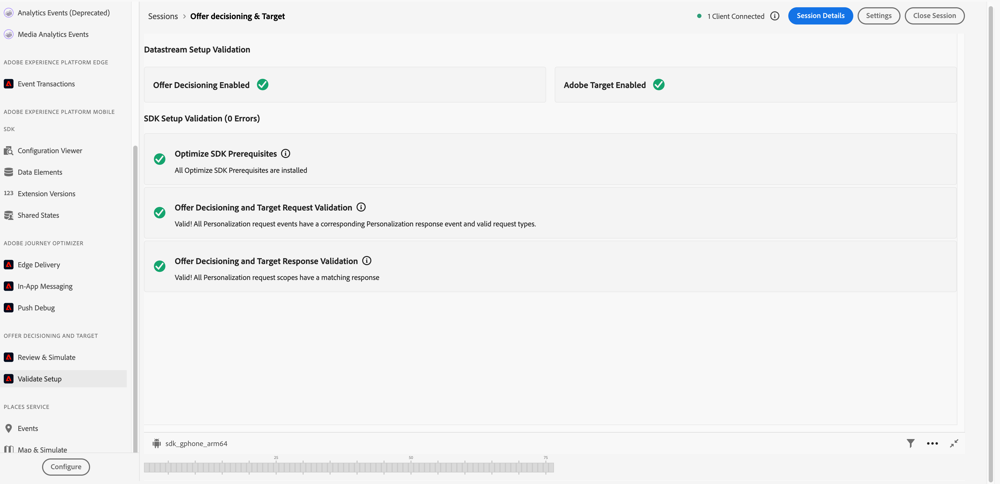
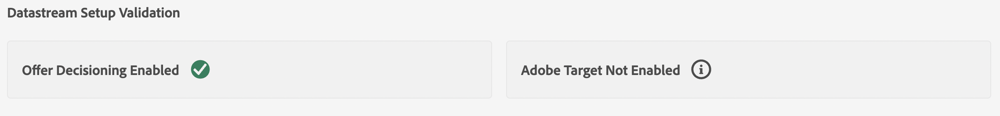
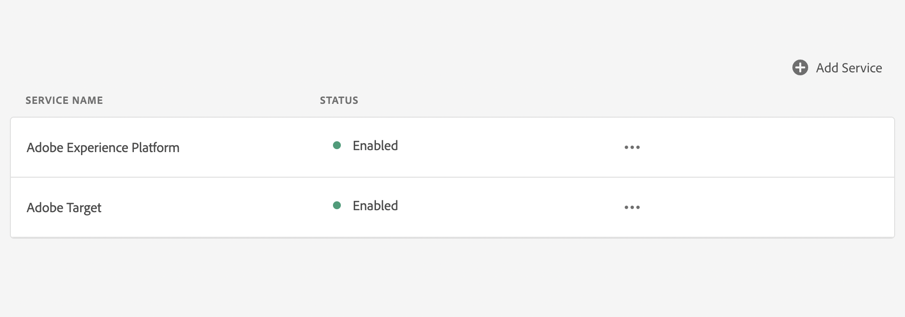
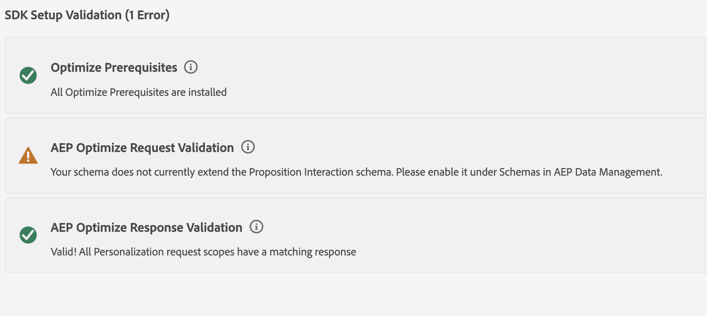

# Decisioning Validation view

## Overview

You can use the Decisioning Validation view to check if your mobile application has been set up successfully to use Adobe Experience Platform Optimize SDK. The view validates all pre-requisites have been met and offers feedback on how to fix your setup in cases where requirements have been missed.

## Getting started

To use this view, follow the steps outlined below:

1. [Setup](./assurance-setup.md) an Assurance session
2. In the **Assurance Plugin Section**, on left side, select **Validate Setup**

## Datastream setup validation

At the top of the Decisioning Validation view, Assurance inspects your current application's datastream to see if Target or Offer Decisioning has been enabled. In order to use optimize, at least one of extensions needs to be enabled inside your datastream.

To enable Target in your datastream, go to the datastream view for application inside the Data Collection UI, and ensure that Adobe Target has been added and enabled.

To enable Offer Decisioning in your datastream, go to datastream for your application in the Data Collection UI, and select Edit in the actions menu for Adobe Experience Platform. The toggle shows if Offer Decisioning is enabled.

## SDK setup validation

Below the datastream validation section, the SDK Setup Validation section offers feedback on two major issues you could face in your application. Firstly, it offers validation that all SDKs have been installed that are required by Optimize SDK to work correctly. Secondly, it validates that every request sent from your application has a valid matching response from upstream services. Errors may arise if your schemas have been improperly implemented, or your application is sending requests that do not receive an appropriate response. This section will provide feedback and identify the error in events, so you can diagnose what went wrong.

