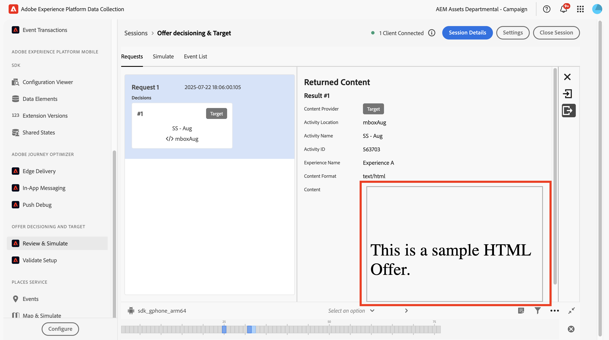
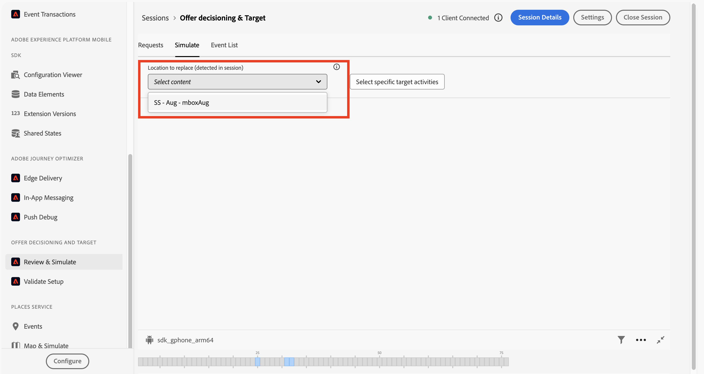
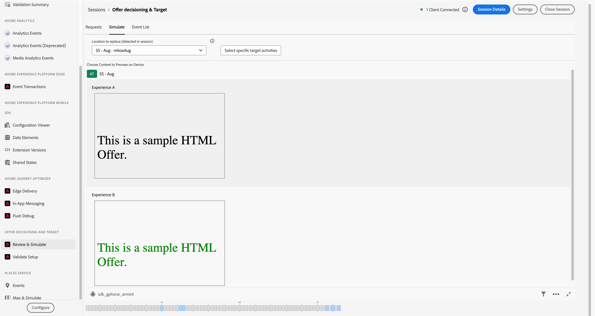
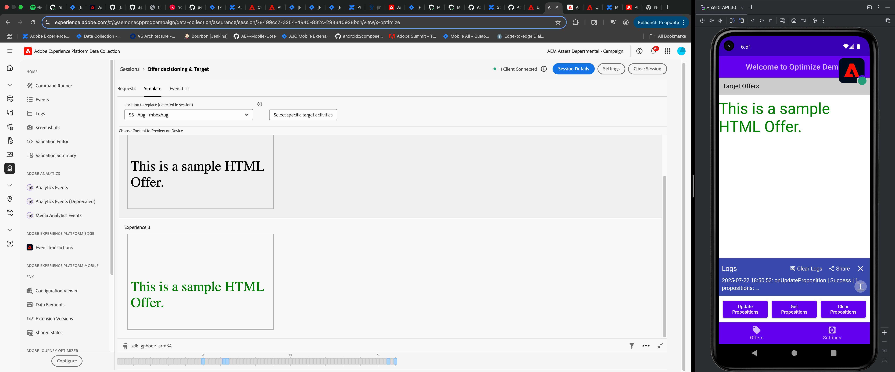

# Decisioning Review & Simulate

This is a feature of the Adobe Experience Platform Assurance which allows the users to review the content sent to devices for each request and simulate different experiences on the same devices in real time.

## Review Requests and Results

1. [Setup and connect](./assurance-for-decisioning.md) ot an Assurance session.
2. To review the personlization requests and results navigate to ‘Review & Simulate’ tab.
   Make sure that at least one decision scope has been set up in the mobile application and an update request made to be able review them.

3. In the review tab you can see all personalization requests in the session. If you do not see any request, trigger an update request from the application.

   

4. Select any request to see more information about it in the expanded right panel. To see the upstream response, click the ‘Show Returned Content’ button available in the right panel.

   

## Simulate Different Results

The result of each personalization request is customized for each user based on several deciding factors as configured. A unique experience is served for each user. Simulate allows the user to view a different experience then the one they currently served.

You can simulate specific experiences served against a scope by following the steps below::

1. Move to the 'Simulate' tab in 'Review & Simulate' section.
   Make sure that at least one decision scope has been set up in the mobile application and an update request made to be able review them.
   

2. There are two ways to select activities that user wants to simulate:
   * Locations requested during the session - These are scopes/locations that were requested during the current session.
      * Select the scope you want to preview from the dropdown menu.
      * Upon selection, a list of all available experiences for the selected scope will be shown.

   

   * Locations not requested during session - Any activity, whether active or inactive, can also be simulated as long as application is listening to them.
      * Click on **Select specific target activities**
      * A list of available activities will be shown, you may select appropriate workspace and search through the list.
      * Select Activities that you want to simulate and click continue.
      * Upon Selection, a list of all available experiences for the selected scopes will be shown.

   

3. Click on any Experience to send it over to the device in real time.

   

4. Simulate results can be updated on device via these two callbacks:
   1. [getPropositions](https://developer.adobe.com/client-sdks/edge/adobe-journey-optimizer-decisioning/api-reference/#getpropositions) - This needs to be triggered by application to get updated results after simulation.
   2. [onPropositionsUpdate](https://developer.adobe.com/client-sdks/edge/adobe-journey-optimizer-decisioning/api-reference/#onpropositionsupdate) - This provides a callback as soon as simulation is done and can be used to update data in real time.
