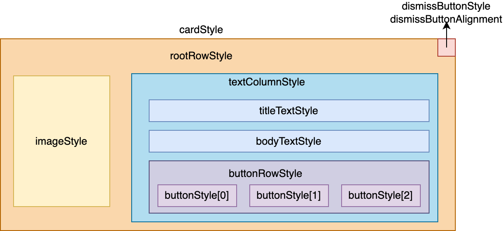

# Class - SmallImageUIStyle

Class representing the style for a small image AEP UI.



## Public Properties

| Property               | Type                                                         | Description                                                  |
| ---------------------- | ------------------------------------------------------------ | ------------------------------------------------------------ |
| cardStyle              | [AepCardStyle](./aepcardstyle.md)                            | The style for the card.                                      |
| rootRowStyle           | [AepRowStyle](./aeprowstyle.md)                              | The style for the root row.                                  |
| imageStyle             | [AepImageStyle](./aepimagestyle,md)                          | The style for the image.                                     |
| textColumnStyle        | [AepColumnStyle](./aepcolumnstyle.md)                        | The style for the column containing the title, body and buttons. |
| titleTextStyle         | [AepTextStyle](./aeptextstyle.md)                            | The text style for the title.                                |
| bodyTextStyle          | [AepTextStyle](./aeptextstyle.md)                            | The text style for the body.                                 |
| buttonRowStyle         | [AepRowStyle](./aeprowstyle.md)                              | The style for the row containing the buttons.                |
| buttonStyle            | Array<Pair<[AepButtonStyle](./aepbuttonstyle.md), [AepTextStyle](./aeptextstyle.md)>> | The style for the buttons.                                   |
| dismissButtonStyle     | [AepIconStyle](./aepiconstyle.md)                            | The style for the dismiss button.                            |
| dismissButtonAlignment | [Alignment](https://developer.android.com/reference/kotlin/androidx/compose/ui/Alignment) | The alignment for the dismiss button.                        |

## Customization

The `SmallImageUIStyle` is created using a builder. Here's an example:

```kotlin
// Displaying content cards in a Row
// create a custom style for the small image card in row
val smallImageCardStyleRow = SmallImageUIStyle.Builder()
            .cardStyle(AepCardStyle(modifier = Modifier.width(400.dp).height(200.dp)))
            .rootRowStyle(
                AepRowStyle(
                    modifier = Modifier.fillMaxSize()
                )
            )
            .titleAepTextStyle(AepTextStyle(textStyle = TextStyle(Color.Green)))
            .build()
```