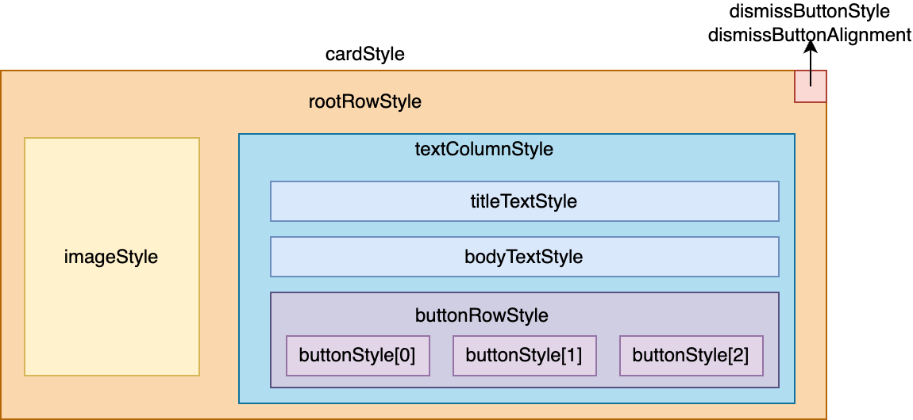

# SmallImageUIStyle

<InlineAlert variant="info" slots="text"/>

SmallImageUIStyle is only available in AEP SDK BOM version 3.7.0+.

Class representing the style for a small image Adobe Experience Platform UI.



## Public Properties

| Property                 | Type                                                         | Description                                                  |
| ------------------------ | ------------------------------------------------------------ | ------------------------------------------------------------ |
| `cardStyle`              | [AepCardStyle](../../../android/public-classes/styles/aepcardstyle.md)                            | The style for the card.                                      |
| `rootRowStyle`           | [AepRowStyle](../../../android/public-classes/styles/aeprowstyle.md)                              | The style for the root row.                                  |
| `imageStyle`             | [AepImageStyle](../../../android/public-classes/styles/aepimagestyle.md)                          | The style for the image.                                     |
| `textColumnStyle`        | [AepColumnStyle](../../../android/public-classes/styles/aepcolumnstyle.md)                        | The style for the column containing the title, body, and buttons. |
| `titleTextStyle`         | [AepTextStyle](../../../android/public-classes/styles/aeptextstyle.md)                            | The text style for the title.                                |
| `bodyTextStyle`          | [AepTextStyle](../../../android/public-classes/styles/aeptextstyle.md)                            | The text style for the body.                                 |
| `buttonRowStyle`         | [AepRowStyle](../../../android/public-classes/styles/aeprowstyle.md)                              | The style for the row containing the buttons.                |
| `buttonStyle`            | Array\<Pair\<[AepButtonStyle](../../../android/public-classes/styles/aepbuttonstyle.md), [AepTextStyle](../../../android/public-classes/styles/aeptextstyle.md)\>\> | The style for the buttons.                                   |
| `dismissButtonStyle`     | [AepIconStyle](../../../android/public-classes/styles/aepiconstyle.md)                            | The style for the dismiss button.                            |
| `dismissButtonAlignment` | [Alignment](https://developer.android.com/reference/kotlin/androidx/compose/ui/Alignment) | The alignment for the dismiss button.                        |

## Customization

The `SmallImageUIStyle` is created using a builder. Here's an example:

<CodeBlock slots="heading, code" repeat="1" languages="Kotlin" />

#### Kotlin

```kotlin
val smallImageCardStyleRow = SmallImageUIStyle.Builder()
            .cardStyle(AepCardStyle(modifier = Modifier.width(400.dp).height(200.dp)))
            .rootRowStyle(
                AepRowStyle(
                    modifier = Modifier.fillMaxSize()
                )
            )
            .titleAepTextStyle(AepTextStyle(textStyle = TextStyle(Color.Green)))
            .build()
```
