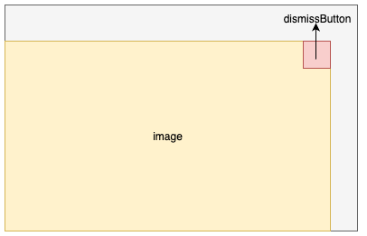

# ImageOnlyTemplate

<InlineAlert variant="info" slots="text"/>

ImageOnlyTemplate is only available in AEP Messaging iOS version 5.8.0+

This class represents an ImageOnly templated content card authored in Adobe Journey Optimizer.

An image only template content card includes only an image that can be tapped like a button. An optional dismiss button can be added to dismiss the content card.

Use the ImageOnlyTemplate class to customize the appearance of the image only templated content cards.

ImageOnlyTemplate conforms to `ObservableObject`, allowing it to be used reactively in SwiftUI views.

## Layout

## Public properties

| Property      | Type                                           | Description                                                  |
| ------------- | ---------------------------------------------- | ------------------------------------------------------------ |
| image         | [AEPImage](../UIElements/aepimage.md)          | The image to be shown on the content card.                   |
| dismissButton | [AEPDismissButton](../UIElements/aepdismissbutton.md) | *Optional* The dismiss button for the content card.       |
