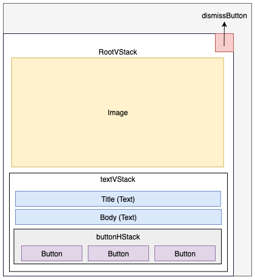

# LargeImageTemplate

<InlineAlert variant="info" slots="text"/>

LargeImageTemplate is only available in AEP Messaging iOS version 5.8.0+

 This class represents a LargeImage templated content card authored in Adobe Journey Optimizer.

 A large image template content card includes a title, body, image, and a maximum of three buttons. The image is displayed prominently above the text content in a vertical layout. An optional dismiss button can be added to dismiss the content card.

 Use the LargeImageTemplate class to customize the appearance of the large image templated content cards.

 LargeImageTemplate conforms to `ObservableObject`, allowing it to be used reactively in SwiftUI views.

## Layout

## Public properties

| Property      | Type                                           | Description                                                  |
| ------------- | ---------------------------------------------- | ------------------------------------------------------------ |
| title         | [AEPText](../ui-elements/aeptext.md)            | The title text for the content card.                         |
| body          | [AEPText](../ui-elements/aeptext.md)            | *Optional* The body text of the content card                 |
| image         | [AEPImage](../ui-elements/aepimage.md)          | *Optional* The image to be shown on the content card.     |
| buttons       | [[AEPButton](../ui-elements/aepbutton.md)]      | *Optional* The list of buttons on the content card.       |
| buttonHStack  | [AEPHStack](../ui-elements/aepstack.md#aephstack)         | A horizontal stack for arranging buttons.                    |
| textVStack    | [AEPVStack](../ui-elements/aepstack.md#aepvstack)         | A vertical stack for arranging the title, body, and buttons. |
| rootVStack    | [AEPVStack](../ui-elements/aepstack.md#aepvstack)         | A vertical stack for arranging the image and text stack.   |
| dismissButton | [AEPDismissButton](../ui-elements/aepdismissbutton.md) | *Optional* The dismiss button for the content card.       |
