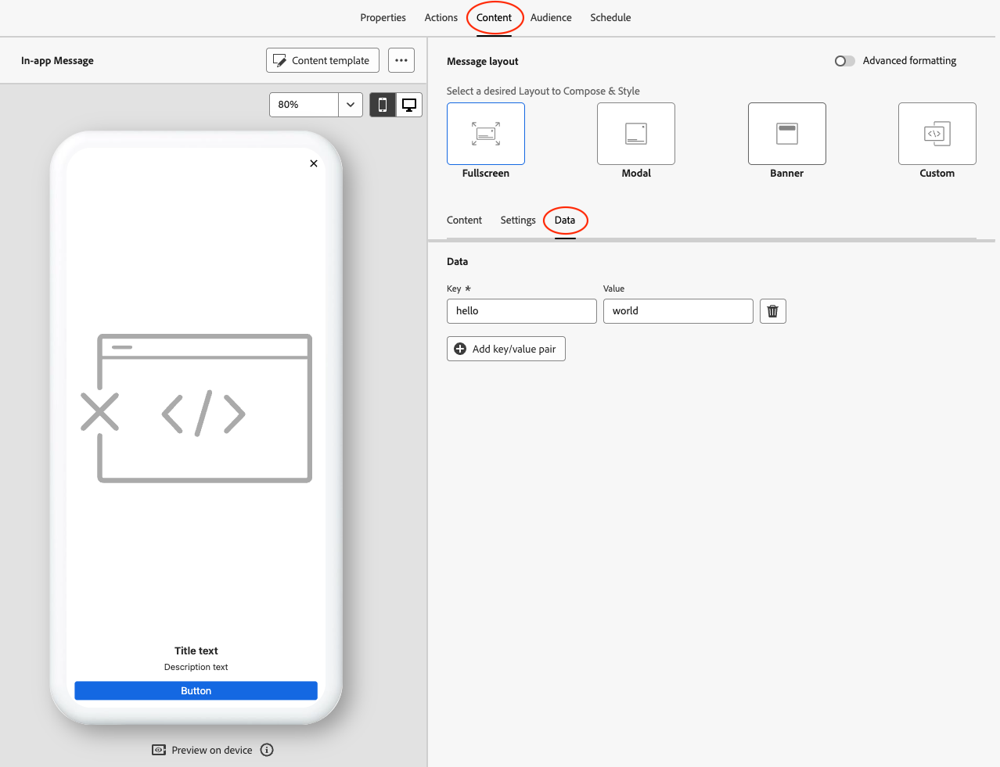

import Tabs from './tabs/messaging-metadata.md'

# Use custom metadata with in-app messages

You can add and retrieve custom metadata in an in-app message payload by completing the following steps:

* [Add custom metadata to an in-app message in AJO](#add-custom-metadata-to-an-in-app-message-in-ajo)
* [Implement and assign a `PresentationDelegate`/`MessagingDelegate`](#implement-and-assign-a-presentationdelegate-messagingdelegate)
* [Retrieve custom metadata from the Message object](#retrieve-custom-metadata-from-the-message-object)

<InlineAlert variant="info" slots="header, text1, text2"/>

Available since

The ability to retrieve custom metadata from an in-app message was first added in:

* Mobile SDK Messaging extension for iOS version **5.7.0**
* Mobile SDK Messaging extension for Android version **3.4.0**

## Add custom metadata to an in-app message in AJO

When authoring an in-app message in AJO, from the **Content** tab, under **Message layout**, select the **Data** tab to add key/value pairs to the payload of the in-app message.

## Implement and assign a `PresentationDelegate`/`MessagingDelegate`

To retrieve custom metadata from a `Message` object, you will first need to implement and set a `PresentationDelegate` (for Android SDK) or `MessagingDelegate` (for iOS SDK).

Please read the [tutorial](./messaging-delegate.md) for more detailed instructions on implementing and using a PresentationDelegate/MessagingDelegate.

## Retrieve custom metadata from the Message object

From within the `PresentationDelegate` or `MessagingDelegate`, call `Message.getMetadata()` or `Message.metadata` after getting an instance of the `Message` object.

<TabsBlock orientation="horizontal" slots="heading, content" repeat="2"/>

Android 3.x

<Tabs query="platform=android3x&function=metadata"/>

iOS

<Tabs query="platform=ios&function=metadata"/>
