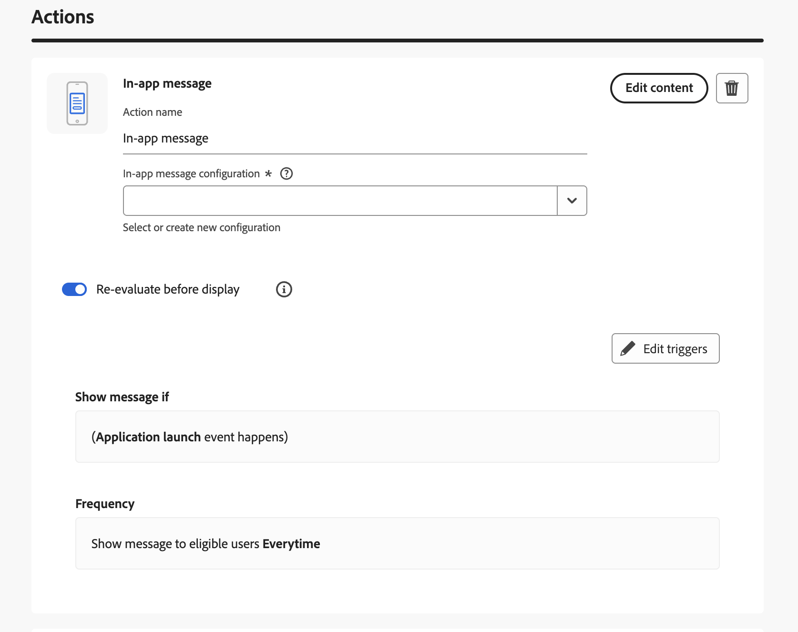

import Tabs from './tabs/re-evaluate.md'

# Re-evaluate in-app messages before display

This guide explains how to create the re-evaluate campaignsin the Adobe Journey Optimizer UI. These are campaigns that are validated before displaying the in-app to user.

## What is re-evaluate?

When the re-evaluate option is enabled on a campaign trigger, the SDK fetches the latest rules from the backend before displaying an in-app message. The in-app message is then displayed using the updateed rules and content, so campaign content or state changes (such as an update or stop) can take effect on the device without the user restarting the application or programmatically refreshing in-app messages.

<InlineAlert variant="warning" slots="text"/>

**Cost and latency:** Re-evaluate triggers an API call to update rules before display. This adds latency and uses the user's network bandwidth. Use re-evaluate only when you need the device to reflect the latest campaign state (for example, time-sensitive content or campaigns that may be updated or paused). For campaigns that do not require this, leave re-evaluate disabled.

## Supported SDK versions

Re-evaluate is supported in the following SDK versions. Update your app to at least these versions of the Mobile Core and Adobe Journey Optimizer (AJO) extensions to use the feature.

<TabsBlock orientation="horizontal" slots="heading, content" repeat="2"/>

Android

<Tabs query="platform=android&function=version"/>

iOS

<Tabs query="platform=ios&function=version"/>

## Create a re-evaluable campiagns

1. In the Adobe Journey Optimizer UI, create a scheduled campaign that contains an in-app message action. For campaign creation basics, see the Experience League documentation for [in-app messages](https://experienceleague.adobe.com/docs/journey-optimizer/using/channels/in-app/create-in-app.html).
2. Enable *"Re-evaluate before display"* for that trigger.
4. Complete the trigger conditions and in-app message content, then review and activate the campaign.

To trigger the campaign from your app, send an Experience event that matches the campaign's trigger conditions. For details, see [Trigger Adobe Journey Optimizer campaigns using the send data to platform event](./trigger-campaign.md).

## Test that re-evaluate works

Use the following steps to verify that re-evaluate is working:

1. Run your application and trigger the in-app message re-evaluable campaign, so that the message is displayed. Note the content shown.
2. In the Adobe Journey Optimizer UI, update the content of the same campaign (for example, change the message text or creative). Ensure the campaign remains active and save or publish the changes. Wait until the campaign's state is updated and the new content is active.
3. In the app, trigger the campaign again (for example, send the same Experience event that matches the trigger, or perform the action that triggers it). The SDK will fetch the updated rules and re-evaluate; the in-app message should now show the new content without restarting the application.

## Next steps

* [Trigger Adobe Journey Optimizer campaigns using the send data to platform event](./trigger-campaign.md)
* [In-App Messaging APIs](../api-reference.md)
* [Validate in-app messaging using Assurance](../validate-messages.md)
* [Rules Engine](../../../../home/base/mobile-core/rules-engine/index.md)
